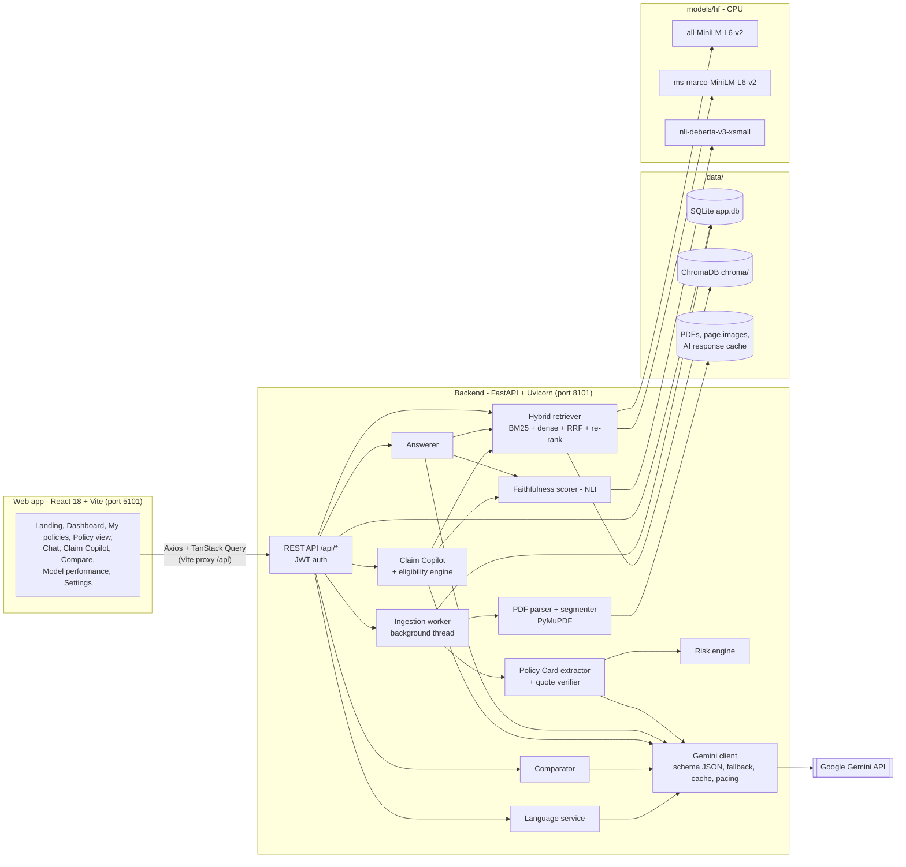
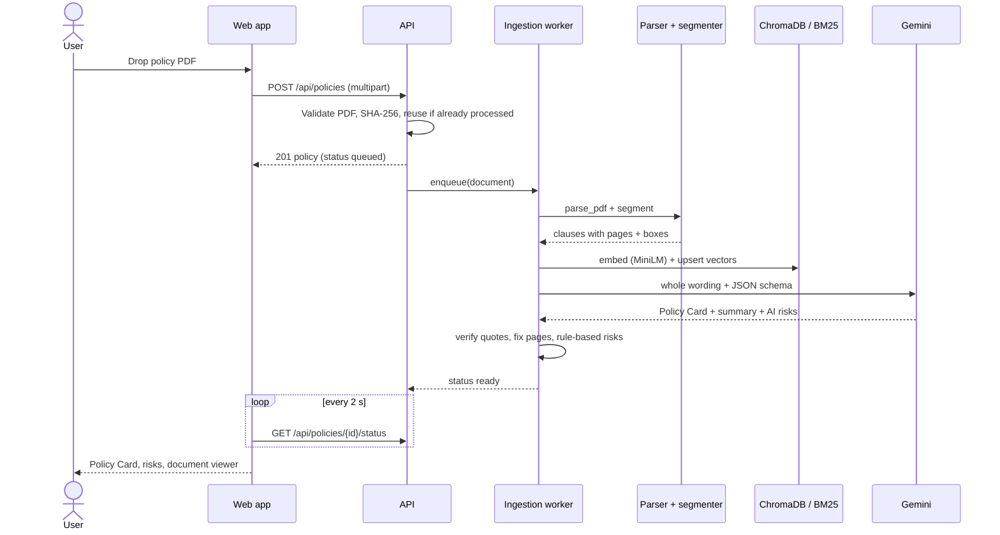
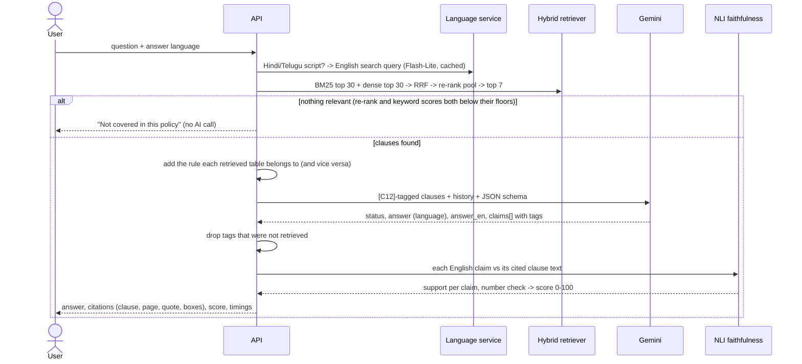
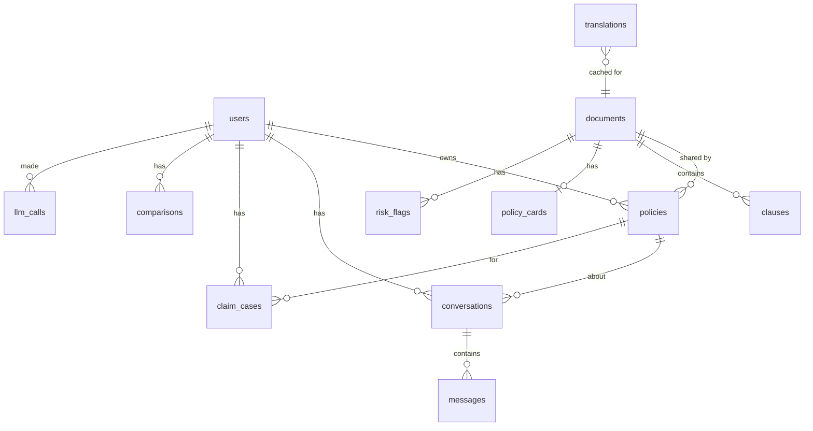

# Architecture

PolicyLens is a single-machine application: a **FastAPI** backend on port **8101** and a **React** web app on port **5101**. Everything is stored locally in the `data/` folder; the only external service is the **Google Gemini API**.

---

## 1. Components

| Component | Code | Responsibility |
|---|---|---|
| REST API | `backend/app/api/` | Auth, policies, chat, claims, comparisons, dashboard, evaluation; consistent `{detail, code}` errors |
| Ingestion worker | `backend/app/services/ingestion.py` | Runs parse -> index -> extract in a background thread; resumes unfinished work after a restart |
| PDF parser | `backend/app/services/pdf_parser.py` | Lines with page, position and font; removes running headers/footers; two-column reading order; joins justified text and letter-spaced headings; tables as rows; rejects scans |
| Segmenter | `backend/app/services/segmenter.py` | Clause starts (`4.2.1`, `Def. 5`, `Excl03`, `Section C`, Roman and bold headings); list items that carry an IRDAI exclusion code become their own clause whether the code opens the item ("o. Maternity: Code – Excl18") or closes it ("... domestic reasons - Code Excl 13"); heading path; chunks of 12-380 words with highlight boxes |
| Hybrid retriever | `backend/app/ml/retrieval/` | BM25 (with insurance synonyms) + MiniLM/ChromaDB -> Reciprocal Rank Fusion -> cross-encoder re-rank |
| Extractor | `backend/app/services/extractor.py` | One long-context Gemini call per policy with a Pydantic JSON schema; every value's quote is located in the clauses to confirm clause and page |
| Risk engine | `backend/app/services/risk_engine.py` | Rules on extracted numbers (co-pay, waiting periods, room rent, sub-limits, deadlines) + AI findings, de-duplicated, with severity |
| Answerer | `backend/app/services/answerer.py` | Retrieval-augmented, citation-constrained answers in the chosen language; keeps a rule and the tables it governs together; removes citations to clauses that were not retrieved |
| Claim Copilot | `backend/app/services/claim_copilot.py`, `eligibility.py` | Multi-query retrieval, calculated pre-checks and cost estimate, structured verdict/checklist/steps |
| Comparator | `backend/app/services/comparator.py` | Field-by-field table with "better" markers + AI trade-offs citing both policies |
| Language service | `backend/app/services/language.py` | Detects Hindi/Telugu questions, translates them for search, translates cards and risks (cached) |
| Faithfulness | `backend/app/ml/faithfulness.py` | NLI entailment of each English statement against its cited clauses + number check |
| Gemini client | `backend/app/services/gemini_client.py` | JSON-schema calls, fallback chain, cool-down for overloaded models, RPM pacing, disk cache, usage log |

---

## 2. Upload and processing flow (F1, F2, F4, F7)

Documents are shared by content hash: if two users upload the same PDF, it is processed once.

---

## 3. Question answering flow (F3, F8, F9)

---

## 4. Claim Copilot flow (F5)

1. The wizard collects the policy, treatment, admission type, claim mode, policy start date, age, pre-existing condition, estimated bill and room type.
2. Seven to nine targeted searches (coverage, waiting period, exclusion, sub-limit, procedure, documents, intimation, and optionally pre-existing disease and room rent) are merged into the 16 best clauses.
3. The **eligibility engine** calculates facts from the Policy Card - months of cover versus each waiting period, which co-payment applies at this age, sub-limits naming the treatment, and an out-of-pocket estimate.
4. Gemini receives the clauses and the calculated facts and returns a structured plan. A failed calculated waiting-period check can never be shown as "covered".
5. Each reason's policy rule is scored for faithfulness; checklist ticks are saved.

---

## 5. Data model

| Table | Purpose |
|---|---|
| `users` | Accounts (bcrypt password hash, answer language, theme) |
| `documents` | One parsed PDF (by SHA-256): status, pages, insurer, product, UIN, parse statistics |
| `policies` | A document in a user's library, with its display name |
| `clauses` | Retrievable chunks: clause reference, heading, section path, text, pages, highlight boxes |
| `policy_cards` | Extracted card (JSON with sources), summary, model, verified ratio |
| `risk_flags` | Risk highlights with severity, category, source (rule / AI), clause and page |
| `conversations`, `messages` | Chat history with citations, faithfulness detail, retrieval trace and timings |
| `claim_cases` | Claim Copilot inputs, result and checklist state |
| `comparisons` | Plan comparison results |
| `translations` | Cached Hindi/Telugu translations of cards and risks |
| `llm_calls` | One row per Gemini request (model, tokens, latency) for the usage panel |

---

## 6. Design decisions

| Decision | Why |
|---|---|
| Local embeddings, re-ranker and NLI | No API quota, deterministic, offline; the faithfulness check is independent of the model that wrote the answer |
| Hybrid retrieval with a re-rank pool that always includes each retriever's top hits | Keyword search is precise for exclusion codes and medical terms; embeddings handle paraphrase; re-ranking puts the best clause first |
| Schema-constrained JSON from Gemini | Predictable structure, no fragile text parsing, every value carries its clause tag and quote |
| Quote verification | A value whose quote cannot be found in the text is shown as unverified rather than silently trusted |
| Server-rendered page images for the viewer | Exact highlight positions from the parser, no extra PDF library in the browser |
| Fallback chain and cool-down | Free-tier Gemini models can be overloaded or out of quota; the app keeps answering with the next model and shows which model answered |
| Response cache by content hash | Re-running the evaluation or re-importing a known PDF does not spend quota twice; a "Re-run AI extraction" button bypasses it |
