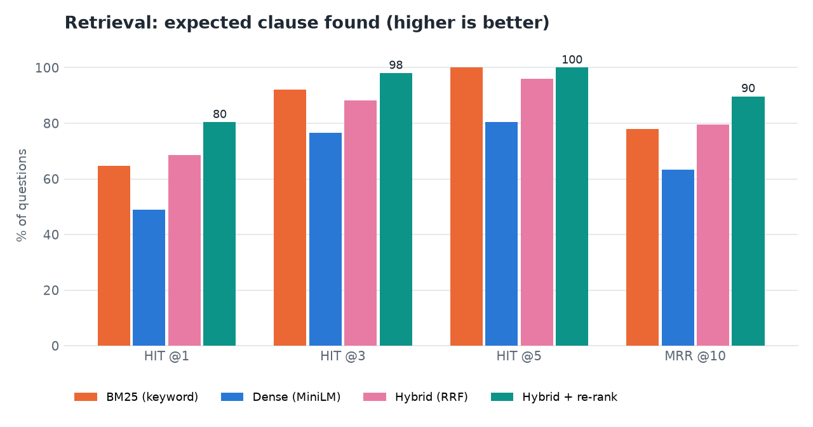
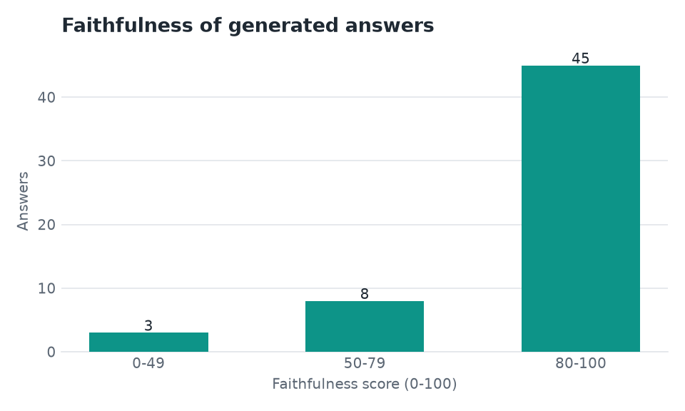
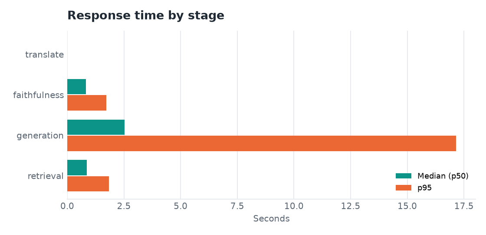
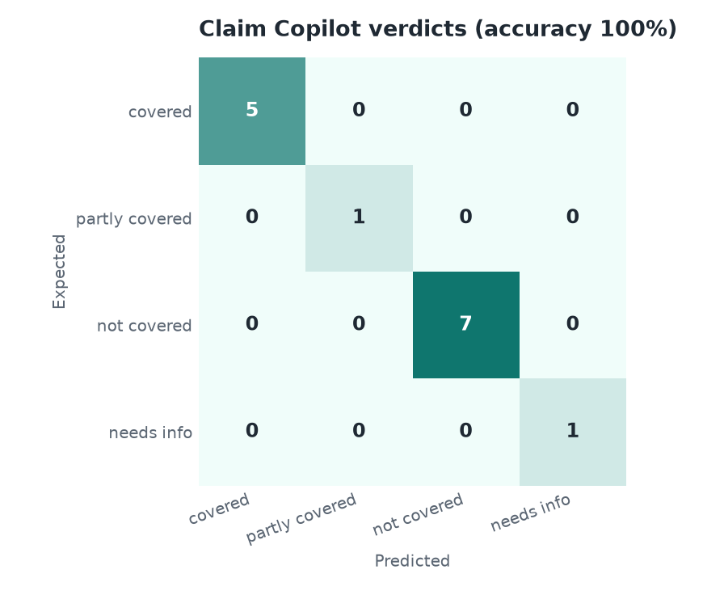
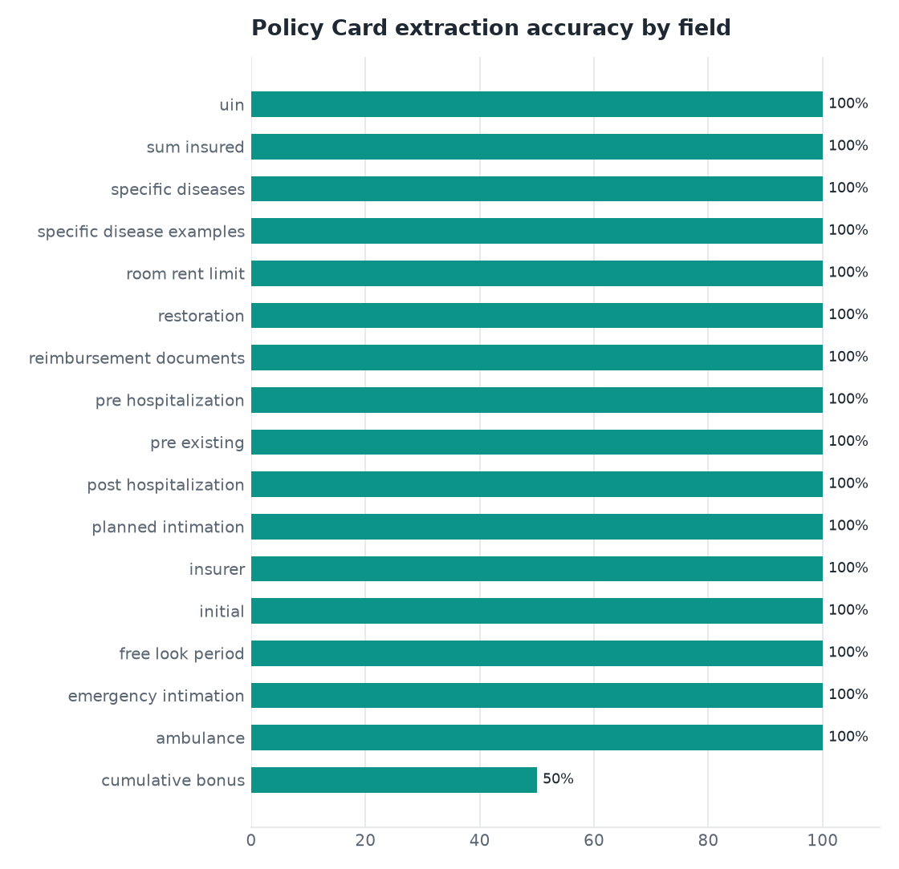

# Models, evaluation and results

PolicyLens does not train a model of its own. It combines pre-trained models, each chosen for one job, with rules that check their output against the policy text. This page lists the models, explains why nothing is trained, describes how every part of the pipeline is measured, and reports the latest results.

The same numbers, with charts, are on the **Model performance** page of the app (`/model-performance`, no login needed).

---

## 1. Models

| Role | Model | Runs | Size | Why this model |
|---|---|---|---|---|
| Reading the policy (Policy Card), answers, Claim Copilot reasoning, plan trade-offs, translation | Google **Gemini** - `gemini-3.8-flash`, falling back to `gemini-3.6-flash` and then `gemini-3.5-flash-lite` | Google API | - | Long context (a whole 40-60 page wording fits in one request), JSON-schema output, good Hindi and Telugu, free tier |
| Dense retrieval | `sentence-transformers/all-MiniLM-L6-v2` (384-dim embeddings) | local CPU | 92 MB | Fast on a laptop CPU (~10 ms per query), strong general-purpose sentence embeddings |
| Re-ranking | `cross-encoder/ms-marco-MiniLM-L6-v2` | local CPU | 92 MB | Reads question and clause together; much better at ranking than either retriever alone (see 4.1) |
| Faithfulness | `cross-encoder/nli-deberta-v3-xsmall` (natural-language inference) | local CPU | 295 MB | Independent of the model that wrote the answer; scores entailment of each claim by its cited clause |
| Keyword retrieval | BM25 Okapi (`rank-bm25`, k1 = 1.4, b = 0.7) with an insurance synonym list | local | - | Exact terms matter in policies ("Excl02", "cataract", "30 days") |
| Vector store | ChromaDB, persistent, cosine distance | local | - | One collection, filtered per document; no server to run |

The local model weights are downloaded once by `setup.bat` into `models/hf/`. Their exact revisions and licences (all Apache-2.0) are pinned in `models/manifest.json`.

**Gemini fallback.** Every Gemini call asks for a JSON schema (Pydantic model) and uses a low thinking level. If the primary model is out of quota or overloaded, the call moves down the chain; an overloaded model is skipped for 10 minutes. The model that produced each answer, card and claim check is stored and shown in the app next to the result. Identical requests are served from a disk cache (`data/cache/llm/`), so re-processing or re-evaluating does not spend quota twice.

---

## 2. Why there is no training

- **The task is reading, not predicting.** Every answer must come from the user's own policy wording and point to the clause it used. A large pre-trained model that is told to use only the supplied clauses, and is then checked, fits that better than a model trained on other policies' wordings.
- **Labelled data is scarce.** There is no public set of policy questions with clause-level answers for Indian health policies. The hand-built set in `data/eval/` is small, so it is used only to measure, never to fit weights.
- **Wordings change.** Insurers revise wordings every year. Retrieval over the uploaded document keeps working for a new wording without retraining.

What *is* tuned is a handful of pipeline settings, each chosen by measurement on the evaluation set:

| Setting | Value | Chosen because |
|---|---|---|
| Clause size | 12-380 words, one clause per numbered item / exclusion code | Citations point at one rule; long clauses are split at sub-items |
| Candidates per retriever | 30 | Enough for fusion to see clauses that only one retriever ranks well, while keeping search under 20 ms |
| Fusion | Reciprocal Rank Fusion, k = 60 | Standard; no score scaling needed between BM25 and cosine |
| Re-rank pool | fused top 20 + top 8 of each retriever | Adding each retriever's own top 8 recovered questions where one retriever alone found the clause |
| Clauses given to Gemini | top 7, plus the rule a retrieved table belongs to and the tables a retrieved rule governs (up to 4 extra) | Waiting-period lists and sub-limit tables are separate chunks from the rule that gives them meaning |
| Answer without Gemini ("not covered in this policy") | re-rank score < 0.004 **and** best BM25 score < 9.0 | See 4.3 |
| Temperature | 0.2 (answers), 0.1 (Policy Card) | Stable, repeatable wording |

---

## 3. How it is measured

`ml/run_all.py` runs the product's real code (the same functions the API calls) over the evaluation set described in [04_DATASET.md](04_DATASET.md): 57 questions (51 answerable, 6 that the policies do not address), 5 Hindi/Telugu questions, 14 Claim Copilot scenarios and 52 hand-checked Policy Card values from four real policy wordings. Nothing in the set is used for training, so all of it is test data.

| What | Metric | Definition |
|---|---|---|
| Retrieval | hit@k | A relevant clause is in the top *k*. A clause is relevant when it contains one of the question's evidence snippets (copied verbatim from the PDF), so the check does not depend on how the parser splits clauses |
| | MRR@10 | Mean of 1 / rank of the first relevant clause |
| | evidence recall@5 | Share of a question's evidence snippets found in the top 5 |
| Answers | answer accuracy | The answer is not "not in policy" and contains **every** key fact (number words and "15-day"/"15 days" are normalised) |
| | citation accuracy | A cited clause contains the evidence, or is on an expected page |
| | faithfulness | Mean NLI support of the answer's claims by their cited clauses, 0-100 (section 3.1) |
| | abstention accuracy | Share of out-of-scope questions answered "not covered in this policy" |
| | false abstentions | Answerable questions wrongly answered "not covered in this policy" |
| | multilingual | Answer is in the requested script and contains the key facts |
| | latency | End-to-end and per stage, measured on live Gemini calls (cached responses excluded) |
| Claim Copilot | verdict accuracy, confusion matrix, per-verdict precision / recall / F1 | Over covered / partly covered / not covered / needs info |
| Policy Card | extraction accuracy | Share of the 52 hand-checked values the card got right (numbers compared after unit conversion) |
| | verified ratio | Share of card values whose quoted source text was found in the cited clause |

### 3.1 Faithfulness score

Gemini restates its answer as short English claims, each tagged with the clauses it relies on. For every claim, the local NLI model scores entailment against sentence windows of the cited clauses and keeps the best window. A claim whose numbers (months, %, rupees) do not appear in the cited text has its support halved, and a near-verbatim restatement of the clause counts as supported. The answer's score is the mean claim support: **80-100 well supported, 50-79 partly supported, below 50 weakly supported**. The score is computed offline, costs no quota, and is shown on every answer.

---

## 4. Results

Latest run: **`experiments/eval-20260922-0027/`** (22 September 2026). During this run the free-tier quota of `gemini-3.8-flash` and `gemini-3.6-flash` was used up, so every answer, claim check and Policy Card came from the `gemini-3.5-flash-lite` fallback. The results below are therefore for the smallest model in the chain.

| Measure | Result |
|---|---|
| Retrieval: relevant clause in the top 5 (hybrid + re-rank) | **100%** (51 / 51) |
| Retrieval: relevant clause ranked first | **80.4%** |
| Answer accuracy (all key facts present) | **100%** (51 / 51) |
| Citation accuracy | **100%** (51 / 51) |
| Faithfulness score, mean / median | **87.0 / 91.7** |
| Out-of-scope questions answered "not covered in this policy" | **100%** (6 / 6), with **0** false abstentions on the 51 answerable questions |
| Hindi / Telugu answers in the requested script with all key facts | **5 / 5** |
| Claim Copilot verdict accuracy | **100%** (14 / 14) |
| Policy Card extraction accuracy | **98.1%** (51 / 52); 96.9% of card values have a verified source quote |
| Answer response time, median / 95th percentile | **4.3 s / 18.2 s** |

### 4.1 Retrieval - which search method finds the right clause

51 answerable questions; a clause counts as relevant when it contains the question's evidence text.

| Method | hit@1 | hit@3 | hit@5 | MRR@10 | evidence recall@5 | median time |
|---|---|---|---|---|---|---|
| BM25 (keywords) | 0.647 | 0.922 | 1.000 | 0.779 | 1.000 | 1 ms |
| Dense (MiniLM + ChromaDB) | 0.490 | 0.765 | 0.804 | 0.632 | 0.794 | 11 ms |
| Hybrid (RRF fusion) | 0.686 | 0.882 | 0.961 | 0.795 | 0.951 | 11 ms |
| **Hybrid + re-rank (used)** | **0.804** | **0.980** | **1.000** | **0.897** | **0.990** | 879 ms |



- **Keywords matter in policies.** BM25 alone already finds the clause in the top 5 every time: questions and clauses share exact terms ("cataract", "ambulance", "free look").
- **Embeddings alone are weakest.** Policy clauses are formulaic and look alike to a general-purpose embedding model; dense search misses one question in five at rank 5. It still helps fusion with paraphrased questions ("glasses" vs "refractive error").
- **The re-ranker makes the difference at the top.** Reading question and clause together lifts rank-1 accuracy from 69% (fusion) to 80% and MRR from 0.80 to 0.90. That is what Gemini sees first. It costs about 0.9 s on a laptop CPU, the largest part of retrieval time.

### 4.2 Answers

| Category | Questions | Correct |
|---|---|---|
| Waiting periods | 14 | 14 |
| Benefits | 15 | 15 |
| Claim process | 8 | 8 |
| Exclusions | 5 | 5 |
| Policy terms | 4 | 4 |
| Room rent | 3 | 3 |
| Sub-limits | 2 | 2 |

**Faithfulness.** Of the 56 answers that were scored (answerable questions plus the multilingual set), 45 are well supported (80-100), 8 partly (50-79) and 3 weakly (below 50). All three weakly supported answers were still correct and correctly cited. They show where the small NLI model struggles:
- An exclusion-list item does not itself say "excluded"; the heading above it does. "Childbirth expenses are excluded" scored 0.05 against the maternity item.
- A rule stated as the inverse of an exclusion: "covered at 7.5 dioptres or more" derived from "excluded below 7.5".
- A defined term swapped for its abbreviation: "Intensive Care Unit charges" vs "ICU Charges".

Adding the clause heading to the evidence lifted the first kind (0.003 to 0.92) but also let the model confirm wrong statements about exceptions. It scored "ectopic pregnancy treatment is excluded" at 0.87 against a clause that excepts ectopic pregnancy. So that change was not adopted: a faithfulness score should err towards caution. The score is shown next to every answer as a prompt to open the cited clause, not as a verdict.



### 4.3 Knowing when to say "not covered in this policy"

Before calling Gemini, PolicyLens checks the best re-rank score and the best keyword (BM25) score of the retrieved clauses. Measured on this set:

| | Best re-rank score | Best BM25 score |
|---|---|---|
| Out-of-scope questions (6) | at most 0.0029 | at most 7.3 |
| Answerable questions (51) | as low as 0.0020 | as low as 7.1 |
| Answerable questions with re-rank < 0.004 (3) | 0.0020-0.0021 | 15.5 or more |

Neither score separates the two groups alone, but the pair does: PolicyLens answers "not covered in this policy" without an AI call only when the re-rank score is below **0.004** *and* the BM25 score is below **9.0**. Result: 6 / 6 out-of-scope questions declined, 0 answerable questions wrongly declined. When Gemini is called, it can still answer "not in policy" if the clauses do not cover the question.

### 4.4 Response time

Median and 95th percentile per stage, answers only (live Gemini calls):

| Stage | Median | 95th percentile |
|---|---|---|
| Retrieval (BM25 + dense + fusion + re-rank) | 0.86 s | 1.8 s |
| Gemini answer | 2.5 s | 17.2 s |
| Faithfulness (NLI) | 0.83 s | 1.7 s |
| **Total** | **4.3 s** | **18.2 s** |



The long tail comes from the fallback chain: when the primary models answer "quota exceeded" or "overloaded", the request moves to the next model, and that wait is included. Claim Copilot checks take longer (one larger Gemini call plus retrieval for several queries), typically 6-12 s.

### 4.5 Claim Copilot

Rows are the expected verdict, columns the verdict PolicyLens gave (14 scenarios):

| | covered | partly covered | not covered | needs info |
|---|---|---|---|---|
| **covered** | 5 | 0 | 0 | 0 |
| **partly covered** | 0 | 1 | 0 | 0 |
| **not covered** | 0 | 0 | 7 | 0 |
| **needs info** | 0 | 0 | 0 | 1 |

Precision, recall and F1 are 1.0 for every verdict. The reasons behind the verdicts have a mean faithfulness of 82.7. Each check lists 7.3 documents and 4.3 claim steps on average. Waiting periods, age-based and network-hospital co-payments, sub-limits and the cost estimate are calculated by rules from the Policy Card, not generated. A failed waiting period always yields "not covered", whatever the model says.



### 4.6 Policy Card extraction

| Policy | Values checked | Correct |
|---|---|---|
| Star Health - Family Health Optima | 14 | 14 |
| HDFC ERGO - Optima Secure | 14 | 13 |
| Niva Bupa - ReAssure 2.0 | 11 | 11 |
| Care Health - Care Supreme | 13 | 13 |

The one difference is HDFC ERGO's cumulative bonus, and it is an ambiguity in the wording rather than a misread. The document covers seven plan variants: 10% a year for Optima Suraksha and Optima Lite, 25% for Optima Select, and none for Optima Secure, which instead grows cover by 50% a year through its Plus Benefit. The reference value takes the general clause (10%); the card reports the Optima Secure figure (50%, up to 100%). Letting the user pick their plan variant on the card is the planned fix.



### 4.7 How the results improved

Three runs are kept in `experiments/`. Each fixed what the previous one revealed:

| Run | Change | hit@5 | Answer accuracy | Citation accuracy | False abstentions | Claim verdicts |
|---|---|---|---|---|---|---|
| `eval-20260921-2353` | Baseline | 98.0% | 88.2% | 92.2% | 5 | 14 / 14 |
| `eval-20260922-0008` | "Not covered in this policy" needs both a low re-rank **and** a low keyword score; a rule and the tables it governs are sent to Gemini together | 98.0% | 98.0% | 96.1% | 1 | 14 / 14 |
| `eval-20260922-0027` | List items carrying an exclusion code ("o. Maternity: Code – Excl18") become separate clauses; the model is told that an exclusion *is* an answer; a non-network co-payment no longer applies to cashless claims | **100%** | **100%** | **100%** | **0** | **14 / 14** |

### 4.8 Limits of these numbers

- **Small set.** 51 answerable questions over four policies. 100% here means no errors were found on this set, not that PolicyLens never errs. Every answer shows its sources and a faithfulness score for that reason.
- **Tuned on the same set.** The abstention thresholds and the parsing fixes in 4.7 were made after studying failures on this set, so the final figures are optimistic. The next check is a fresh question set on policy wordings PolicyLens has not seen.
- **Model and quota.** The Gemini model used depends on the free-tier quota at the time. The run records which model produced each result (`answers.jsonl`, `claims.jsonl`, `metrics.json`).

---

## 5. Re-running the evaluation

Stop PolicyLens (`stop.bat`), then from the project folder:

```bat
venv\Scripts\python ml\run_all.py              :: everything (about 10 minutes, ~80 Gemini calls)
venv\Scripts\python ml\run_all.py --skip-llm   :: retrieval and Policy Card checks only, no API calls
venv\Scripts\python ml\run_all.py --run-name eval-20260922-0027   :: resume or re-plot a run
```

Each run writes `experiments/eval-YYYYMMDD-HHMM/`:

| File | Contents |
|---|---|
| `metrics.json` | Every number on this page, plus dataset counts, settings and models |
| `retrieval.jsonl`, `answers.jsonl`, `claims.jsonl`, `extraction.jsonl` | One row per question / scenario / card value, with the prediction |
| `plots/*.png` | The charts above |
| `eval.log` | Progress log |

`experiments/latest.json` points the **Model performance** page at the newest run. `notebooks/evaluation_report.ipynb` rebuilds the tables and plots from it.
