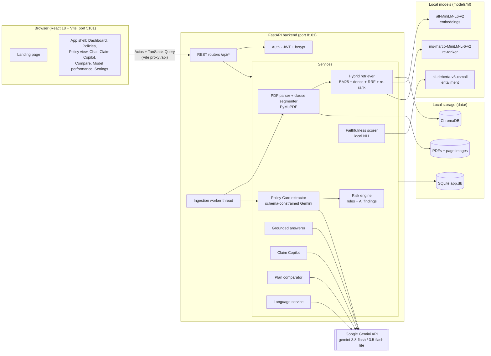
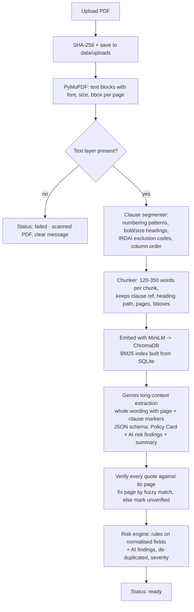
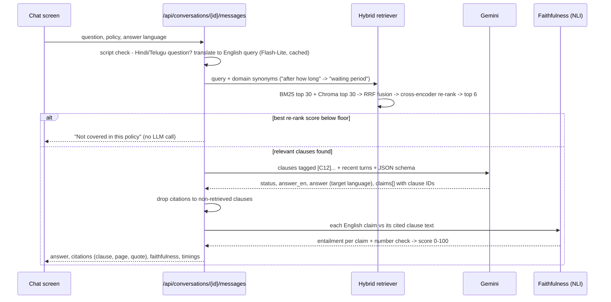

# PolicyLens - Build Plan

PolicyLens reads a person's own health-insurance policy wording, answers questions with exact clause and page citations, flags the fine print that costs money at claim time, and walks the user through a claim.

This plan covers architecture, modules, data model, API, AI pipeline, screens, milestones and risks. It is the working reference for the build.

---

## 1. Target machine (checked)

| Item | Found | Status |
|---|---|---|
| OS | Windows 11 Pro 10.0.26200 | OK |
| CPU / RAM | Intel i5-12500 (6C/12T), 15.7 GB | OK - all local models are small CPU models |
| GPU | Intel UHD 770 (no CUDA) | OK - nothing needs a GPU |
| Python | 3.11.9 (`py -3.11`); launcher default is 3.14 | OK - scripts call `py -3.11` explicitly |
| Node.js | v24.19.0 (LTS), npm 11.17 | OK |
| Git | 2.55 + Git LFS 3.7.1 | OK |
| Docker | 29.7.2 | Present, **not used** - nothing needs it |
| Free disk | D: 89 GB, C: 184 GB | OK - about 2.5 GB needed (venv, node_modules, model weights) |

---

## 2. Architecture



**Design principles**

- **One process, one machine.** FastAPI + Uvicorn serves the API; a background thread handles PDF ingestion so uploads return immediately. No queues, no containers.
- **Grounded or silent.** The LLM only sees retrieved clauses and must cite them by ID. The backend rejects citations to clauses that were not retrieved. A local model scores every answer's faithfulness, independently of the LLM that wrote it.
- **Quota-aware.** The Gemini free tier has daily limits, so heavy lifting stays local (embeddings, re-ranking, faithfulness). Gemini results are cached by content hash, and calls retry with backoff and fall back to the Flash-Lite model.
- **Traceable.** Every extracted value, risk flag, answer sentence and claim step carries a clause ID and page number. The UI can open the PDF page with that clause highlighted.

### 2.1 Ingestion pipeline (F1, F2, F4, F7)



Status moves `queued -> parsing -> indexing -> extracting -> ready` (or `failed`). The UI polls and shows each step. If Gemini is unavailable, the policy still becomes searchable. The Policy Card then shows an error with a **Retry extraction** button.

### 2.2 Question answering (F3, F4, F8, F9)



---

## 3. Modules mapped to features

| Feature | Backend modules (`backend/app/...`) | Frontend (`frontend/src/...`) |
|---|---|---|
| **F1** Policy upload and parsing | `services/pdf_parser.py`, `services/segmenter.py`, `services/chunker.py`, `services/ingestion.py` (worker), `api/policies.py` | `pages/Policies.tsx`, `components/policy/UploadDropzone.tsx`, `components/policy/PdfPageViewer.tsx` |
| **F2** Policy Card | `services/extractor.py`, `schemas/policy_card.py` (JSON schema), `services/quote_verifier.py` | `components/policy/PolicyCard.tsx`, `pages/PolicyView.tsx` |
| **F3** Clause-grounded chat | `services/answerer.py`, `api/conversations.py`, `services/prompts/` | `pages/Chat.tsx`, `components/chat/*` (message, citation chip, clause drawer) |
| **F4** Hybrid retrieval | `ml/retrieval/bm25_index.py`, `ml/retrieval/dense_index.py` (Chroma), `ml/retrieval/fusion.py` (RRF), `ml/retrieval/reranker.py`, `ml/retrieval/hybrid.py` | `components/policy/ClauseSearch.tsx` (shows BM25 / dense / re-rank scores) |
| **F5** Claim Copilot | `services/claim_copilot.py`, `services/eligibility.py` (deterministic waiting-period and cost checks), `api/claims.py` | `pages/ClaimCopilot.tsx` (4-step wizard), `components/claims/*` |
| **F6** Plan comparison | `services/comparator.py` (field-by-field + AI trade-offs), `api/comparisons.py` | `pages/Compare.tsx` |
| **F7** Risk highlights | `services/risk_engine.py` (rules + AI findings, severity) | `components/policy/RiskHighlights.tsx` |
| **F8** Multilingual answers | `services/language.py` (script detection, query translation, cached translation of cards and risks) | `pages/Settings.tsx`, language switch in chat and Claim Copilot, Noto Sans Devanagari/Telugu fonts |
| **F9** Faithfulness score | `ml/faithfulness.py` (NLI claim-vs-clause entailment + numeric consistency) | `components/chat/FaithfulnessBadge.tsx` (score + per-claim breakdown) |
| Shared | `core/config.py`, `core/security.py`, `core/db.py`, `core/logging.py`, `services/gemini_client.py` (retry, backoff, fallback, usage log), `services/seed.py` | `lib/api.ts`, `lib/auth.tsx`, `components/ui/*` (shadcn), `components/layout/*` |
| Dashboard, model performance | `api/dashboard.py`, `api/evaluation.py` | `pages/Dashboard.tsx`, `pages/ModelPerformance.tsx` |

### Feature detail

- **F1**: Parsing uses `page.get_text("dict")` for blocks, fonts and bounding boxes. Blocks are sorted in reading order, including two-column layouts. Running headers and footers that repeat on most pages are removed. The segmenter recognises `1.`, `4.2.1`, `(a)`, `(iv)`, `Section C`, `Code-Excl01`-style references and bold or larger headings, and builds a heading path such as *Exclusions > Specific waiting periods > 3.2*. Each chunk keeps page numbers and bounding boxes. The **original PDF** can be opened in the browser's own viewer. The in-app viewer shows server-rendered page images (PyMuPDF) with the cited clause highlighted, so no extra PDF library is needed in the frontend.
- **F2**: The Policy Card is extracted in one long-context Gemini call with a Pydantic JSON schema. It includes insurer, product, UIN / policy number, policy type, sum insured options, deductible, co-pay (general, age-based, zone-based), room-rent and ICU limits, waiting periods (initial, pre-existing, specific diseases, maternity), sub-limits, pre/post-hospitalisation days, day care, ambulance, restoration, no-claim bonus, key exclusions, claim intimation timelines, free-look and grace periods. Every field is `{value, normalised, clause_id, page, quote, verified}`. The same call also returns a plain-language summary and recommended next actions. Results are cached by `(pdf sha256, model, prompt version)`.
- **F3**: Answers have a status of `answered`, `partial` or `not_in_policy`. The model must say *"This isn't covered in this policy"* when the retrieved clauses don't address the question. Clicking a citation opens the page with the clause highlighted. Follow-up questions use the last turns of the conversation.
- **F4**: The retriever runs BM25 (rank-bm25, domain tokeniser and synonym map) and dense MiniLM search in ChromaDB (cosine, filtered by policy). It fuses the two with Reciprocal Rank Fusion, then re-ranks with a cross-encoder. Setting `EMBEDDING_PROVIDER=gemini` switches dense search to `gemini-embedding-001` in a separate collection.
- **F5**: The wizard collects **policy -> treatment -> details** (planned or emergency, cashless or reimbursement, policy start date, age, pre-existing condition, estimated cost, room type). Retrieval runs templated sub-queries (coverage, exclusions, waiting periods, sub-limits, claim procedure, documents) and merges the results. Gemini returns a verdict (**covered / partly covered / not covered / need more information**) with cited reasons, eligibility pre-checks, a document checklist and numbered steps with timelines. A deterministic engine checks waiting periods against the start date and estimates out-of-pocket cost from co-pay, deductible and sub-limits (labelled as an estimate). Checklist ticks are saved.
- **F6**: The comparison shows two ready policies field by field with normalised values and a "better" marker where the direction is clear (lower waiting period or co-pay, higher sum insured). It also shows risk counts by severity and AI trade-offs: an overall summary, *choose A if...*, *choose B if...* and next actions, each citing clauses from both policies.
- **F7**: Rules run on normalised fields. Examples: co-pay of 20% or more is *high*; pre-existing waiting of 36 months or more is *high* and 24 months is *medium*; a room-rent cap with proportionate deduction is *high*; zone co-pay, sub-limits on common procedures and short intimation windows are *medium*. The rules are merged with AI-found gotchas, and each flag has a severity, an explanation, a clause and a page.
- **F8**: Supported languages are English, Hindi and Telugu. The user sets a default in Settings and can override it per question. Gemini returns the English and target-language answers in one call, so faithfulness is always scored on the English text. Clause quotes stay in the policy's original English. Cards and risk lists are translated on demand and cached.
- **F9**: The answer is split into claims, and each claim is checked against its cited clauses with a local NLI cross-encoder (max entailment over sentence windows). Numbers in a claim (months, %, amounts) must appear in the cited text. The score is shown as 0-100 with a label (*well supported* >= 80, *partly supported* 50-79, *weakly supported* < 50) and a per-claim breakdown.

---

## 4. Database (SQLite via SQLAlchemy 2.x, `data/app.db`)

| Table | Key columns |
|---|---|
| `users` | id, email (unique), full_name, password_hash, language (`en`/`hi`/`te`), theme, created_at |
| `policies` | id, owner_id -> users, display_name, insurer, product_name, file_path, sha256, page_count, status, status_detail, error, is_sample, extraction_model, created_at, processed_at |
| `clauses` | id, policy_id, ordinal, clause_ref, heading_path, text, page_start, page_end, bboxes (JSON), word_count |
| `policy_cards` | id, policy_id (unique), data (JSON fields with source), summary (JSON), model, prompt_version, created_at |
| `risk_flags` | id, policy_id, title, category, severity (`high`/`medium`/`low`), explanation, clause_id, page, source (`rule`/`ai`) |
| `translations` | id, source_type, source_id, language, content (JSON), created_at - cache for cards, risks, comparisons |
| `conversations` | id, user_id, policy_id, title, created_at, updated_at |
| `messages` | id, conversation_id, role, content, content_en, language, status, citations (JSON), faithfulness, faithfulness_detail (JSON), retrieval_ms, generation_ms, total_ms, model, created_at |
| `claim_cases` | id, user_id, policy_id, treatment, inputs (JSON), result (JSON), verdict, checklist_state (JSON), language, faithfulness, total_ms, created_at |
| `comparisons` | id, user_id, policy_a_id, policy_b_id, language, result (JSON), created_at |
| `llm_calls` | id, user_id, purpose, model, input_tokens, output_tokens, latency_ms, ok, error, created_at - usage log shown on the dashboard |

Tables are created automatically on first start. `scripts/seed.py` creates the demo user and imports the sample policies from `data/processed/` (sample policies are clearly labelled *Sample*).

---

## 5. API (`/api`, OpenAPI at `http://localhost:8101/docs`)

| Area | Endpoints |
|---|---|
| Health | `GET /api/health` (DB, Chroma, local models, Gemini configured) |
| Auth | `POST /api/auth/register`, `POST /api/auth/login`, `GET /api/auth/me`, `PATCH /api/users/me` (name, language, theme), `POST /api/users/me/password` |
| Policies | `GET /api/policies`, `POST /api/policies` (multipart upload), `POST /api/policies/samples` (add sample policies), `GET /api/policies/{id}`, `GET /api/policies/{id}/status`, `DELETE /api/policies/{id}`, `GET /api/policies/{id}/file`, `GET /api/policies/{id}/pages/{n}` (PNG), `GET /api/policies/{id}/clauses?page=`, `GET /api/policies/{id}/clauses/{clause_id}` |
| Card and risks | `GET /api/policies/{id}/card?lang=`, `POST /api/policies/{id}/extract` (re-run), `GET /api/policies/{id}/risks?lang=` |
| Retrieval | `POST /api/policies/{id}/search` (query -> ranked clauses with BM25, dense, fused and re-rank scores) |
| Chat | `GET /api/conversations`, `POST /api/conversations`, `GET /api/conversations/{id}`, `DELETE /api/conversations/{id}`, `POST /api/conversations/{id}/messages` |
| Claim Copilot | `POST /api/claims`, `GET /api/claims`, `GET /api/claims/{id}`, `PATCH /api/claims/{id}/checklist`, `DELETE /api/claims/{id}` |
| Compare | `POST /api/comparisons`, `GET /api/comparisons`, `GET /api/comparisons/{id}` |
| Dashboard | `GET /api/dashboard/summary` (KPIs + chart series from the user's own activity) |
| Model performance | `GET /api/evaluation/latest`, `GET /api/evaluation/runs`, `GET /api/evaluation/runs/{run}/plots/{file}` |

Errors use a consistent `{"detail": "...", "code": "..."}` shape. Gemini quota errors return `429` with a readable message that the UI shows as a toast.

---

## 6. AI / ML pipeline

No model training is needed. The product combines pre-trained local models with the Gemini API.

| Component | Model | Where it runs | Why |
|---|---|---|---|
| Extraction, answers, Claim Copilot, comparison | `gemini-3.8-flash` (newest free-tier Flash, from `.env`) | Gemini API | Long context (whole policy in one call), JSON-schema output, Hindi/Telugu |
| Light tasks and fallback | `gemini-3.5-flash-lite` | Gemini API | Query translation, fallback when the main model hits its quota |
| Dense embeddings | `sentence-transformers/all-MiniLM-L6-v2` (alt: `gemini-embedding-001`) | Local CPU | Fast, free, deterministic, no quota |
| Re-ranker | `cross-encoder/ms-marco-MiniLM-L-6-v2` | Local CPU | Re-ranks about 20 fused candidates in about 100 ms |
| Faithfulness | `cross-encoder/nli-deberta-v3-xsmall` | Local CPU | An independent check that is not graded by the model that wrote the answer |
| Keyword search | `rank-bm25` (BM25Okapi) | Local | Exact terms: "cataract", "Excl03", "co-payment" |
| Vector store | ChromaDB persistent (`data/chroma/`) | Local | As specified |

All three local models load through `sentence-transformers`, so no new library is needed. `setup.bat` downloads them once into `models/hf/` (about 460 MB). After that the app works offline, apart from Gemini calls.

### 6.1 Evaluation (Objective 6)

- **Evaluation set** (`data/eval/`), written by hand from the sample policies and committed:
  - `qa.jsonl` has **at least 45 question/answer pairs**, each with policy, expected clause references and pages, expected answer, key facts (for example `["24 months", "2 years"]`) and expected coverage verdict. About 6 are deliberately *not answerable* from the policy.
  - `claims.jsonl` has about 12 claim scenarios with an expected verdict.
  - `cards/<policy>.json` holds hand-checked Policy Card values for extraction accuracy.
- **Scripts** (`ml/`):
  - `eval_retrieval.py` (no API calls): Hit@1/3/5, MRR@10 and Recall@5 for **BM25 only, dense only, hybrid RRF and hybrid + re-rank**. This is the ablation that shows the benefit of hybrid retrieval.
  - `eval_answers.py`: answer accuracy (key-fact match + verdict), citation accuracy (expected clause/page among the citations), mean faithfulness and its distribution, abstention accuracy on unanswerable questions, and latency p50/p95 per stage.
  - `eval_claims.py`: verdict accuracy and a confusion matrix.
  - `eval_extraction.py`: field-level accuracy of the Policy Card and the share of verified quotes.
  - `run_all.py`: paced to stay under free-tier rate limits, resumable, and caches every Gemini response.
- **Outputs** go to `experiments/eval-YYYYMMDD-HHMM/`: `metrics.json` (dataset split = full held-out evaluation set, item counts, date, models, settings), `predictions.jsonl`, `eval.log`, and PNG plots (retrieval ablation bars, faithfulness histogram, latency box plot, confusion matrix, extraction accuracy by field). `experiments/latest.json` points to the newest run.
- **In the product**, the **Model performance** page shows these metrics with Recharts and links the PNGs. `notebooks/evaluation_report.ipynb` reproduces the tables and plots.

---

## 7. Screens

| # | Screen | Contents |
|---|---|---|
| 1 | **Landing** | React Bits animated background + text effect, value proposition, *Get started*; GSAP ScrollTrigger "How it works" (Upload -> Understand -> Ask -> Claim) and feature grid; Lenis smooth scroll; live-looking product preview built from real components; footer |
| 2 | **Login / Register** | Validation, password rules, errors, redirect to the page the user came from |
| 3 | **Dashboard** | KPI cards (policies, questions asked, average faithfulness, median response time, claim checks, high-severity risks); Recharts: questions over time, faithfulness distribution, claim verdicts, risks by severity per policy; recent activity |
| 4 | **My policies** | Drag-and-drop upload with live processing steps, policy cards grid, *Add sample policies*, delete with confirmation |
| 5 | **Policy view** | Tabs: *Policy Card* (each value links to its page), *Risk highlights* (severity badges), *Document* (page viewer with clause highlight + *Open original PDF*), *Clause search* (hybrid retrieval explorer) |
| 6 | **Chat** | Policy picker, language switch, conversation list, suggested questions, answers with citation chips, faithfulness badge, clause side drawer |
| 7 | **Claim Copilot** | 4-step wizard -> verdict banner, pre-checks, cost estimate, tickable document checklist, step timeline; saved cases |
| 8 | **Compare** | Pick two policies -> side-by-side table with "better" markers, risk counts, trade-offs, *choose A if / choose B if* |
| 9 | **Model performance** | Retrieval ablation, answer and citation accuracy, faithfulness, latency, extraction accuracy, confusion matrix |
| 10 | **Settings** | Answer language (English / Hindi / Telugu), profile, password, light/dark theme |

Every screen has loading (skeletons), empty and error states, toasts and confirmation dialogs, and works from 360 px upward. The layout is a sidebar on desktop and a sheet menu on phones.

**Brand:** the *PolicyLens* logo is a lens ring over a document with a check mark (SVG). The palette is deep teal (trust and health) with amber for warnings and red/amber/sky severity colours. Type is Plus Jakarta Sans for headings, Inter for body text, and Noto Sans Devanagari/Telugu for Indian scripts. Light and dark themes are included. All motion respects `prefers-reduced-motion`.

---

## 8. Ports, configuration and scripts

- Backend **8101**, frontend **5101** (`strictPort: true`). No extra services, so the 11010-11019 range is unused.
- `.env.example` lists `GEMINI_API_KEY`, `GEMINI_MODEL`, `GEMINI_LITE_MODEL`, `EMBEDDING_PROVIDER`, `JWT_SECRET`, `JWT_EXPIRE_MINUTES`, `BACKEND_PORT`, `FRONTEND_PORT`, `CORS_ORIGINS`, `DATA_DIR`, `MODELS_DIR`, `MAX_UPLOAD_MB`, `LLM_MAX_RPM`, `LOG_LEVEL`, `DEMO_EMAIL`, `DEMO_PASSWORD`.
- `setup.bat` checks Python 3.11 and Node, creates `venv`, installs backend requirements (CPU PyTorch), downloads the local models, runs `npm ci`, creates `.env` from the example (generating a JWT secret), and initialises and seeds the database and indexes.
- `run.bat` checks that ports 8101 and 5101 are free, starts the backend and frontend in two windows, waits for `/api/health`, and opens the browser.
- `scripts/reset.bat` deletes runtime data (DB, index, uploads) and re-seeds.

---

## 9. Folder structure

```
8.ProjectCode/
  backend/        app/api, app/core, app/models, app/schemas, app/services, app/ml; tests/; requirements.txt
  frontend/       src/pages, src/components (ui, layout, policy, chat, claims, reactbits), src/lib; vite.config.ts
  ml/             retrieval ablation, answer / claim / extraction evaluation, run_all.py
  notebooks/      evaluation_report.ipynb
  experiments/    eval-YYYYMMDD-HHMM/ (metrics.json, predictions.jsonl, plots, eval.log), latest.json
  models/         manifest.json (model IDs, revisions, licences); hf/ (downloaded weights)
  data/           policies/ (sample PDFs), processed/ (parsed clauses + cards), eval/, app.db, chroma/, uploads/
  scripts/        seed.py, download_models.py, process_samples.py, check_setup.py, reset.bat
  docs/           PLAN.md + 01..11 documentation
  setup.bat  run.bat  .env.example  .gitignore  README.md
```

---

## 10. Milestones

| Phase | Deliverable | Commit |
|---|---|---|
| 3 Foundations | Skeleton, `setup.bat` / `run.bat`, FastAPI app, DB models, auth, seed user, React shell (routing, theme, sidebar, auth pages) | "Add project foundations" |
| 4 Data and AI | Parser, segmenter, chunker, Chroma + BM25 + RRF + re-ranker, Gemini client, extractor, faithfulness scorer, processed sample policies, evaluation set, evaluation scripts, first evaluation run, backend tests | "Add retrieval and evaluation" |
| 5 Features | F1 upload + viewer -> F2 card -> F7 risks -> F3/F4/F9 chat -> F5 Claim Copilot -> F6 compare -> F8 languages -> dashboard + model performance | One commit per major feature |
| 6 Polish | Animated landing page, micro-interactions, responsive and accessibility pass, empty and error states | "Add animated landing page" |
| 7 Test | pytest, `npm run build`, full demo scenario from a fresh `run.bat`, fixes | "Pass end-to-end checks" |
| 8 Docs | `docs/01..11`, README, copy of HOW_TO_RUN | "Add product documentation" |

---

## 11. Risks and mitigations

| Risk | Mitigation |
|---|---|
| Gemini free-tier daily and per-minute limits | Local embeddings, re-ranking and faithfulness; cache by content hash; client-side RPM limiter; retry with backoff; Flash-Lite fallback; evaluation runs are paced and resumable; clear "quota reached" message in the UI |
| Policy PDFs vary (two columns, tables, headers, scans) | Reading-order sort, header/footer removal, paragraph-level fallback when numbering is missing; scanned PDFs are detected and rejected with an explanation (OCR is out of scope) |
| LLM invents coverage | Answers see only retrieved clauses; citations are validated; an abstention floor on re-rank score; independent NLI faithfulness score; numbers checked against the cited text |
| Extracted value on the wrong page | Every quote is fuzzy-matched to page text; the page is corrected or the value is marked *unverified* in the card |
| Hindi/Telugu retrieval with English-only embeddings | Non-Latin questions are translated to an English search query first; answers come back in the chosen language; faithfulness is scored on the English version |
| `passlib` breaks with new `bcrypt` releases | Pin `bcrypt==4.0.1` |
| Large first-time downloads (PyTorch CPU, models) | Done once by `setup.bat` with progress; everything is cached locally afterwards |
| ChromaDB default embedding function downloads its own model | We always pass our own embeddings; the default function is disabled |
| Port clashes with other local products | Fixed ports, `strictPort`, `run.bat` checks ports first |
| Shared git repository | Commit only this folder with `git commit -- .`; retry on `index.lock` |

---

## 12. Decisions to confirm

1. **Gemini models:** `gemini-3.8-flash` as the main model (the newest free-tier Flash listed today) and `gemini-3.5-flash-lite` for light tasks and fallback. Both will be verified against your key in Phase 2.
2. **Local model weights** (about 460 MB, one file about 280 MB) are downloaded by `setup.bat` into `models/hf/` and **not committed**. They are third-party weights and one file is over the 100 MB limit. `models/manifest.json` records exact IDs and revisions. Committing them would need Git LFS.
3. **Runtime state** (`data/app.db`, `data/chroma/`, `data/uploads/`, rendered page images) is **not committed**. It changes on every run and holds password hashes. The valuable outputs are committed instead: sample PDFs, `data/processed/` (parsed clauses + extracted cards) and `data/eval/`. `setup.bat` rebuilds the DB and index from them without any API calls.
4. **Extra local models:** the re-ranker and the NLI faithfulness checker are additional pre-trained models, loaded through the `sentence-transformers` library that is already in the stack.
5. **PDF viewer:** server-rendered page images (PyMuPDF) with highlight overlays, plus the browser's own viewer for the original PDF. No additional frontend PDF library.
