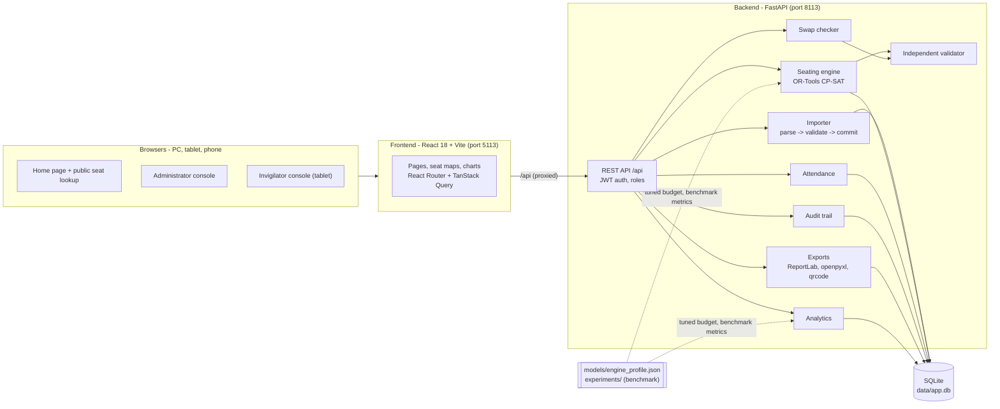
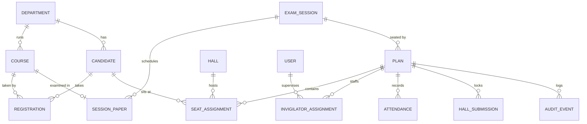
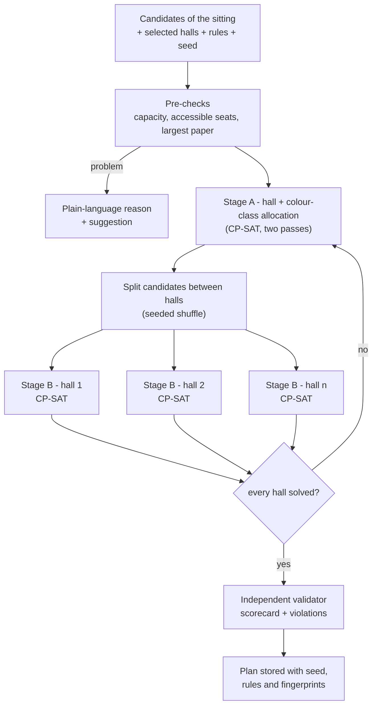
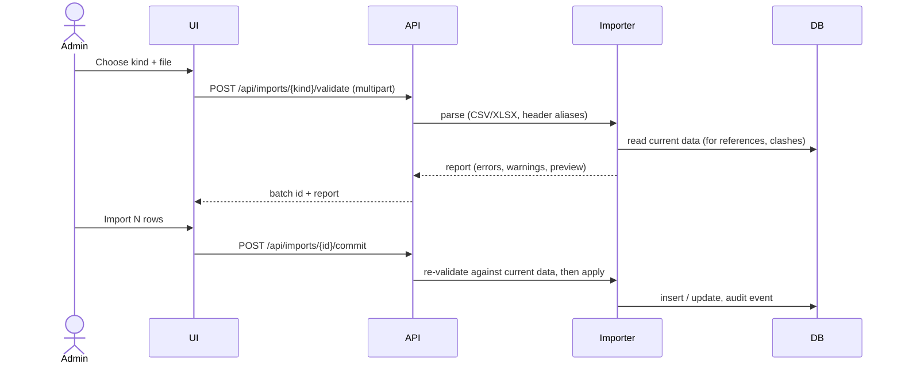
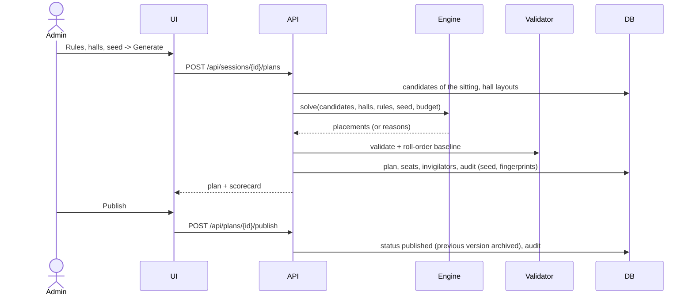
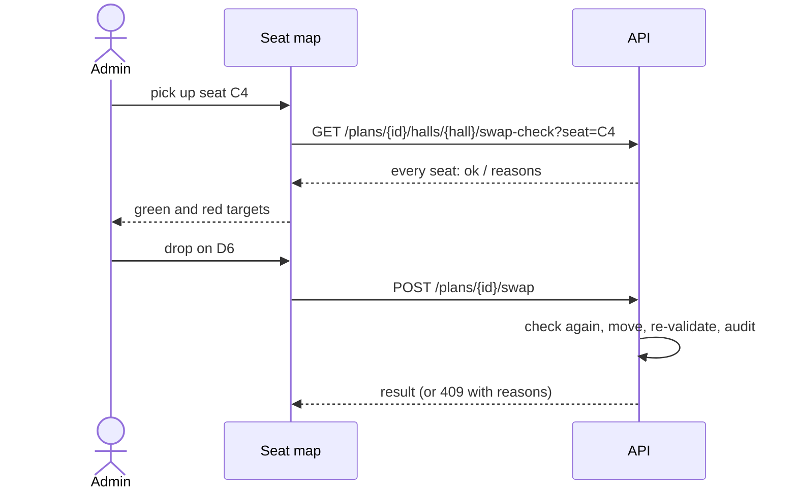
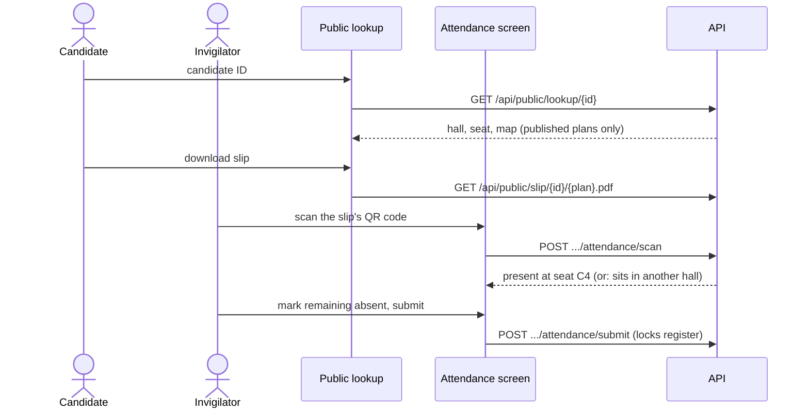

# Architecture

SeatWise is a single-machine web product: a **FastAPI** backend with an **SQLite** database, and a **React** frontend served by **Vite**. Everything runs offline once installed.

## Components

- The browser only talks to port **5113**. The Vite server forwards `/api` to the backend on **8113**, so tablets and phones need a single address.
- The backend owns every rule. The frontend never decides whether a seat move is legal: it asks the API, so the seat map, the exports and the benchmark all apply identical checks.
- A plan is always re-checked by the **independent validator** (plain Python, no solver) before it is stored.

## Data model

| Table | Purpose |
|---|---|
| `users` | Administrators and invigilators (bcrypt password hash, role, status active/pending/disabled). |
| `departments`, `courses` | Course catalogue. |
| `candidates`, `registrations` | Candidates and the courses each one sits. |
| `halls` | Rows x columns, blocked seats, accessible seats, aisles, availability. |
| `exam_sessions`, `session_papers` | The timetable: sittings and the courses in each (with optional shared-paper group). |
| `plans` | A seating plan version: status, seed, rules, fingerprints, solve time, scorecard, roll-order baseline. |
| `seat_assignments` | Candidate -> hall, row, column, seat label. |
| `invigilator_assignments` | Who supervises which hall in a plan. |
| `attendance`, `hall_submissions` | Marks per candidate and the lock when a register is submitted. |
| `import_batches` | Every upload with its validation report. |
| `audit_events` | Append-only log of plans, seeds, moves, publications, imports, exports and attendance. |
| `settings` | Default seating rules. |

The database file is created automatically on first start (`SQLAlchemy create_all`).

## The seating engine

Code: `backend/app/services/engine/`.

1. **Seat graph and colouring.** Each hall is a graph: seats are nodes, and neighbouring seats are joined. There are 8 neighbours by default, including diagonals; aisles and blocked seats remove edges. SeatWise colours the grid by (row parity, column parity) - 4 classes, or 2 with 4-neighbour adjacency. Seats of one class are never neighbours.
2. **Stage A - allocation (CP-SAT).** It decides how many candidates of each (paper, department, accessible-need) group go to each hall, and which colour class each paper uses in each hall. Confining a paper to one class per hall makes same-paper neighbours impossible *by construction*.
   - The compact strategy first picks the fewest, largest halls that provably fit.
   - Pass 1 then minimises peak fill and spreads papers and departments.
   - Pass 2 keeps that optimum and follows seeded random weights, so which class a paper gets cannot be predicted.
3. **Stage B - seat layout per hall (CP-SAT).** `x[candidate, seat]` booleans, restricted to the candidate's class and to accessible seats for those who need them. Constraints: one seat per candidate and at most one candidate per seat. Roll-number spacing is enforced by "if A sits on s, B sits on none of s's neighbours" clauses. The objective minimises same-department neighbours, then maximises a seeded random weight, so the result is one random valid layout. Halls are solved **in parallel threads**, each with one deterministic worker.
4. **Recovery.** A hall that finds nothing within its budget gets one try with four times the budget. If it still fails, Stage A re-balances with that hall eased (bounded retries).
5. **Validation.** `validator.py` re-checks every rule without the solver and produces the scorecard (placed, same-paper pairs, roll-gap violations, accessible misses, same-department pairs, utilisation, per-hall figures).

**Reproducibility.** Every sub-seed is derived from the plan seed with SHA-256, CP-SAT uses one worker per hall with a *deterministic* time budget, and candidates are processed in a fixed order. As a result, the same data, rules, seed and engine version give the same plan. The plan stores:

| Field | Contents |
|---|---|
| `data_fingerprint` | SHA-256 of the inputs, rules and budget |
| `solver_hash` | SHA-256 of what the engine produced |
| `assignment_hash` | SHA-256 of the current seating, which changes after manual moves |

**Verify** re-runs the engine and compares the hashes.

## Main flows

### Import

### Generate and publish a plan

### Move a candidate on the seat map

### On the day

## Security

- Passwords are hashed with bcrypt. Sign-in issues a signed JWT (HS256) whose secret lives only in `.env`.
- Roles: administrators do everything; invigilators only see and mark the halls they are assigned to in published plans.
- Public endpoints expose published seats only, a shortened name ("Maya F.") and no email or date of birth. They are rate-limited per device.
- Every change that matters is written to the append-only audit trail.

## Technology

| Layer | Technology |
|---|---|
| Frontend | React 18, TypeScript, Vite, Tailwind CSS, shadcn/ui (Radix), Lucide icons, React Router, TanStack Query, Axios, Motion, GSAP + ScrollTrigger, Lenis, React Bits, Recharts, dnd-kit, sonner |
| Backend | Python 3.11, FastAPI, Uvicorn, Pydantic v2, SQLAlchemy 2, SQLite, PyJWT, passlib/bcrypt, python-dotenv |
| Engine and outputs | Google OR-Tools CP-SAT, NumPy, pandas, openpyxl, ReportLab, qrcode, matplotlib (benchmark plots) |
| Tests | pytest (backend), TypeScript type checks and production build (frontend), `scripts/demo_scenario.py` |
