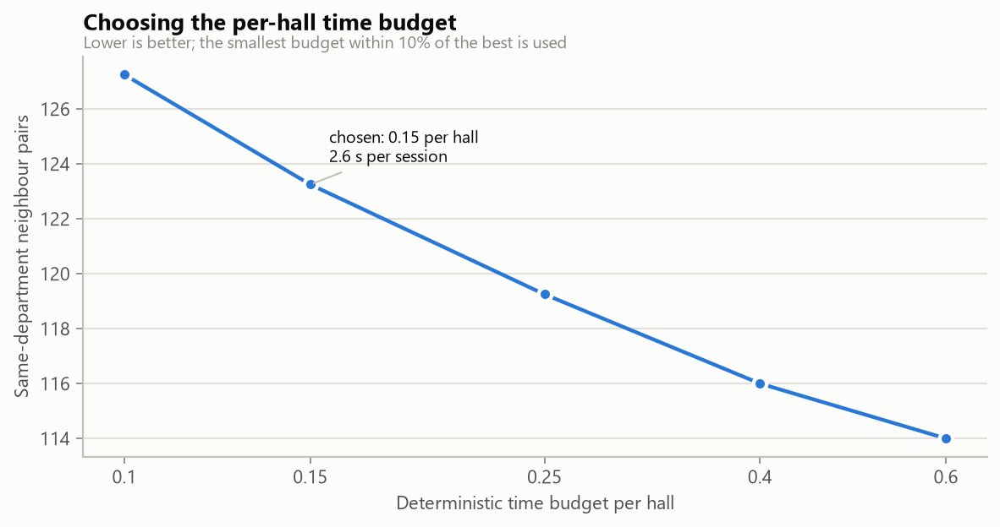
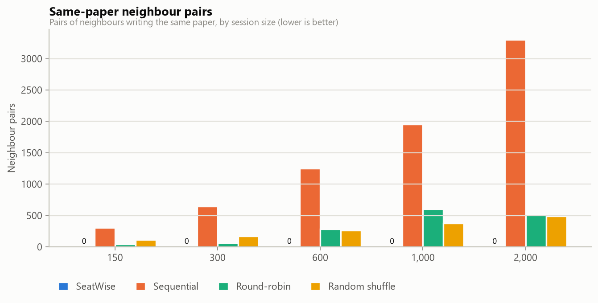
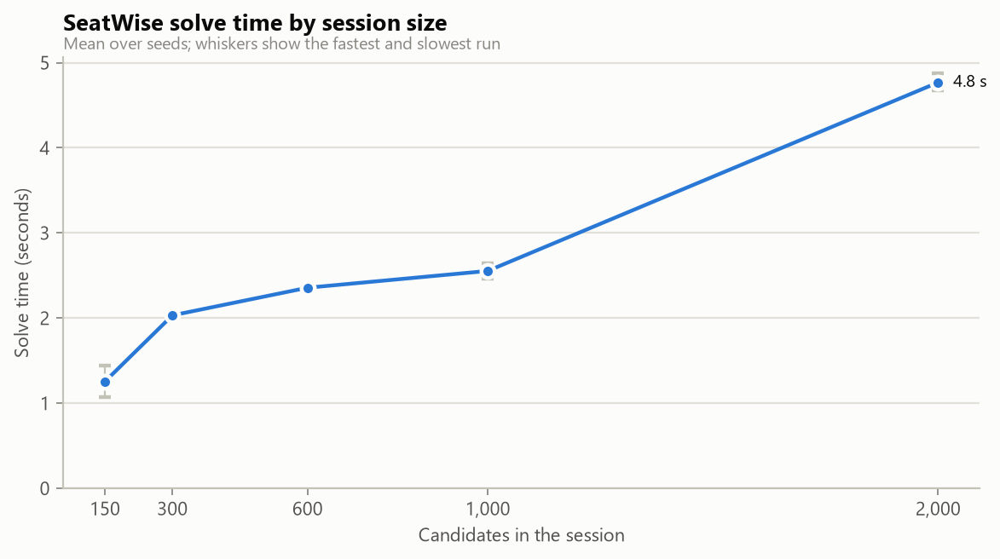
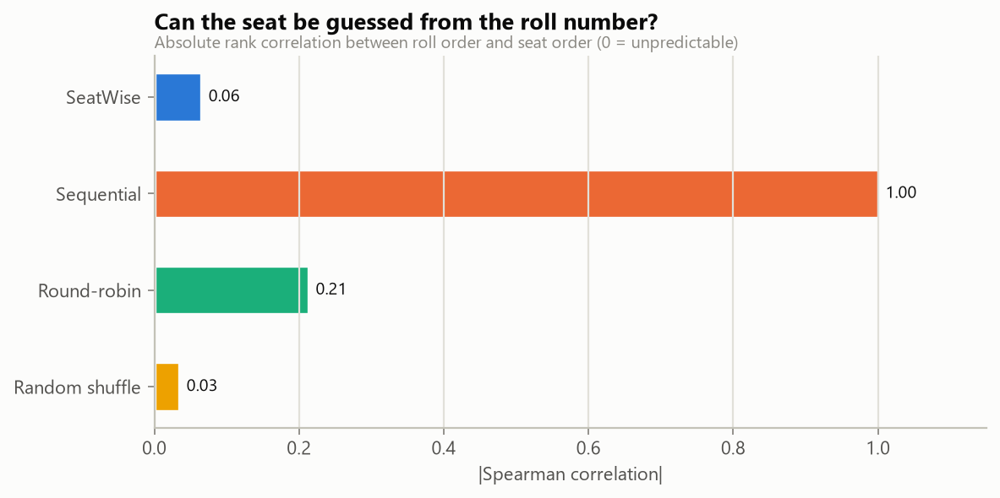
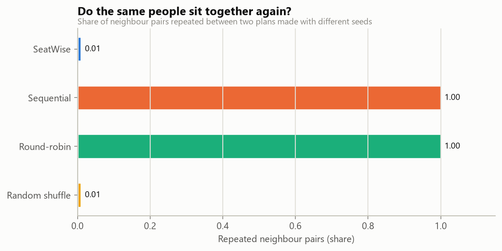
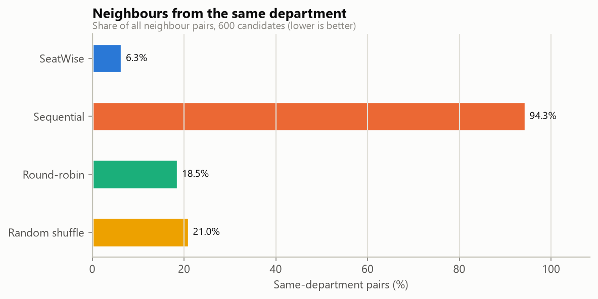
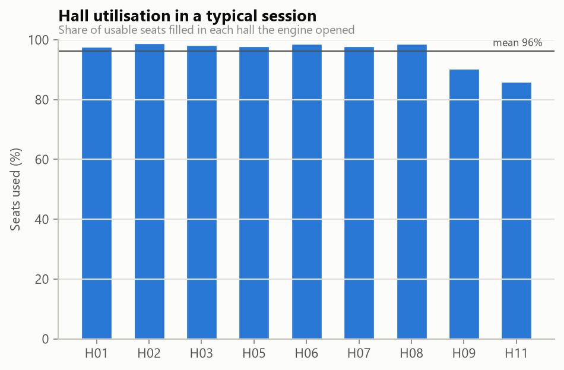

# Models and evaluation

SeatWise has **no trained model**. Its core is an optimisation engine: Google OR-Tools **CP-SAT** in two stages (hall and colour-class allocation, then seat layout per hall), followed by an independent validator. How it works is in [02_ARCHITECTURE.md](02_ARCHITECTURE.md#the-seating-engine).

Because nothing is trained, the engine is **benchmarked**. The benchmark:

- runs the engine on seeded synthetic exam sessions;
- validates every plan independently;
- compares the engine with the ways seating is usually done by hand;
- tunes the one engine setting that matters for speed, the per-hall time budget.

## What is measured

| Measure | Meaning | Target |
|---|---|---|
| Same-paper neighbour pairs | Neighbouring seats (8 around each seat) whose candidates write the same paper | **0** |
| Roll-gap violations | Neighbours whose roll numbers (same prefix) are closer than the gap | **0** |
| Accessible missed | Candidates needing an accessible seat who are not on one | **0** |
| Hard rules met | Share of plans with all three above at 0 and everyone seated | **100%** |
| Solve time | Wall-clock seconds from request to a validated plan | seconds |
| Same-department pairs | Neighbours from one department (a preference, minimised) | low |
| Roll-to-seat correlation | Spearman rank correlation between roll order and seat order | about 0 |
| Repeated neighbour pairs | Share of neighbour pairs that recur when the plan is regenerated with another seed | as low as random |
| Front-row bias | Largest gap between a department's share of front-row seats and its share of candidates, over all seeds | small |

### Baselines

| Method | How it seats |
|---|---|
| **Sequential** | Roll-number order, row by row - the classic spreadsheet plan |
| **Round-robin** | Papers interleaved in a repeating cycle - the usual improved manual plan |
| **Random shuffle** | A random permutation, no rules |

The baselines live in `backend/app/services/engine/baselines.py`. The product uses the sequential baseline for its "conflicts avoided" figure.

## How to run it

```bat
venv\Scripts\python -m ml.benchmark           :: full run (about 7 minutes): 8 scenarios x 4 methods x 3 seeds,
                                              :: predictability over 6 seeds, budget tuning
venv\Scripts\python -m ml.benchmark --quick   :: smoke run (under a minute)
```

Each run writes `experiments/engine-benchmark-<date>/`:

| File | Contents |
|---|---|
| `metrics.json` | Scenario list and seeds, run date, engine and OR-Tools versions, machine, headline, per scenario/method summary, predictability, tuning |
| `results.csv` | Every single run |
| `benchmark.log` | The run log |
| `*.png` | The charts below |

A full run also rewrites `models/engine_profile.json` (the tuned per-hall budget), which the product loads at start-up. The product shows the run under **Analytics > Engine performance**. The notebook `notebooks/engine_benchmark.ipynb` shows the same results and includes a live example.

## Settings

| Setting | Value | Where |
|---|---|---|
| Per-hall deterministic budget (Stage B) | **0.15**, tuned | `models/engine_profile.json` (override: `SOLVER_HALL_BUDGET` in `.env`) |
| Stage A budget | 0.3 (pass 2: half) | `engine.py` |
| Workers per hall | 1 (deterministic) | `engine.py` |
| Halls solved in parallel | all CPU threads | `SOLVER_THREADS` in `.env` |
| Random weight range (Stage B) | 0-19 per candidate-seat | `stage_b.py` |
| Re-balancing retries | 5 | `SOLVER_MAX_RETRIES` in `.env` |

### Tuning the per-hall budget

The budget trades department mix, a soft preference, against speed. The benchmark tries five budgets on the 600- and 1,000-candidate scenarios with two seeds each, and picks **the fastest budget whose department mix is within 10% of the best seen**. Every budget met every hard rule.

| Per-hall budget | Same-dept. pairs (mean) | Session solve (s) | Hard rules |
|---|---|---|---|
| 0.1 | 127.2 | 3.72 | all met |
| **0.15 (chosen)** | 123.2 | 2.63 | all met |
| 0.25 | 119.2 | 3.56 | all met |
| 0.4 | 116.0 | 5.01 | all met |
| 0.6 | 114.0 | 6.58 | all met |

The smallest budget (0.1) is slower overall because some halls run out of time and are re-solved with a larger budget.



## Results

Run `engine-benchmark-20260921`, on 21 Sept 2026. The machine was a 12-thread Intel desktop running Windows 11, with Python 3.11.9 and OR-Tools 9.15.6755.

**Data split:** not applicable - nothing is trained; every scenario is an evaluation case. The seeds used were 11, 12 and 13, plus 21-26 for predictability.

### Scenarios

| Scenario | Candidates | Papers | Halls available | Adjacency | Roll gap |
|---|---|---|---|---|---|
| xs-150 | 150 | 4 | 3 (212 seats) | 8 | 5 |
| s-300 | 300 | 6 | 6 (398 seats) | 8 | 5 |
| m-600 | 600 | 8 | 12 (752 seats) | 8 | 5 |
| l-1000 | 1,000 | 10 | 19 (1,359 seats) | 8 | 5 |
| xl-2000 | 2,000 | 14 | 39 (2,522 seats) | 8 | 5 |
| m-600-adj4 | 600 | 8 | 12 (752 seats) | 4 | 5 |
| m-600-gap0 | 600 | 8 | 12 (752 seats) | 8 | 0 |
| m-600-gap10 | 600 | 8 | 12 (752 seats) | 8 | 10 |

### Headline

| Result | Value |
|---|---|
| Plans meeting every hard rule | **24 of 24 (100%)** |
| Same-paper neighbours, SeatWise | **0** in every run |
| Same-paper neighbours, sequential seating (600 candidates) | 1,253 |
| Solve time, 600 candidates | **2.4 s** (mean) |
| Solve time, 2,000 candidates | **4.8 s** |
| Roll-to-seat correlation | **0.065** (sequential 1.000) |
| Neighbour pairs repeated with a new seed | **1.0%** (sequential and round-robin 100%) |

### Every scenario and method (means over 3 seeds)

| Scenario | Method | Solve (s) | Same-paper pairs | Roll-gap violations | Accessible missed | Same-dept. pairs | Halls used | Seats filled | Hard rules met |
|---|---|---|---|---|---|---|---|---|---|
| xs-150 | SeatWise | 1.25 | 0 | 0 | 0 | 23 | 3.0 | 71% | 100% |
| xs-150 | Sequential | 0.00 | 307 | 122 | 3 | 405 | 3.0 | 71% | 0% |
| xs-150 | Round-robin | 0.00 | 41 | 44 | 3 | 93 | 3.0 | 71% | 0% |
| xs-150 | Random shuffle | 0.00 | 116 | 21 | 3 | 164 | 3.0 | 71% | 0% |
| s-300 | SeatWise | 2.03 | 0 | 0 | 0 | 7 | 5.0 | 82% | 100% |
| s-300 | Sequential | 0.00 | 648 | 231 | 3 | 803 | 5.0 | 100% | 0% |
| s-300 | Round-robin | 0.00 | 63 | 56 | 3 | 111 | 5.0 | 100% | 0% |
| s-300 | Random shuffle | 0.00 | 171 | 21 | 3 | 221 | 5.0 | 100% | 0% |
| m-600 | SeatWise | 2.36 | 0 | 0 | 0 | 109 | 9.0 | 96% | 100% |
| m-600 | Sequential | 0.00 | 1253 | 453 | 6 | 1648 | 10.0 | 97% | 0% |
| m-600 | Round-robin | 0.00 | 281 | 198 | 7 | 324 | 10.0 | 97% | 0% |
| m-600 | Random shuffle | 0.00 | 265 | 23 | 7 | 366 | 10.0 | 97% | 0% |
| l-1000 | SeatWise | 2.55 | 0 | 0 | 0 | 190 | 12.0 | 96% | 100% |
| l-1000 | Sequential | 0.00 | 1954 | 755 | 11 | 2801 | 14.0 | 97% | 0% |
| l-1000 | Round-robin | 0.00 | 607 | 408 | 12 | 687 | 14.0 | 97% | 0% |
| l-1000 | Random shuffle | 0.00 | 376 | 21 | 12 | 617 | 14.0 | 97% | 0% |
| xl-2000 | SeatWise | 4.77 | 0 | 0 | 0 | 597 | 28.0 | 97% | 100% |
| xl-2000 | Sequential | 0.00 | 3299 | 1528 | 16 | 5768 | 29.0 | 99% | 0% |
| xl-2000 | Round-robin | 0.00 | 511 | 351 | 16 | 932 | 29.0 | 99% | 0% |
| xl-2000 | Random shuffle | 0.00 | 490 | 18 | 16 | 1008 | 29.0 | 99% | 0% |
| m-600-adj4 | SeatWise | 6.02 | 0 | 0 | 0 | 12 | 9.0 | 96% | 100% |
| m-600-adj4 | Sequential | 0.00 | 704 | 453 | 6 | 924 | 10.0 | 97% | 0% |
| m-600-adj4 | Round-robin | 0.00 | 216 | 166 | 7 | 233 | 10.0 | 97% | 0% |
| m-600-adj4 | Random shuffle | 0.00 | 145 | 12 | 7 | 205 | 10.0 | 97% | 0% |
| m-600-gap0 | SeatWise | 2.31 | 0 | 0 | 0 | 108 | 9.0 | 96% | 100% |
| m-600-gap0 | Sequential | 0.00 | 1253 | 0 | 6 | 1648 | 10.0 | 97% | 0% |
| m-600-gap0 | Round-robin | 0.00 | 281 | 0 | 7 | 324 | 10.0 | 97% | 0% |
| m-600-gap0 | Random shuffle | 0.00 | 265 | 0 | 7 | 366 | 10.0 | 97% | 0% |
| m-600-gap10 | SeatWise | 2.42 | 0 | 0 | 0 | 104 | 9.0 | 96% | 100% |
| m-600-gap10 | Sequential | 0.00 | 1253 | 921 | 6 | 1648 | 10.0 | 97% | 0% |
| m-600-gap10 | Round-robin | 0.00 | 281 | 252 | 7 | 324 | 10.0 | 97% | 0% |
| m-600-gap10 | Random shuffle | 0.00 | 265 | 48 | 7 | 366 | 10.0 | 97% | 0% |

The baselines fill halls in the order given, so they sometimes use one more hall than SeatWise's compact strategy.





### Unpredictability and fairness (600 candidates, 6 seeds)

| Method | Roll-to-seat correlation | Repeated neighbour pairs | Front-row bias (percentage points) |
|---|---|---|---|
| SeatWise | 0.065 | 1.0% | 4.7 |
| Sequential | 1.000 | 100.0% | 12.4 |
| Round-robin | 0.213 | 100.0% | 3.4 |
| Random shuffle | 0.034 | 1.0% | 1.6 |

SeatWise is as unpredictable as a pure random shuffle: neighbours almost never repeat, and roll order says nothing about the seat. Unlike the shuffle, it keeps every rule.

Its front-row bias is small but higher than a shuffle's. A paper occupies one colour class per hall, and only two of the four classes include the front row. Which paper gets which class is itself random, so the bias shrinks as more plans are drawn.









## Observations

- **Correctness is structural.** Stage A confines each paper to one colour class per hall, and seats of a class are never neighbours. Same-paper neighbours are therefore impossible before Stage B starts, which is why no run has any.
- **4-neighbour adjacency is slower** (6.0 s vs 2.4 s). Its two colour classes each cover half the hall, so Stage B has twice as many seat choices per candidate. It gives far fewer same-department neighbours for the same reason.
- **Scaling is close to linear** in the number of halls. Halls are solved in parallel, and most of the time goes to the deterministic per-hall budget.
- **Reproducibility.** Re-running with the stored seed reproduces the plan exactly. The product's **Verify** button and the test suite both check this.

## In the product

- **Plan page:** solve time, rules met, conflicts avoided compared with roll order, the fingerprints and **Verify**.
- **Analytics > Plans:** the roll-order comparison, seats filled per hall, departments per hall and attendance.
- **Analytics > Engine performance:** everything in this document, read from the run in `models/engine_profile.json`.
