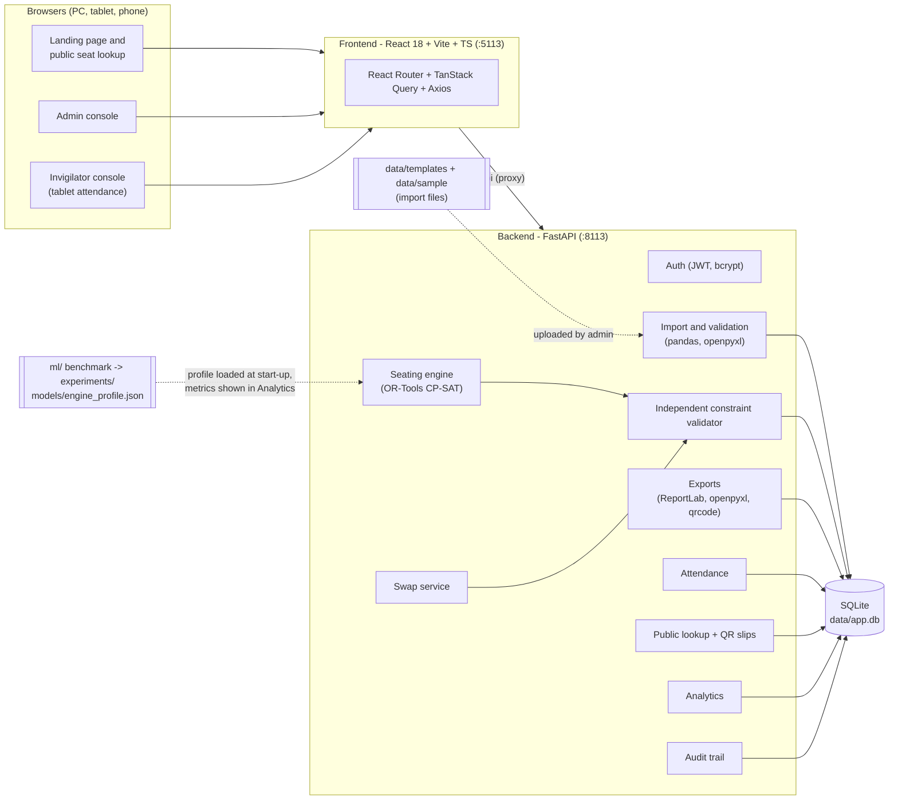
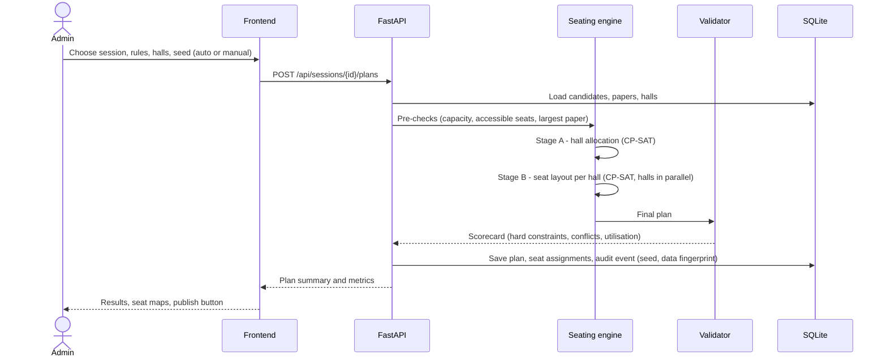

# SeatWise - Build Plan

> Constraint-optimised, cheat-resistant exam seating plans generated in seconds.

This plan covers the architecture, modules, data model, API, the optimisation engine and its evaluation, the screens, the build milestones and the main risks. The build follows it phase by phase.

---

## 1. Machine check (done in Phase 1)

| Item | Found | Status |
|---|---|---|
| Windows | Windows 11 Pro 10.0.26200 | OK |
| CPU / RAM | Intel Core i5-12500 (12 logical cores) / 15.7 GB | OK (the solver uses several cores) |
| Python | 3.11.9 (`py -3.11`), plus 3.14 installed alongside | OK, 3.11 is used for the venv |
| Node.js / npm | v24.19.0 (LTS) / 11.17.0 | OK |
| Git / Git LFS | 2.55.0 / present | OK (LFS not expected to be needed) |
| Docker | present | Not used: nothing in SeatWise needs a container |
| Free disk | C: 192 GB, D: 90 GB | OK (the full install needs about 1.5 GB) |
| Ports 8113, 5113, 11130-11139 | all free | OK |

Nothing needs to be installed.

---

## 2. Terminology

| Term | Meaning |
|---|---|
| **Candidate** | A person sitting examinations. Identified by a unique **candidate ID** (roll number), e.g. `ACF24017`. |
| **Department** | The unit a candidate and a course belong to. Used for the department-mix rule. |
| **Course** | A subject that has an examination paper, e.g. `ACF-201 Financial Reporting`. |
| **Paper group** | Optional. Courses that share one question paper (a common paper). They are treated as the *same paper* for anti-cheating spacing. |
| **Session** | One dated sitting from the timetable (date + start and end time). Several courses are examined in the same session, and each candidate sits at most one paper per session. |
| **Hall** | A room with a grid of `rows x columns` seats. Seats are labelled row letter + column number (`C4`). Halls can have blocked seats, accessible seats and aisles. |
| **Plan** | A seating solution for one session: every candidate in that session gets exactly one hall and seat. A session can have several plan versions; one is **published**. |
| **Seed** | The random number that drives the randomised plan. It is stored with the plan so the plan can be reproduced and audited. |

---

## 3. Architecture

A single-machine web product. Two local processes: the FastAPI backend (port **8113**) and the Vite frontend dev server (port **5113**, which proxies `/api` to the backend, so tablets and phones on the same Wi-Fi only need port 5113).

**Main principles**
- The backend owns every rule. The frontend never decides whether a seat move is legal. It asks the backend, so there is one source of truth.
- The solver is followed by an **independent validator** (plain Python, no solver) that re-checks every constraint on the final plan. The same validator powers live swap checking and the analytics scorecard.
- Everything runs offline after `setup.bat`. No external API keys are needed (see section 11).

### 3.1 Plan generation flow

---

## 4. The seating engine (core technique)

### 4.1 Rules

| Rule | Type | Detail |
|---|---|---|
| Capacity | hard | Each seat holds at most one candidate. Blocked seats are never used. Each candidate gets exactly one seat. |
| Same-paper separation | hard | Neighbouring candidates never write the same paper (same course or same paper group). The neighbourhood is **8 seats** (front, back, left, right and the four diagonals) by default, or 4. Aisles break adjacency. |
| Roll-number spacing | hard | Neighbours must have roll numbers at least **G** apart (same prefix, numeric part compared). G is configurable (0 = off). |
| Accessible seating | hard | Candidates who need an accessible seat are only placed on accessible seats. Spare accessible seats can be used by anyone. |
| Subject combinations | hard (checked at import) | A candidate cannot be registered for two papers in the same session (clash). Courses in a paper group count as one paper. |
| Department mix | soft | (a) Each department is spread across halls instead of filling one hall. (b) The number of neighbouring pairs from the same department is minimised. |
| Randomisation | objective | A seeded random tie-breaking objective picks one of the many valid plans, so the layout cannot be predicted from roll numbers. |
| Hall usage | objective | Use the fewest halls, then balance, depending on the chosen fill strategy (compact / balanced). |

**Confirmed defaults** (editable in Settings; each plan stores the exact values it was generated with):

| Setting | Default |
|---|---|
| Adjacency | **8 neighbours** (including diagonals); aisles break adjacency |
| Roll-number gap G | **5** - neighbours' roll numbers (same prefix) must differ by 5 or more |
| Accessible seats per hall | **2** - front-row seats nearest the door, used when a hall file does not list its own |

### 4.2 Algorithm (two-stage decomposition)

A single model over *every candidate x every seat* (for example 600 x 800 = 480,000 variables) would be too slow for "seconds". SeatWise splits the problem into two stages:

1. **Pre-checks with clear messages** - total capacity, accessible needs vs accessible seats, and for each paper whether it fits under the per-hall ceiling below. When something is impossible, the admin gets a plain reason and a suggestion ("Paper ACF-201 has 180 candidates but the selected halls can seat at most 150 of them without neighbours; add a hall or switch to 4-neighbour adjacency").
2. **Stage A - hall allocation (CP-SAT, small).** Integer variables `n[hall, group]` = how many candidates of each (paper, needs-accessible) group go to each hall. Constraints: capacity, accessible seats, and a **graph-colouring ceiling**. On the seat adjacency graph, all candidates of one paper in a hall must form an *independent set*, so a paper can occupy at most `alpha(hall)` seats. `alpha` is the maximum independent set size, computed once per hall layout and cached. With 8-neighbour adjacency this is about a quarter of the seats, which forces every full hall to mix at least four papers. Objective: fewest halls (or most balanced fill), then spread papers and departments across halls, then seeded random tie-breaks.
3. **Stage B - seat layout per hall (CP-SAT, candidate level).** For each hall, `x[candidate, seat]` booleans (at most about 80 x 80 per hall). Same-paper separation is modelled as clique constraints on every adjacent seat pair. Roll-number spacing uses row and column integer views of each candidate's seat (`|dr| >= 2 or |dc| >= 2` for close-roll pairs). Accessible needs restrict variable domains. The objective is `W * same-department neighbour pairs - sum(random_weight[c, s] * x[c, s])`, where the random weights come from the seed. This produces a *random valid plan*, not the solver's first structured one. Halls are solved **in parallel** (thread pool). If a hall is infeasible, the engine adds a cut for that hall's combination in Stage A and re-solves (bounded retries).
4. **Validation** - the independent validator re-checks everything and computes the scorecard.

**Reproducibility and audit (F3).** Each hall model uses a random seed derived from `(plan seed, hall code)`, a single deterministic search worker and a *deterministic* time budget, so the same data + rules + seed gives the same plan on the same engine version. A plan stores the seed, the rules, the engine version, a SHA-256 **data fingerprint** of the inputs and a SHA-256 **assignment hash**. A **"Verify reproducibility"** action re-runs the solve and confirms the hash matches. Manual swaps are logged one by one, so the difference between the solver output and the final plan is fully traceable.

### 4.3 Baselines (for "conflicts avoided" and the evaluation)
- **Sequential** - candidates in roll-number order, filled row by row (the usual spreadsheet method).
- **Round-robin** - papers interleaved in a repeating pattern (the usual improved manual method).
- **Random shuffle** - a random permutation with no constraints.

"Conflicts avoided" in Analytics = same-paper neighbour pairs in the sequential baseline on the same data minus those in the SeatWise plan (which is zero).

---

## 5. Module list mapped to features

| Feature | Backend modules | Frontend | Notes |
|---|---|---|---|
| **F1 Data import** | `services/importer/` (parsers, per-entity validators, clash detection), `api/imports.py`, `api/data.py` | `pages/app/ImportPage`, `pages/app/DataPage` | CSV or XLSX per entity, or one combined workbook. Two steps: **validate** (row and column error report, warnings, preview) then **commit** (replace or update). Downloadable templates and sample files. |
| **F2 Constraint-optimised allocation** | `services/engine/` (`graph.py` seat graph + alpha, `prechecks.py`, `stage_a.py`, `stage_b.py`, `engine.py`), `services/validator.py`, `api/plans.py` | `pages/app/SessionsPage`, `pages/app/SessionPlanPage` | Rules panel, hall picker, fill strategy, run with live stage progress, results scorecard. |
| **F3 Randomised fair plans** | `services/engine/randomness.py`, `services/audit.py`, `api/audit.py` | Seed field, plan versions list, **Verify reproducibility**, `pages/app/AuditPage` | Seed auto-drawn (or typed in, e.g. drawn in front of witnesses) and logged. |
| **F4 Visual hall grid** (NEW) | `services/swap.py`, `api/plans.py` (hall grid, swap check, swap) | `components/seatmap/*`, `pages/app/HallMapPage` | Colour-coded by paper (with printed codes, so colour is not the only cue). Drag a seat: every target seat lights green or red with the reason, computed by the backend. Drop to swap or move to an empty seat. Tap-to-swap and keyboard alternatives for tablets and accessibility. |
| **F5 Outputs** | `services/exports/` (`seating_chart_pdf.py`, `hall_lists_xlsx.py`, `invigilator_pdf.py`, `slips_pdf.py`, `attendance_xlsx.py`), `api/exports.py` | `pages/app/ExportsPage` | Seating charts (PDF grid per hall), hall-wise lists (Excel, one sheet per hall + summary + roll-order door list), invigilator sheets (PDF with signature column, paper counts and instructions), bulk QR slips (PDF), attendance report (Excel). |
| **F6 Hall attendance** (NEW) | `services/attendance.py`, `api/attendance.py` | `pages/app/AttendancePage` | Tablet-first: large tap targets on the seat grid or list, present/absent toggle, live counts, "scan or type candidate ID" field (hardware QR scanners type into it; camera scanning where the browser allows the camera), submit and lock, 5-second refresh so the admin sees progress live. |
| **F7 Seat lookup and QR slip** (NEW) | `api/public.py`, `services/exports/slips_pdf.py` | `pages/public/LookupPage` | Public, no login, rate limited, published plans only. Shows hall, building and floor, seat, paper, date and time, and a mini map with the seat highlighted. The QR slip PDF encodes a link back to the lookup page. |
| **F8 Analytics** | `services/analytics.py`, `api/analytics.py` | `pages/app/DashboardPage`, `pages/app/AnalyticsPage` | Hall utilisation, constraint scorecard, conflicts avoided vs baseline, department mix per hall, solve-time history, attendance rates, **Engine performance** tab (benchmark metrics and plots). |
| Platform | `core/` (config, security, logging, db), `api/auth.py`, `api/users.py`, `api/settings.py` | `pages/auth/*`, `pages/app/TeamPage`, `pages/app/SettingsPage` | Login and register (registrations start as *pending invigilators* until an admin approves them), team management, default rules, workspace reset. |

---

## 6. Database tables (SQLite, SQLAlchemy 2.x, created automatically)

| Table | Key columns |
|---|---|
| `users` | id, email (unique), full_name, role (`admin` / `invigilator`), status (`active` / `pending` / `disabled`), password_hash, created_at |
| `departments` | id, code (unique), name |
| `courses` | id, code (unique), name, department_id |
| `candidates` | id, roll_no (unique), full_name, department_id, email, date_of_birth, needs_accessible_seat |
| `registrations` | candidate_id, course_id (unique pair) |
| `halls` | id, code (unique), name, building, floor, rows, cols, blocked_seats (JSON), accessible_seats (JSON), aisles_after_cols (JSON), is_active |
| `exam_sessions` | id, code, date, start_time, end_time, label |
| `session_papers` | id, session_id, course_id, paper_group |
| `plans` | id, session_id, version, status (`draft` / `published` / `archived`), seed, rules (JSON), hall_ids (JSON), engine_version, data_fingerprint, assignment_hash, solve_ms, stage_stats (JSON), scorecard (JSON), created_by, created_at, published_at |
| `seat_assignments` | id, plan_id, candidate_id, course_id, hall_id, row, col, seat_label (unique per plan + hall + seat, unique per plan + candidate) |
| `invigilator_assignments` | id, plan_id, hall_id, user_id |
| `attendance` | id, plan_id, candidate_id, hall_id, status (`present` / `absent`), marked_by, marked_at, method (`tap` / `scan`) |
| `hall_submissions` | plan_id, hall_id, submitted_by, submitted_at (attendance lock) |
| `import_batches` | id, kind, filename, status (`validated` / `committed` / `failed`), rows_total, rows_valid, report (JSON), payload (JSON), created_by, created_at |
| `audit_events` | id, at, actor_id, action, plan_id, details (JSON) |
| `settings` | key, value (JSON) - default rules |

---

## 7. API endpoints (all under `/api`, OpenAPI docs at `http://localhost:8113/docs`)

| Area | Endpoints |
|---|---|
| Health | `GET /health` |
| Auth | `POST /auth/login`, `POST /auth/register`, `GET /auth/me` |
| Team | `GET /users`, `POST /users`, `PATCH /users/{id}` (approve, role, disable) |
| Settings | `GET /settings/rules`, `PUT /settings/rules`, `POST /settings/reset-workspace` |
| Import | `GET /imports/templates/{kind}`, `GET /imports/samples/{kind}`, `POST /imports/{kind}/validate` (multipart; kind = courses, candidates, halls, timetable, workbook), `POST /imports/{batch_id}/commit`, `GET /imports` |
| Data | `GET /departments`, `GET /courses`, `GET /candidates?q=&page=`, `GET /candidates/{id}`, `GET /halls`, `GET /halls/{id}`, `GET /sessions`, `GET /sessions/{id}` |
| Plans | `POST /sessions/{id}/plans` (generate), `GET /sessions/{id}/plans`, `GET /plans/{id}`, `GET /plans/{id}/halls/{hall_id}`, `GET /plans/{id}/halls/{hall_id}/swap-check?seat=C4`, `POST /plans/{id}/swap`, `POST /plans/{id}/publish`, `POST /plans/{id}/verify`, `PUT /plans/{id}/invigilators`, `DELETE /plans/{id}` (drafts only) |
| Exports | `GET /plans/{id}/exports/seating-charts.pdf`, `.../hall-lists.xlsx`, `.../invigilator-sheets.pdf`, `.../qr-slips.pdf`, `.../attendance.xlsx` (optional `hall_id` filter) |
| Attendance | `GET /attendance/assignments` (my halls), `GET /plans/{id}/halls/{hall_id}/attendance`, `PUT /plans/{id}/attendance/{candidate_id}`, `POST /plans/{id}/halls/{hall_id}/attendance/scan`, `POST /plans/{id}/halls/{hall_id}/attendance/submit` |
| Public | `GET /public/lookup/{candidate_id}`, `GET /public/slip/{candidate_id}/{plan_id}.pdf`, `GET /public/qr/{candidate_id}/{plan_id}.png` |
| Analytics | `GET /analytics/overview`, `GET /analytics/plans/{id}`, `GET /analytics/engine`, `GET /analytics/engine/plots/{name}` |
| Audit | `GET /audit?plan_id=&action=` |

---

## 8. Evaluation pipeline (no model training)

SeatWise has no trained model. The OR-Tools CP-SAT engine is the core, so it is **benchmarked** instead.

- `scripts/generate_sample_data.py --seed 2026` - the seeded generator for departments, courses, candidates, registrations, halls and the timetable. Its output is committed under `data/sample/`, with ready-to-import Excel/CSV templates under `data/templates/`.
- `ml/scenarios.py` - seeded benchmark scenarios of increasing size (about 150 to 2,000 candidates per session, 3 to 30 halls, 4 to 14 papers) with 8- and 4-neighbour adjacency and several roll gaps.
- `ml/baselines.py` - sequential, round-robin and random-shuffle seating.
- `ml/benchmark.py` - runs SeatWise and the baselines on every scenario with several seeds and records solve time, feasibility, same-paper neighbour pairs (target 0), roll-gap violations (target 0), accessible violations (target 0), same-department neighbour pairs, utilisation and halls used.
- `ml/predictability.py` - fairness and unpredictability over many seeds: correlation between roll order and seat order (target about 0), the chance that two neighbours under one seed are neighbours again under another seed (target: close to the random baseline), and front-row share per department (target: no bias).
- Output: `experiments/engine-benchmark-<date>/` containing `metrics.json` (scenario list, seeds, run date, engine and OR-Tools versions, results), PNG plots (solve time vs size, conflicts per method, utilisation, predictability) and `benchmark.log`.
- `models/engine_profile.json` - the tuned engine settings the app loads at start-up (per-hall deterministic time budget, objective weights, thread count), written by the benchmark.
- `notebooks/engine_benchmark.ipynb` - runs the benchmark and shows the plots.
- In the product: **Analytics > Engine performance** shows the headline metrics, results table and plots from the latest run. Each plan's own solve time and scorecard appear on the plan page.

---

## 9. Screens

| # | Screen | Route | Who |
|---|---|---|---|
| 1 | Landing page (animated hero, how it works, features, find-your-seat CTA, footer) | `/` | Public |
| 2 | Login / Register | `/login`, `/register` | Public |
| 8 | Public seat lookup + QR slip | `/lookup`, `/lookup/:candidateId` | Public |
| - | Dashboard (KPI cards, charts, upcoming sessions, live attendance) | `/app` | Admin, invigilator (own view) |
| 3 | Data import + current data (courses, candidates, halls, timetable) | `/app/import`, `/app/data` | Admin |
| 4 | Sessions and plan generation (rules, halls, seed, run, results, versions, publish) | `/app/sessions`, `/app/sessions/:id` | Admin |
| 5 | Hall seat maps with drag-to-swap | `/app/plans/:planId/halls/:hallId` | Admin (invigilators read-only) |
| 6 | Exports | `/app/exports` | Admin |
| 7 | Hall attendance (tablet) | `/app/attendance`, `/app/attendance/:planId/:hallId` | Invigilator, admin |
| 9 | Analytics + Engine performance | `/app/analytics` | Admin |
| - | Audit trail, Team, Settings | `/app/audit`, `/app/team`, `/app/settings` | Admin |

Every screen has loading (skeletons), empty and error states, toasts and confirmation dialogs, and works from 360 px wide. On a phone, the seat map scrolls and zooms inside its own panel and uses tap-to-swap.

**Frontend libraries:** the fixed stack from the brief, plus a few small supporting packages. `@dnd-kit/core` handles touch-friendly drag and drop on tablets (native HTML drag and drop does not work with touch). `sonner` provides toasts (the shadcn/ui default). `class-variance-authority`, `clsx` and `tailwind-merge` are the helpers shadcn/ui needs. Optionally a small QR camera decoder for the attendance scan field. React Bits components (for example a seat-grid-like **Dot Grid** background and animated headline text) are copied into `src/components/reactbits/`.

**Brand:** SeatWise logo (SVG seat-grid mark with a check), an ink-indigo primary with a teal "valid" accent, amber warnings and rose conflicts, light and dark themes, an accessible categorical palette for papers on the seat map, and one consistent type scale.

---

## 10. Milestones

| # | Phase | Deliverable | Commit |
|---|---|---|---|
| M1 | 3 Foundations | Folder skeleton, `setup.bat`, `run.bat`, `.env.example`, FastAPI app (config, logging, DB, JWT auth, demo users), React shell (router, theme, layout, sidebar, auth pages) | "Add project foundations" |
| M2 | 4 Data and engine | Sample data generator + committed data and templates, seating engine (pre-checks, Stage A, Stage B, validator), baselines, benchmark run, experiment artefacts, engine profile, engine tests | "Add seating engine benchmark" |
| M3 | 5 F1 | Import and validation end to end | "Add data import" |
| M4 | 5 F2 + F3 | Plan generation, versions, publish, audit, verify reproducibility | "Add plan generation" |
| M5 | 5 F4 | Hall seat map, live swap validation | "Add hall seat maps" |
| M6 | 5 F5 | PDF and Excel exports | "Add seating exports" |
| M7 | 5 F6 | Tablet attendance | "Add hall attendance" |
| M8 | 5 F7 | Public lookup and QR slips | "Add seat lookup" |
| M9 | 5 F8 | Dashboard, analytics, engine performance | "Add analytics dashboard" |
| M10 | 6 Polish | Animated landing page, micro-interactions, responsive and accessibility pass | "Add landing page" |
| M11 | 7 Testing | pytest suite green, production build, demo scenario walked through and fixed | "Pass end-to-end checks" |
| M12 | 8 Docs | `docs/01..11`, README, HOW_TO_RUN copy | "Add product documentation" |

**Tests (pytest):** import validators (bad columns, duplicates, unknown references, clashes), engine properties over many seeded scenarios (zero same-paper neighbours, roll-gap and accessible rules honoured, capacity respected, same seed gives the same plan, different seeds give different plans, infeasible input gives a clear reason), swap validation, auth and roles, exports (valid PDF and XLSX), public lookup (published plans only, rate limit), attendance lock.

---

## 11. What is needed from you (Phase 2)

Only the default rules needed confirming (MASTER_PROMPT section 9). **Confirmed:**

1. **Adjacency** - 8 neighbours (including diagonals).
2. **Roll-number gap** - 5.
3. **Accessible seats per hall** - 2 (front-row seats nearest the door) when a hall file does not list them.

**No API keys or accounts are needed.** No SeatWise feature (F1-F8) uses an LLM or a trained model, so the Gemini, scikit-learn and PyTorch parts of the standard stack are not installed. This keeps setup fast and fully offline. Everything else in the fixed stack is used as specified.

---

## 12. Out of scope (by design)
- Cloud deployment, multi-tenant hosting, microservices (single Windows machine by design).
- Sending email or SMS (candidates use the public lookup page and QR slips instead).
- LLM or trained-model features (none are part of F1-F8).

---

## 13. Risks and mitigations

| Risk | Mitigation |
|---|---|
| Solve time grows with session size | Two-stage decomposition, halls solved in parallel, deterministic time budgets tuned by the benchmark (target: under 10 s for about 600 candidates in about 14 halls on this PC), progress shown in the UI. |
| Deterministic, reproducible solves are slower than multi-threaded search | One deterministic worker per hall, many halls in parallel. The benchmark measures the trade-off and the profile stores the tuned budget. |
| Infeasible inputs (one paper dominates a session, too few accessible seats) | Pre-checks with plain-language reasons and concrete suggestions. Stage A graph-colouring ceilings avoid most Stage B failures. Bounded retries with cuts. |
| `passlib` breaks with `bcrypt` 5.x | Pin `bcrypt==4.0.1`. |
| Drag and drop on touch tablets | `@dnd-kit` pointer and touch sensors, plus tap-to-swap and keyboard fallbacks. |
| Camera access is blocked on plain-HTTP LAN addresses | The attendance scan field also accepts hardware QR scanners and typed IDs. Phone cameras open the QR link natively in the public lookup page. |
| Non-Latin names in PDFs | Bundle an open-licence Unicode TTF font for ReportLab. |
| React Bits components pulling heavy dependencies | Pick components that only need Motion, GSAP or plain canvas/CSS. Respect `prefers-reduced-motion`. |
| Other products running on the same PC | Fixed ports 8113 / 5113 with `strictPort`, and extra services only in 11130-11139 (none planned). |
| Parallel git sessions in the same repository | Follow MASTER_PROMPT section 14 exactly (path-limited commits, retry on `index.lock`, no history rewrites). |
