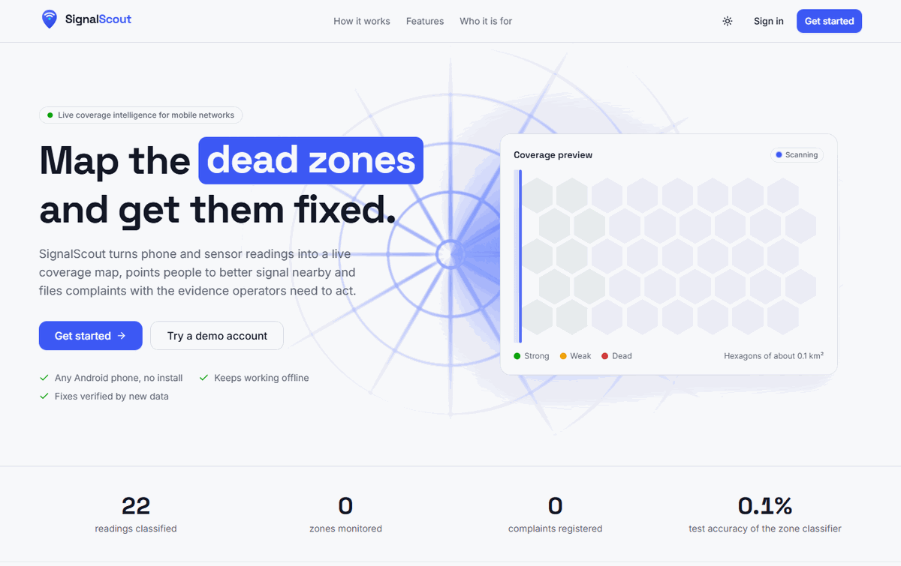
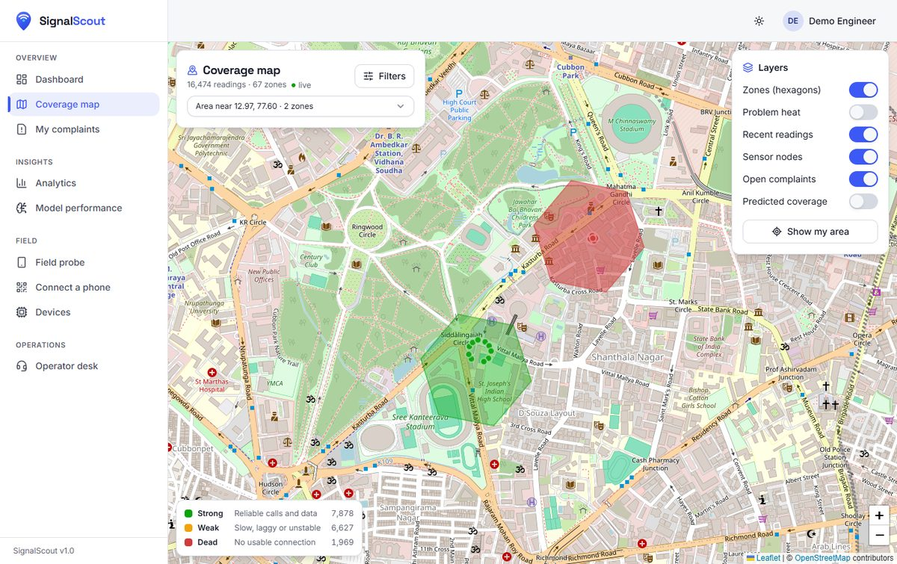
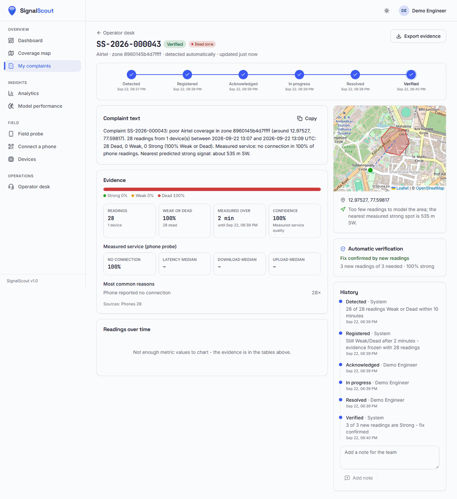

# SignalScout

**Find dead zones. Get them fixed.**

SignalScout turns phone and sensor readings into a live coverage map. It points people to better signal nearby, and turns places where mobile service keeps failing into complaints with the evidence operators need. New readings then confirm the fix, or reopen the complaint.

## What it does

- **Measures with the phones people already have.** The field probe runs in Chrome on Android, with no app install. It measures round-trip time, loss and speed with GPS, and keeps working offline. Optional **ESP32 sensor nodes** watch community Wi-Fi around the clock; a simulator stands in when there is no hardware.
- **Classifies every reading** as Strong, Weak or Dead, with a confidence and the reasons.
- **Maps coverage live** in hexagons of about 0.1 km² per operator, with heat, live points, sensor nodes, complaints and predicted coverage.
- **Suggests better signal nearby.** A Gaussian Process predicts service around you and points the way, even without a connection.
- **Files complaints itself** when a zone stays weak or dead. The evidence is frozen and the operator desk is told by email and Telegram.
- **Verifies fixes** with new readings from the zone, or reopens the complaint.
- **Shows the patterns:** worst areas, the hours when service fails, operator comparisons, complaint handling times, and the measured performance of every model.

| Coverage map | Complaint with evidence and verification |
|---|---|
|  |  |

## Quick start (Windows)

You need **Python 3.11** and **Node.js LTS**; see [How to run](docs/03_HOW_TO_RUN.md#1-what-you-need).

1. Double-click **`setup.bat`**. It installs everything (first run: about 10 minutes and 500 MB of downloads), and is safe to run again.
2. Double-click **`run.bat`**. The dashboard opens at **http://localhost:5202**.
3. Sign in with a demo account. The password for all three is **`Scout@2026`**.

| Account | Role |
|---|---|
| `user@signalscout.demo` | Field user: measure, map, report, follow complaints |
| `engineer@signalscout.demo` | Network engineer: plus the operator desk |
| `admin@signalscout.demo` | Administrator: plus settings and users |

4. To measure with a phone:
   1. Open **Connect a phone** and scan the QR code with an Android phone.
   2. Turn Wi-Fi off, open the link in Chrome, and sign in.
   3. Tap **Start measuring**.

To see the whole flow in a few minutes, sign in as admin and choose **Settings → Demo thresholds**. Then follow [the demo scenario](docs/09_TESTING.md#5-try-it-yourself-with-a-phone-about-10-minutes).

SignalScout uses only ports **8202** (API) and **5202** (dashboard). Press **Ctrl+C** in the `run.bat` window to stop it.

## Documentation

| Document | Contents |
|---|---|
| [01 Overview](docs/01_OVERVIEW.md) | The problem, users, features, limits |
| [02 Architecture](docs/02_ARCHITECTURE.md) | Components, data flow, main sequences, data model, security |
| [03 How to run](docs/03_HOW_TO_RUN.md) | Install, start, phone, ESP32, stop, reset |
| [04 Datasets](docs/04_DATASET.md) | Sources, licences, cleaning, labels, download guide |
| [05 Models and training](docs/05_MODELS_AND_TRAINING.md) | Classifier, radio estimate, better-signal predictor: training and results |
| [06 API reference](docs/06_API_REFERENCE.md) | Every endpoint with real examples |
| [07 User guide](docs/07_USER_GUIDE.md) | Screen by screen |
| [08 Configuration](docs/08_CONFIGURATION.md) | Every `.env` key and in-app setting, and how to get the keys |
| [09 Testing](docs/09_TESTING.md) | Tests, results, the end-to-end demo scenario |
| [10 Troubleshooting](docs/10_TROUBLESHOOTING.md) | Common problems and fixes |
| [11 Project structure](docs/11_PROJECT_STRUCTURE.md) | What is where |

Interactive API docs are at http://localhost:8202/docs while SignalScout runs.

## Built with

| Part | Technology |
|---|---|
| API | Python 3.11, FastAPI, SQLAlchemy 2, SQLite, Pydantic 2 |
| Models | PyTorch (MLP zone classifier), XGBoost, scikit-learn (Gaussian Process), H3 |
| Web app and phone probe | React 18, TypeScript, Vite, Tailwind CSS, Radix UI, TanStack Query, Leaflet with OpenStreetMap, Recharts, Motion, GSAP, Lenis, PWA with IndexedDB |
| Phone access | Cloudflare quick tunnel (free HTTPS) |
| Sensor node | ESP32 Arduino firmware (TinyGPSPlus, NimBLE, ArduinoJson, LittleFS) |
| Notifications | Telegram Bot API, Gmail SMTP |

## Model results (test data)

| Model | Result |
|---|---|
| Zone classifier (PyTorch MLP) | 83.5% accuracy, macro-F1 0.827 across four device profiles. Without SINR/CQI: 0.861, against 0.742 for the documented ranges alone. Calibration error 0.008 |
| Radio-condition estimate from speed tests | Macro-F1 0.498 per test and 0.539 per zone, above a tuned threshold (0.466) and the majority class (0.211). Shown only as supporting evidence |
| Better-signal predictor (GP) | RSRP error 6.34 dB on held-out 200 m blocks, against 6.83 dB for inverse distance and 10.97 dB for the area mean. 96% of held-out readings fall inside the 95% band |

Details, baselines and plots are in [05 Models and training](docs/05_MODELS_AND_TRAINING.md), and in the app under **Model performance**.

## Data and licences

- **4G LTE Speed Dataset** (Cork drive tests), CC BY-SA 4.0: https://www.kaggle.com/datasets/aeryss/lte-dataset
- **Cellular Network Analysis Dataset**, CC0 1.0: https://www.kaggle.com/datasets/suraj520/cellular-network-analysis-dataset
- **iptoasn** IP-to-network table (public domain), used to tell the operator from a phone's address: https://iptoasn.com
- **OpenStreetMap** map tiles, © OpenStreetMap contributors
- **OpenCelliD** tower positions (optional), CC BY-SA 4.0
- **React Bits** components in `frontend/src/components/reactbits/`, under the MIT + Commons Clause licence included there
