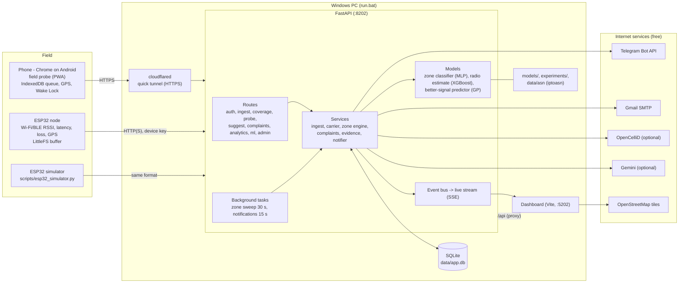
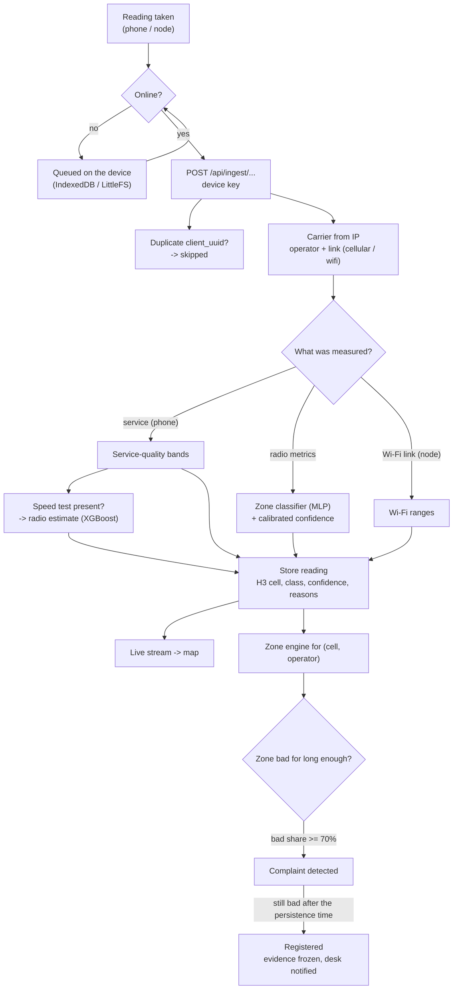
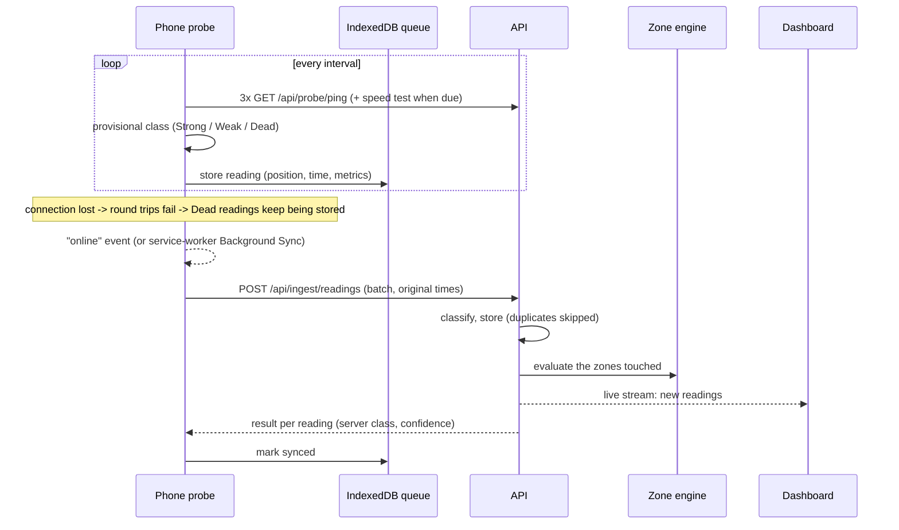
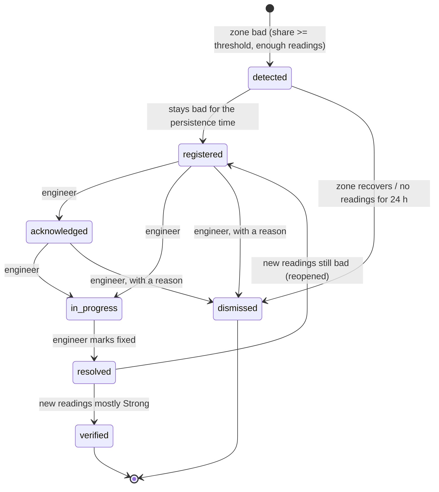
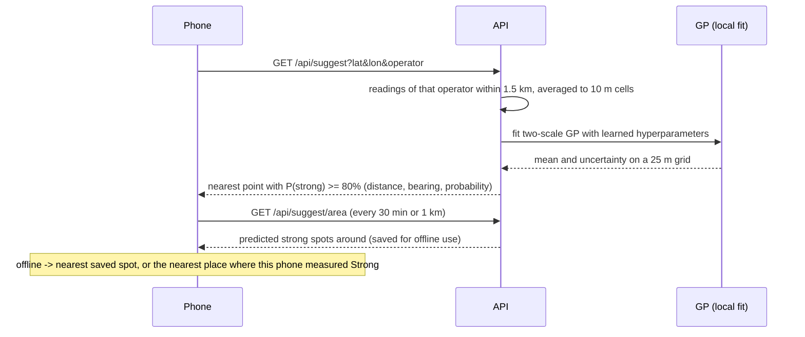

# Architecture

SignalScout is one FastAPI service with a SQLite database and a React web app. The web app has two faces: the **dashboard** for desks and admins, and the **field probe** for phones. Phones reach the service over an HTTPS tunnel. ESP32 nodes, real or simulated, send readings directly.

## Components

| Component | Responsibility |
|---|---|
| **Field probe** (`frontend/src/pages/probe`, `lib/probe`) | Measures every few seconds (3 round trips; periodic download/upload tests); labels each reading on the phone; queues readings in IndexedDB; syncs in batches of up to 200; keeps the screen on; saves strong spots for offline suggestions. |
| **Dashboard** (`frontend/src/pages`) | Map, complaints, desk, analytics, model performance, devices, settings. It updates live from the event stream. Its query cache is persisted, so the last data stays readable offline. |
| **ESP32 node / simulator** | Posts compact batches to `/api/ingest/node` with a device key, and buffers while offline. |
| **Tunnel** | `cloudflared` gives the API a public HTTPS address. Phones need HTTPS for GPS and must use mobile data. The API serves the built web app on the same address, so the probe and API share one origin. |
| **API routes** (`backend/app/api`) | Validation, authentication and authorisation. They delegate to services. |
| **Ingest service** | Idempotent by `client_uuid`; carrier lookup (IP → ASN → operator, link type); classification; H3 cell; stores the reading; publishes it to the live stream; runs the zone engine. |
| **Zone engine** | Judges each (hexagon, operator) from recent readings, by reading time; detects, registers and dismisses complaints; verifies or reopens resolved ones. |
| **Complaint service + evidence** | Lifecycle rules, timeline events, evidence bundle, summary text. |
| **Notifier** | Queues email and Telegram messages per complaint event; sends them with retries and backoff. |
| **Model registry** | Loads `models/*.joblib` at startup; the models are used in-process. |

## How a reading flows

Phone readings taken over Wi-Fi are stored and shown in the phone's log. They are left out of mobile coverage, zones and complaints.

## Main sequences

### 1. Measuring, going offline, syncing

### 2. Complaint lifecycle

- **Registration** freezes the evidence: readings, class shares, measurements, time span, nearest strong spot and summary. It then queues notifications to the desk email and Telegram chat.
- A user can also **report** a problem at a location. The report is registered at once, with the evidence from that zone attached.
- **Verification** counts only readings taken after the resolve time. It needs a minimum number of them (5 by default, 3 with demo thresholds).
- Every change is a timeline event, and is published on the live stream so the desk updates without a reload.

### 3. Better-signal suggestion

## Data model

| Table | Holds |
|---|---|
| `users` | Accounts: name, email, password hash, role (`user`, `engineer`, `admin`), active flag |
| `devices` | Phones, ESP32 nodes, simulators and the sample replay: owner, kind, key hash and prefix, fixed position, last seen |
| `readings` | Every observation: time, position, accuracy, H3 cell, operator (and how it was found), link, radio metrics, service metrics, Wi-Fi/BLE RSSI, class, confidence, method, reasons, radio estimate, model version |
| `zone_states` | Current state per (cell, operator): counts, bad share, label, last reading |
| `complaints` | Reference code, cell, operator, severity, status, timestamps per stage, assignee, reporter, evidence, summary, verification state, reopen count |
| `complaint_events` | Timeline: status changes, notes, assignments, verification results |
| `notifications` | Email and Telegram messages with delivery state, attempts and next retry |
| `sync_batches` | Every upload: device, counts accepted / duplicate / rejected |
| `settings` | Values admins changed in the app |
| `cell_towers` | Cached OpenCelliD towers |

All times are stored in UTC and shown in the viewer's local time.

## Security

- **People** sign in with email and password (bcrypt). They receive a JWT that expires after 12 hours by default. Routes check roles:
  - field users see only their own devices, readings and complaints from zones they measured;
  - engineers see the whole queue;
  - admins also manage users and settings.
- **Devices** authenticate with an `X-Device-Key` header. The key is stored only as a SHA-256 hash, and can be rotated. A device key can only upload readings and use the probe endpoints.
- **Carrier detection** trusts forwarding headers only from this PC (the tunnel), so a client cannot choose its operator.
- **Secrets** live only in `.env`, which is git-ignored. The firmware's `config.h` is git-ignored too.
- **Input** is validated by Pydantic schemas. Physical ranges are enforced (for example RSRP within 3GPP limits, loss between 0 and 1).

## Ports and processes

| Process | Port | Started by |
|---|---|---|
| API (Uvicorn) | 8202 | `run.bat` → `scripts/launcher.py` |
| Dashboard (Vite) | 5202 (strict: fails rather than moving) | launcher |
| cloudflared | none (outbound only) | launcher, when `TUNNEL_ENABLED=true` |
| ESP32 simulator | none (client) | launcher, when `ESP32_SIMULATOR=true` |

The launcher starts the processes and prints their output with a prefix. If the web sources changed, it rebuilds `frontend/dist` for phones first. On Ctrl+C or `run.bat --stop` it stops only its own processes.
