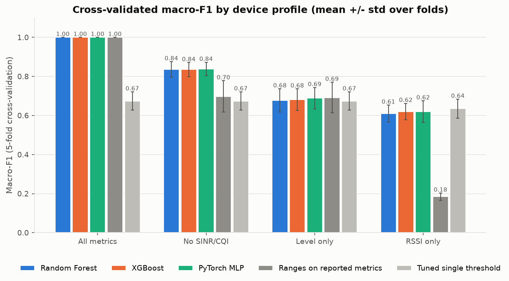
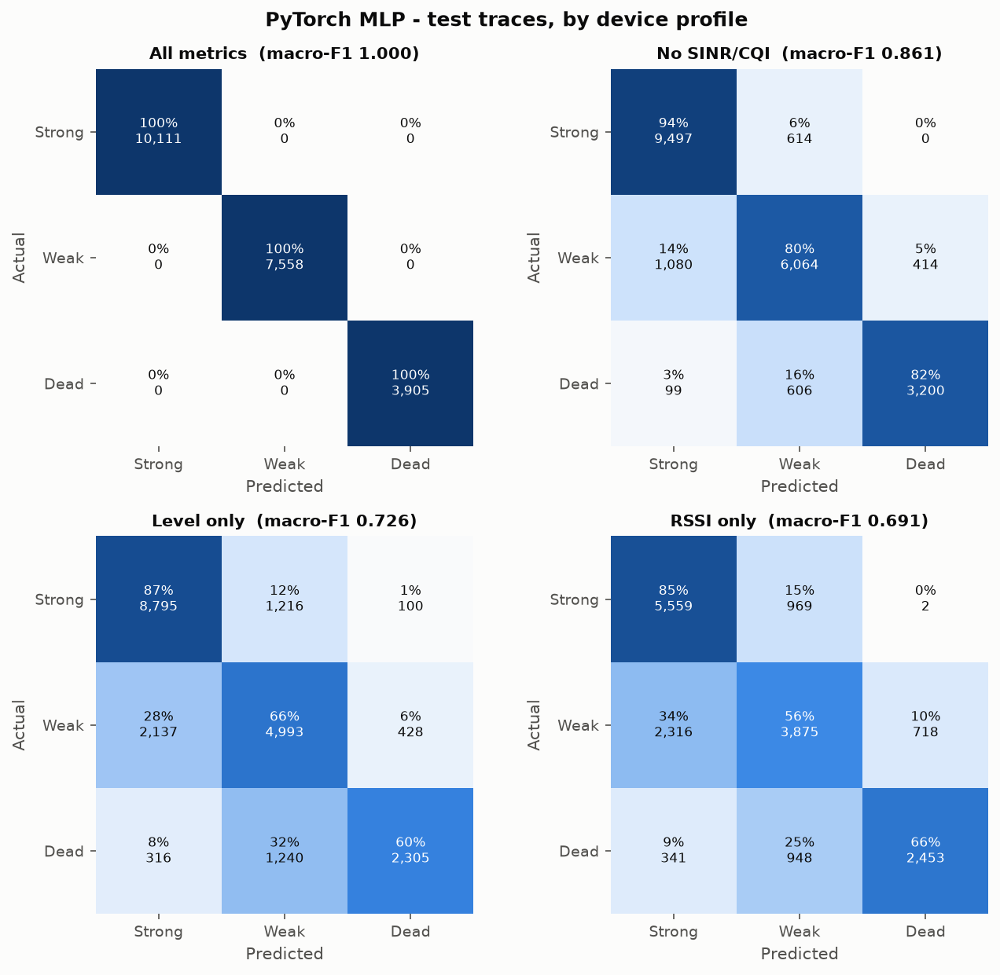
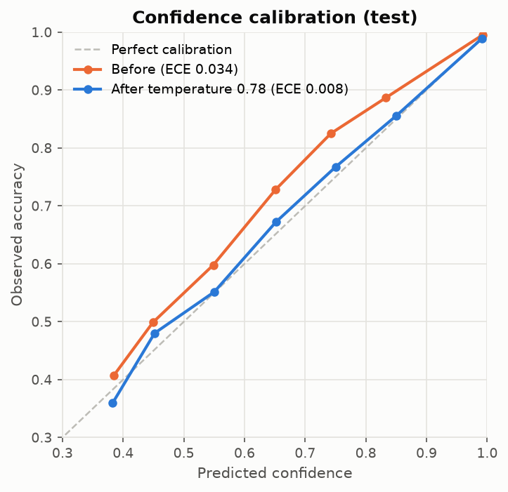

# Models and training

SignalScout decides whether each reading is **Strong**, **Weak** or **Dead** in one of three ways, depending on what the device can measure. Each decision comes with a confidence score. Two further models support the measured result.

| Component | Input | Output | Kind |
|---|---|---|---|
| **Service-quality rules** (phone probe) | Round-trip time, probe loss, download speed, online/offline | Strong / Weak / Dead with reasons | Documented rules |
| **Zone classifier** | Radio metrics (RSRP, RSRQ, SINR, RSSI, CQI; any subset) | Strong / Weak / Dead with confidence | PyTorch MLP (chosen from 3 candidates) |
| **Wi-Fi link rules** (ESP32 nodes) | Wi-Fi RSSI, latency, loss, connected | Strong / Weak / Dead | Documented rules |
| **Radio-condition estimate** | A phone speed test and the two before it | Estimated radio class | XGBoost |
| **Better-signal predictor** | Readings around a place | Predicted signal or speed nearby, with uncertainty | Gaussian Process (two-scale kernel) |

Every model is trained locally on a laptop CPU from the committed datasets (see [04_DATASET.md](04_DATASET.md)). Each training run writes to its own folder under `experiments/`:

- the model file;
- `metrics.json`;
- the plots;
- `train.log`.

The version the app loads is copied to `models/`. You can see all the numbers below, and the plots, in the app under **Insights → Model performance**.

---

## 1. How readings are classified

### Phone probe: measured service quality

A phone browser cannot read radio metrics, so the probe measures the service itself. Every reading does three things:

- sends three small round trips to the server (`/api/probe/ping`);
- every minute, by default, also runs an adaptive download test and an upload test;
- records whether the phone is online.

| Class | Rule |
|---|---|
| **Dead** | Offline, or at least 2 of 3 round trips lost |
| **Weak** | Median round trip above 400 ms, download below 2 Mbps, or 1 round trip lost |
| **Strong** | Everything else |

Admins can change the thresholds under **Settings** (`probe_weak_rtt_ms`, `probe_weak_dl_mbps`). The phone labels each reading immediately (provisional), and the server confirms it on sync.

### ESP32 nodes: Wi-Fi link rules

| Class | Rule |
|---|---|
| **Strong** | Wi-Fi RSSI ≥ -67 dBm |
| **Weak** | -80 to -67 dBm, or latency above 300 ms, or loss above 20% |
| **Dead** | Below -80 dBm, or disconnected |

If a node has a cellular modem, its cellular RSSI goes through the zone classifier.

### Radio readings: the zone classifier

Radio readings come from the sample data, from nodes with a cellular modem, and from any future native client. They are classified by the zone classifier described below. The documented ranges (see [04_DATASET.md](04_DATASET.md#labels)) define the classes. The classifier learns to reproduce them when some metrics are missing, which is common because many phones and modems do not report SINR or CQI.

### From readings to zones

- Readings are grouped into H3 hexagons at resolution 9 (about 0.1 km²) **per operator**.
- A zone is judged from the readings in a sliding window.

| Setting | Standard | Demo |
|---|---|---|
| Readings needed in the window | 8 | 4 |
| Window | 30 min | 10 min |
| Share of Weak/Dead that makes the zone bad | 70% | 70% |
| Minutes the zone must stay bad before a complaint is registered | 15 | 2 |
| New readings needed to verify a fix | 5 | 3 |

- Time is taken from the readings themselves. So readings synced late, after an outage, still count at the moment they were taken.

---

## 2. Zone classifier

**Task:** classify each radio reading as Strong, Weak or Dead, even when some metrics are missing.

### Features (24)

- **Technology family:** one-hot 2G, 3G or LTE/NR.
- **Current values:** level, quality, SINR, RSSI, CQI.
- **Availability flags:** one `has_*` flag per metric, so a missing value is information rather than an error.
- **30-second rolling window per device:** median, minimum and standard deviation of the level; medians of quality, SINR and RSSI; the deviation of the current level from the window median.
- **Range bands:** the band each metric falls in, and the worst band.

The feature code is `backend/app/ml/features.py`. Training and the live service use the same code.

### Device profiles

Training data is expanded into four copies with metrics removed. The model sees every level of completeness it will meet in the field.

| Profile | Metrics present |
|---|---|
| `full` | All metrics |
| `no_sinr_cqi` | No SINR or CQI (many phones and modems) |
| `level_only` | Signal level only |
| `rssi_only` | RSSI only (2G modems, basic devices) |

### Candidates and baselines

| Method | Notes |
|---|---|
| Random Forest | scikit-learn, class-balanced |
| XGBoost | gradient-boosted trees, class-balanced |
| **PyTorch MLP** | 2 hidden layers (64, 32), ReLU, dropout 0.1, AdamW (lr 2e-3, weight decay 1e-4), class-weighted loss, early stopping on validation macro-F1 |
| Ranges on reported metrics | The documented ranges applied to whatever metrics are present |
| Tuned single threshold | Two cut-offs on one metric, tuned on training data |

### Model selection: 5-fold cross-validation, grouped by trace

Macro-F1, mean ± standard deviation over folds:

| Method | All metrics | No SINR/CQI | Level only | RSSI only | Mean |
|---|---|---|---|---|---|
| Random Forest | 1.000 ± 0.000 | 0.836 ± 0.039 | 0.678 ± 0.059 | 0.609 ± 0.044 | 0.781 |
| XGBoost | 1.000 ± 0.000 | 0.835 ± 0.036 | 0.681 ± 0.056 | 0.620 ± 0.042 | 0.784 |
| **PyTorch MLP** | 1.000 ± 0.000 | **0.838 ± 0.034** | 0.688 ± 0.055 | 0.619 ± 0.056 | **0.786** |
| Ranges on reported metrics | 1.000 ± 0.000 | 0.698 ± 0.080 | 0.692 ± 0.079 | 0.185 ± 0.019 | 0.644 |
| Tuned single threshold | 0.674 ± 0.047 | 0.674 ± 0.047 | 0.674 ± 0.047 | 0.635 ± 0.049 | 0.664 |

The MLP has the best mean, so it is the chosen model. The three learned models are close, and the differences are within the spread between folds.

### Held-out test: 20 traces never used for training or selection

Macro-F1:

| Method | All metrics | No SINR/CQI | Level only | RSSI only | Mean |
|---|---|---|---|---|---|
| Random Forest | 1.000 | 0.859 | 0.712 | 0.664 | 0.809 |
| XGBoost | 1.000 | 0.857 | 0.703 | 0.684 | 0.811 |
| **PyTorch MLP** | 1.000 | **0.861** | 0.726 | 0.691 | **0.819** |
| Ranges on reported metrics | 1.000 | 0.742 | 0.739 | 0.184 | 0.666 |
| Tuned single threshold | 0.729 | 0.729 | 0.727 | 0.699 | 0.721 |

Chosen model on all test rows (81,859 across the four profiles): **accuracy 83.5%, macro-F1 0.827**.

| Class | Precision | Recall | F1 | Support |
|---|---|---|---|---|
| Strong | 0.844 | 0.921 | 0.881 | 36,863 |
| Weak | 0.801 | 0.760 | 0.780 | 29,583 |
| Dead | 0.877 | 0.770 | 0.820 | 15,413 |

**How to read this:**

- With every metric present, the labels follow directly from the ranges, so any faithful method scores 1.00. That column only confirms that nothing is broken.
- The model is useful when metrics are missing. Without SINR/CQI it scores 0.861, against 0.742 for the ranges alone.
- With RSSI only, the fixed ranges collapse (0.184), because 2G RSSI thresholds do not suit LTE RSSI. The model does not.
- With one level metric there is little more information to use, so the model is on par with a tuned threshold.

### Calibration

The confidence shown in the app should mean what it says. Temperature scaling (T = 0.78) was fitted on the validation traces. It is kept only if it improves the expected calibration error (ECE) there. On the test traces, ECE dropped from **0.034 to 0.008**.

### Consistency check on another region

The Patna dataset has level-only readings, other network-type strings and a different region. The classifier agrees with the documented ranges on **100%** of its 16,829 rows, for every network type. This checks consistency; it is not an accuracy measurement.

### Most important features

Measured as the drop in macro-F1 when the feature is shuffled:

| Feature | Drop |
|---|---|
| `band_worst` | 0.283 |
| `rssi` | 0.076 |
| `quality` | 0.061 |
| `has_quality` | 0.057 |
| `quality_median30` | 0.056 |

### Plots

In `experiments/classifier_20260922_163745/`:





`feature_importance.png`, `profile_scores.png` and `mlp_training.png` are in the same folder.

---

## 3. Radio-condition estimate (phone speed tests)

**Task:** estimate the radio class from what a phone browser can measure (speed tests). Nothing else is available to the browser.

**Data:** the Cork traces, which record both radio metrics and throughput. Phone speed tests are reproduced from them:

- a test is the mean download and upload over 5 seconds;
- each virtual device runs one test per minute;
- each trace gives three interleaved devices, with offsets 0, 20 and 40 s.

This gives 6,288 training tests, 1,224 validation tests and 1,200 test tests, split by trace.

**Features (9):** download and upload speed, the two previous downloads, the median and minimum of the last three downloads, the median of the last three uploads, log download, and a flag for a zero download.

**Model:** XGBoost with class-balanced weights. Temperature calibration T = 1.52.

| Method (test traces) | Accuracy | Macro-F1 |
|---|---|---|
| **Speed-test model, per test** | **49.3%** | **0.498** |
| **Speed-test model, per zone** (52 zones, ≥ 3 tests, majority vote) | **55.8%** | **0.539** |
| Tuned speed threshold (7.6 / 2.26 Mbps) | 48.9% | 0.466 |
| Always the majority class | 46.2% | 0.211 |

- Calibration error (ECE): 0.035.
- Bad-zone detection (at least 70% of tests Weak or Dead): F1 0.45, with a prevalence of 25%.

**How it is used:** speed depends on cell load as well as radio conditions, so this is a **partial proxy**. The app shows it as supporting evidence ("estimated radio condition") next to the measured service-quality class and never lets it override that class. The numbers above are shown in the app as they are.

Plots are in `experiments/radio_estimate_20260922_164320/`: `confusion_matrix.png`, `baselines.png` and `calibration.png`.

---

## 4. Better-signal predictor (Gaussian Process)

**Task:** from nearby readings of the same operator, predict signal or speed at places nobody has measured yet, with an uncertainty. Then suggest the nearest place that is probably strong.

| Target | Used for | Strong threshold |
|---|---|---|
| RSRP (dBm) | Readings with radio metrics | -100 dBm |
| log10 download speed (Mbps) | Phone-probe readings | 2 Mbps |

**Kernel:**

```
C_short * Matern(nu=1.5, length 10-300 m) + C_long * Matern(nu=1.5, length 300-10000 m) + White noise
```

- The short scale captures street-level variation. The long scale captures the area trend.
- Hyperparameters are learned per target and per operator on the densest 2 km areas.
- The learned length scales are 33 m and 341 m for RSRP, and 26 m and 837 m for speed.

**Live service:**

- Readings are averaged into 10 m cells.
- A local GP is fitted on the cells within 1.5 km, at most 1,500 of them.
- Candidate points are scored by the probability of being strong.
- A 25 m grid around the person is predicted, only where readings are close enough to support a prediction.
- The nearest point predicted Strong with at least 80% probability is suggested, together with its distance, bearing and the number of readings behind it.

**Evaluation:**

- Whole 200 m blocks are held out (5-fold spatial block cross-validation), and each is predicted exactly as the live service does.
- This is much harder, and more honest, than holding out random points next to training points.

| Method | RSRP RMSE (dB) | RSRP MAE | Strong/not agreement | Speed RMSE (log10 Mbps) |
|---|---|---|---|---|
| **Gaussian Process** | **6.34** | **4.70** | **82.8%** | **0.430** |
| Inverse distance weighting | 6.83 | 4.85 | 80.3% | 0.441 |
| Nearest neighbours | 7.43 | 5.45 | 78.9% | 0.451 |
| Local mean | 10.95 | 8.72 | 64.0% | 0.560 |
| Area mean | 10.97 | 8.77 | 64.0% | 0.567 |

**Uncertainty:** 96.2% of held-out RSRP readings fall inside the 95% band, and 79.1% inside the 68% band. The bands are slightly conservative, which is the safe side for suggestions. Holding out random points instead gives an RSRP RMSE of 5.23 dB, which shows how much easier that test would be.

**On your own data:**

- **Model performance → Field validation** repeats the check on this installation's phone speed tests once 30 or more measured 10 m cells exist.
- It hides 20% of the measured spots, predicts them, and compares the result with a mean-only baseline.

Plots are in `experiments/gp_20260922_164328/`: `rmse_comparison.png`, `surface_rsrp.png`, `interval_calibration.png` and `residuals.png`.

---

## 5. Training the models yourself

Everything runs on a laptop CPU. A full rebuild takes about 6 minutes, most of it cross-validation.

```
venv\Scripts\python ml\train_all.py
```

This runs, in order:

1. `ml/prepare_data.py`: cleans `data/raw/` into `data/processed/`.
2. `ml/train_classifier.py`: the zone classifier.
3. `ml/train_throughput_model.py`: the radio-condition estimate.
4. `ml/train_gp.py`: the better-signal predictor.

Each script also accepts these options:

| Option | Effect |
|---|---|
| `--quick` | Small smoke run on a few traces; does not update `models/` |
| `--no-copy` | Full run, but keep `models/` as it is |
| `--out-root <folder>` | Write the run somewhere other than `experiments/` |
| `--seed <n>` | Random seed (default 42; runs are reproducible) |

After a full run, restart the backend with `run.bat` to load the new models. The dashboard's **System status** card and **Model performance** show the loaded version.

**Settings:**

- Random seed 42 everywhere (Python, NumPy, PyTorch, XGBoost).
- The classifier trains for up to 30 epochs with early stopping (patience 4).
- The last run's durations: cross-validation 248 s, Random Forest 16 s, XGBoost 28 s, MLP 14 s.

### On Kaggle (optional)

`notebooks/03_kaggle_zone_classifier.ipynb` reproduces the zone classifier in one self-contained notebook.

1. Sign in at https://www.kaggle.com → **Create → New Notebook**.
2. **File → Import Notebook**, and upload `notebooks/03_kaggle_zone_classifier.ipynb`.
3. In the right panel: **Add data**, search for "4G LTE Speed Dataset" by aeryss, and click **Add**.
4. **Run All** (CPU is enough; about a minute).
5. Download `zone_classifier.joblib` and `metrics.json` from the **Output** panel.
6. To use the Kaggle model instead of the local one, put `zone_classifier.joblib` in `models/` and restart the backend.

Local training is the default, and it produces the same model.

### Notebooks

| Notebook | Contents |
|---|---|
| `01_data_exploration.ipynb` | Both datasets: coverage, class shares, metric distributions, maps |
| `02_model_results.ipynb` | Loads the runs in `experiments/` and reproduces the tables above |
| `03_kaggle_zone_classifier.ipynb` | The self-contained classifier for Kaggle |
