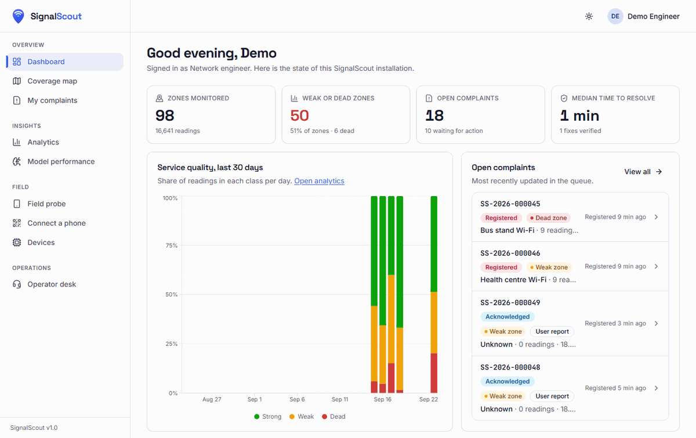
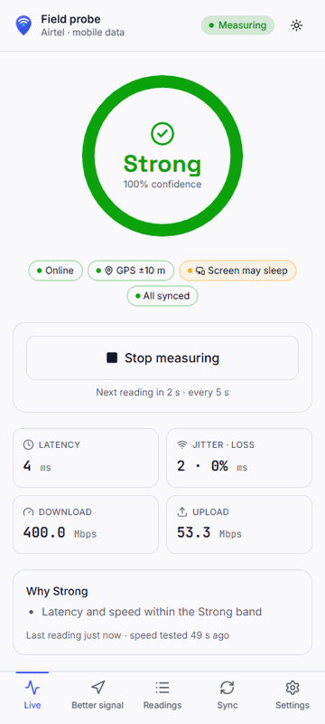
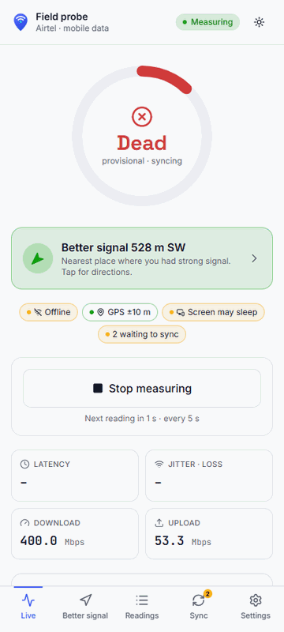
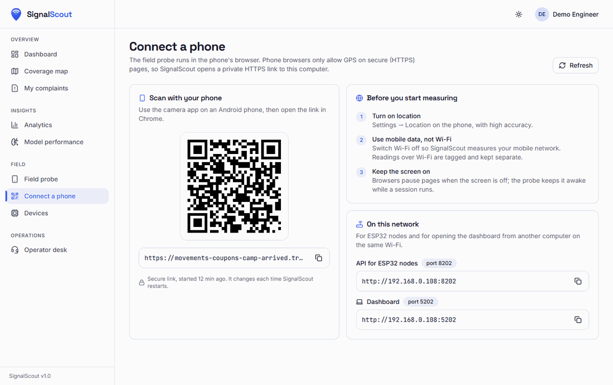
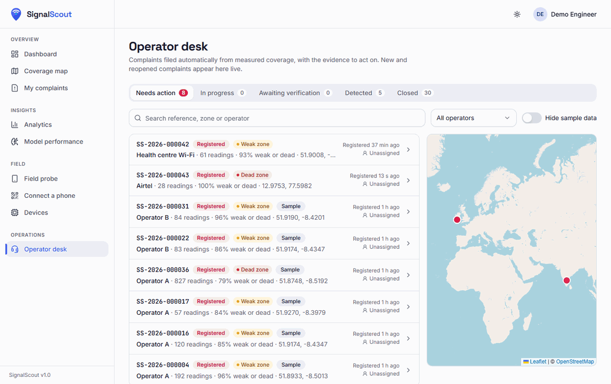
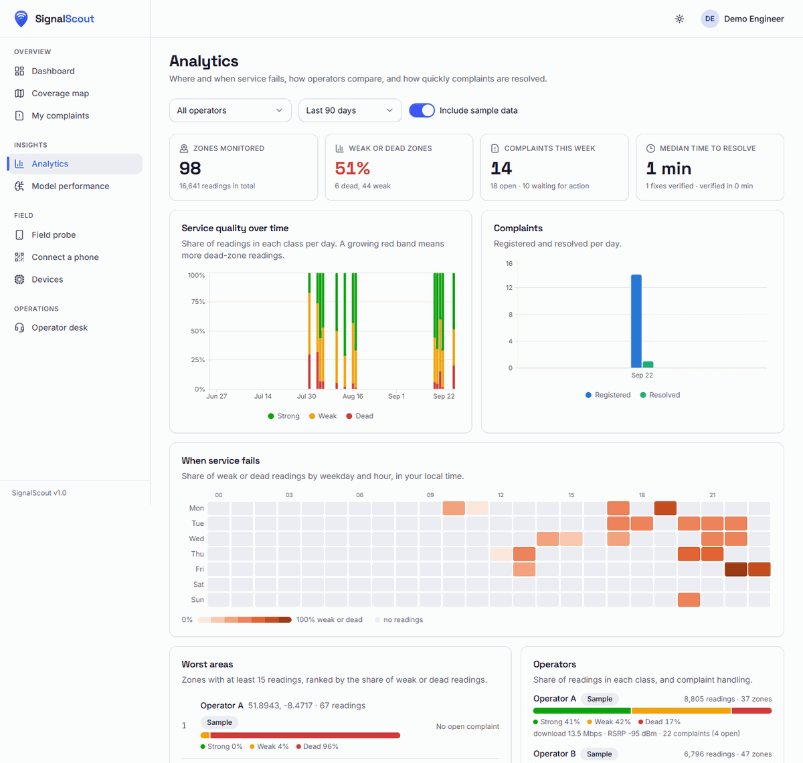
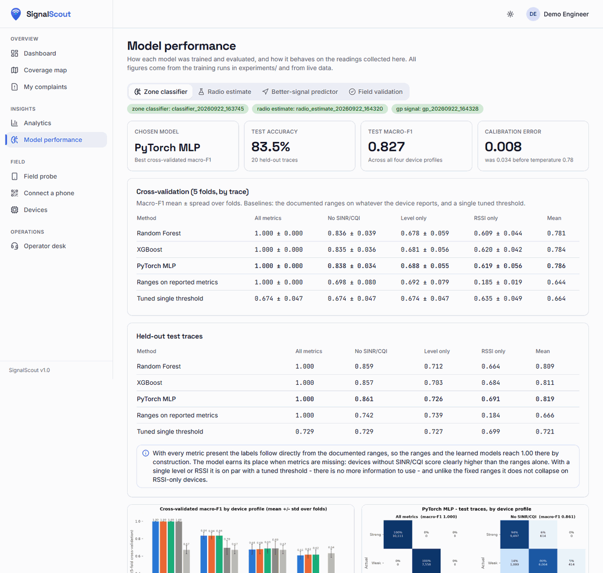

# User guide

This guide walks through every screen. The dashboard is at **http://localhost:5202** on the PC running SignalScout. The phone opens the field probe through the link on **Connect a phone**.

**Demo accounts.** The password for all three is `Scout@2026`. Demo passwords cannot be changed.

| Account | Role | Sees |
|---|---|---|
| `user@signalscout.demo` | Field user | Dashboard, map, own complaints, analytics, model performance, field probe, own devices |
| `engineer@signalscout.demo` | Network engineer | Everything above plus the **Operator desk** and all complaints |
| `admin@signalscout.demo` | Administrator | Everything plus **Settings** and **Users** |

New accounts made with **Register** are field users. An admin can promote them.

Throughout the product:

- **Strong** means reliable calls and data, **Weak** means slow, laggy or unstable service, and **Dead** means no usable connection.
- The colours green, amber and red always come with the word, never alone.
- Data from the public-dataset replay is tagged **Sample**.

---

## 1. Landing page, sign in, register

The landing page explains the product and shows live numbers from this installation. **Get started** creates an account. **Try a demo account** goes to sign in, where three buttons fill in the demo accounts.

After signing in you land on the dashboard. If you followed a link to a particular page, such as the probe link from the QR code, you land there instead.

The sun/moon button switches between light, dark and system theme. The menu under your name has **Profile** and **Sign out**.

## 2. Dashboard

- **Four tiles:**
  - zones monitored;
  - weak or dead zones;
  - open complaints;
  - a fourth tile that depends on your role: median time to resolve for engineers, or your own readings for field users.
- **Service quality, last 30 days:** the share of readings in each class per day. Hover a bar for the numbers. Days without readings stay empty.
- **Open complaints:** the four most recently updated. Engineers see the whole queue; field users see complaints from zones they measured. **View all** opens the full list.
- **System status:** API, database and the three models. **Measure with your phone** gives the three-step start. **How zones are judged** explains the classes.

## 3. Coverage map

**Layers** (panel on the right; the layers button on phones):

| Layer | Shows |
|---|---|
| Zones (hexagons) | One hexagon (about 0.1 km²) per zone, coloured by its class over the selected period |
| Problem heat | Where Weak and Dead readings concentrate |
| Recent readings | The latest individual readings; new ones appear live and pulse briefly |
| Sensor nodes | ESP32 nodes (and simulated ones) with their latest Wi-Fi link state |
| Open complaints | Pins for complaints that are not closed |
| Predicted coverage | The Gaussian Process prediction around the map centre, as a grid |

- **Area.** When readings exist in more than one town, for example the sample city and where you measure, a selector under the title switches between them. The map opens on the area where real devices measured most recently. **Show my area** jumps to your current position.
- **Filters:**
  - operator;
  - period (last 24 hours, 7 days, 30 days, or all time);
  - time of day (all day, morning, afternoon, evening, night), in your local time;
  - sources (phones, ESP32 nodes, simulator, sample);
  - whether to include phone readings made over Wi-Fi.

  Filters are remembered in this browser.
- **Zone details.** Click a hexagon for its readings by class, the confidence, median latency, speed or signal, the operators seen there and the last reading. Two buttons:
  - **Better signal:** draws a line to the nearest predicted strong spot and explains the prediction.
  - **Report:** opens a report form for this place; see [My complaints](#6-my-complaints).
- The legend at the bottom left counts readings per class for the current filters.

## 4. Field probe (on the phone)

Open **Connect a phone** on the PC and scan the QR code with an Android phone. Then, on the phone:

1. Turn **Wi-Fi off**, so the mobile network is measured, and turn location on.
2. Open the link in **Chrome** and sign in.
3. Allow location, then tap **Register and continue**. The phone gets its own device key.
4. Optional: Chrome menu → **Add to Home screen** installs the probe like an app.

The probe has five tabs at the bottom.

| Live, good service | Live, in a dead spot without connection |
|---|---|
|  |  |

- **Live**
  - **Start measuring / Stop measuring.**
  - The meter shows the class of the latest reading: provisional on the phone, then confirmed by the server with a confidence.
  - Chips show whether you are online, GPS accuracy, whether the screen is kept on, and how many readings wait to sync.
  - Tiles show latency, jitter and loss, and the last speed test with its age.
  - **Why …** lists the reasons for the class. When the phone ran a speed test, it also shows the *estimated radio condition*, clearly marked as an estimate.
  - **In a Weak or Dead spot**, a green card points to **Better signal … m** in a compass direction, even without a connection. Tap it for directions.
- **Better signal:** an arrow and a distance to the nearest spot predicted strong for your operator, with the predicted value and the chance it is strong.
  - The arrow follows the phone's compass when available; otherwise it points relative to north.
  - **Walking directions** opens OpenStreetMap.
  - Strong spots around you are saved for offline use every 30 minutes, or after moving 1 km.
- **Readings:** the log of readings on this phone, with class, time and sync state.
- **Sync:**
  - readings waiting and the last upload;
  - the upload history (accepted, duplicates, rejected);
  - **Sync now**.

  Queued readings upload automatically when the connection returns, with their original times and positions.
- **Settings:**
  - **Mobile operator** (detected automatically; set it by hand if needed);
  - **Reading every** (5, 10, 20, 30 or 60 seconds);
  - **Speed test every**;
  - **Data saver**, which skips speed tests, and the estimated data use per hour;
  - **Unregister this phone**, **Sign out** and **Open the dashboard**.

Keep the screen on while measuring. The probe asks the browser to keep it awake. Readings over Wi-Fi are kept separate from mobile coverage.

## 5. Connect a phone

- **QR code** with the secure (HTTPS) link to the probe. Phone browsers only allow GPS on HTTPS pages. The link comes from a free Cloudflare tunnel started by `run.bat`, and it changes on every start. The page checks for the new link every 5 seconds.
- **Before you start measuring:** location on, mobile data instead of Wi-Fi, screen on.
- **On this network:** the PC's LAN addresses. Use the API address for ESP32 nodes, and the dashboard address for other computers on the same Wi-Fi. Each has a copy button.

## 6. My complaints

- Tabs **Open**, **Closed** and **All**. They list complaints raised where your phone measured weak or dead service, and problems you reported yourself.
- **Report a problem** opens a form:
  1. Choose where. Your current location, or the zone you clicked on the map, is filled in.
  2. Choose the operator (detected, or chosen by you).
  3. Describe what happened.
  4. **Register complaint** files it immediately, with the measured evidence from that zone attached.

  If the zone already has an open complaint, your report is added to it as a note.

## 7. Complaint page

- **Header:** reference (`SS-2026-000043`), status, severity, operator and zone.
- **Stepper:** Detected → Registered → Acknowledged → In progress → Resolved → Verified, each with the time it was reached.
- **Complaint text:** ready to paste into an email or ticket, with a **Copy** button.
- **Evidence:**
  - readings by class, share weak or dead, time span, confidence;
  - measured service (no connection, latency, download and upload medians) or radio metrics (signal level, quality, serving cells), depending on the device;
  - the most common reasons and the data sources.
- **Readings over time:** chart of the key metric, with gaps where there were no readings.
- **Map:** the zone outline and the nearest strong spot. With an OpenCelliD key, known towers within 1 km are shown as well.
- **Automatic verification:** after *Resolved*, the new readings counted, the share strong, and the outcome (*Fix confirmed* or *reopened*).
- **History:** every status change, assignment and note, with who made it and when. Anyone who can see the complaint can **Add a note**.
- **Export evidence:** evidence as JSON, readings as CSV, or **Print or save as PDF**. The print layout hides the navigation.
- **Engineers also see:**
  - the action buttons for the next steps: **Acknowledge**, **Start work**, **Mark resolved**, **Confirm fix**, **Reopen**, **Dismiss** (dismissing needs a reason);
  - **Assign** to an engineer.

## 8. Operator desk (engineers)

- **Queues:**

  | Queue | Statuses |
  |---|---|
  | Needs action | registered, including reopened |
  | In progress | acknowledged, in progress |
  | Awaiting verification | resolved |
  | Detected | not yet persistent |
  | Closed | verified, dismissed |

  The counts update live. A new or reopened complaint appears without reloading the page.
- **Search** by reference, zone or operator. **Filter** by operator. **Hide sample data**.
- The list shows severity, operator, readings, share weak or dead, place, age and assignee. The map on wide screens shows the same complaints as pins.
- Open a complaint to act on it; see [Complaint page](#7-complaint-page).
- With email and Telegram configured, the desk inbox and chat get a message for every registered or reopened complaint, with a link to it.

## 9. Analytics

Filters at the top: operator, period, and whether to include sample data. They are remembered.

- **Tiles:** zones monitored, share of weak or dead zones, complaints this week, median time to resolve.
- **Service quality over time:** the daily class shares. **Complaints:** registered and resolved per day.
- **When service fails:** a weekday × hour grid of the share of weak or dead readings, in your local time. Darker means worse. Hover a cell for its numbers.
- **Worst areas:** zones with at least 15 readings, ranked by the share of weak or dead readings. Each shows its position, class bar and any open complaint (click to open it).
- **Operators:** class shares, median latency, download or signal, complaints and resolution time for each operator.
- **Complaint funnel:** how many complaints reached each stage, and the median time between stages; plus dismissed and reopened counts.

## 10. Model performance

| Tab | Shows |
|---|---|
| **Zone classifier** | Chosen model, test accuracy, macro-F1, calibration error; cross-validation and test tables against the baselines, for each device profile; plots (profile scores, confusion matrices, calibration, feature importance, training curve); labels and data |
| **Radio estimate** | Per-test and per-zone results against baselines, how to read them, plots |
| **Better-signal predictor** | Error on held-out areas against four baselines, uncertainty bands, length scales, plots |
| **Field validation** | Checks on this installation's own data: the predictor on your phone speed tests (after 30 measured spots), agreement between measured class and radio estimate, and radio readings from field devices |

Badges at the top show the model versions that are loaded. [05_MODELS_AND_TRAINING.md](05_MODELS_AND_TRAINING.md) explains every number.

## 11. Devices

- **Phones** and **Sensor nodes**, each with status (online or offline), last seen, reading count and key prefix.
- **Add ESP32 node:**
  1. Enter a name and the Wi-Fi network it monitors.
  2. If it has no GPS, enter a fixed latitude and longitude.
  3. Copy the device key. It is shown **once**, together with the two lines to paste into the firmware's `config.h`.
- For each device you can:
  - rename it or change its position;
  - **replace its key**; the old one stops working;
  - see its **sync history**;
  - remove it (its readings stay).
- Simulated nodes (when `ESP32_SIMULATOR=true`) appear here as "Simulated node".

## 12. Profile

- Display name.
- **Email me when my complaints change** (needs email to be configured).
- Change password (not for demo accounts).

## 13. Settings (admins)

- **Zone and complaint rules:** readings needed, window, bad share, persistence, verification readings, strong and reopen shares, verification timeout, probe thresholds. Each value shows its allowed range. **Save** applies the changed values at once.
  - **Demo thresholds** register a complaint after about 2 minutes in a dead zone, for live demonstrations.
  - **Standard thresholds** suit day-to-day monitoring.
- **Notifications:**
  - status of the Telegram desk chat and of email (Gmail SMTP);
  - switches to send to each;
  - **Link Telegram chat**: send any message to your bot first;
  - **Send test**.

  The status line also shows whether the optional OpenCelliD and Gemini services are on.
- **Sample data:** readings, zones and complaints from the replay. **Remove sample data** or **Load again**.
- **Recent notifications:** each message with its channel, state (pending, sent, failed), attempts and error.

## 14. Users (admins)

- All accounts with role, status and creation date.
- Change a role (field user, engineer, admin), or disable and enable an account.
- You cannot demote or disable yourself.
