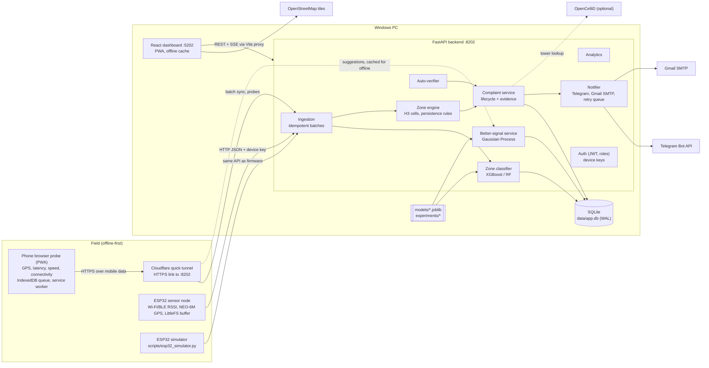
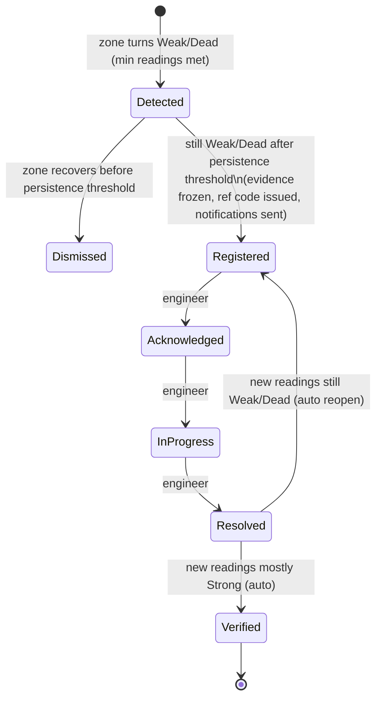

# SignalScout - Build Plan

SignalScout finds weak and dead mobile-network zones automatically from real phone and sensor readings, points people to better signal nearby, and files complaints with technical evidence that engineers can act on and that the system verifies on its own.

This document is the engineering plan: architecture, modules, data model, API surface, ML pipeline, screens, milestones and risks.

> This is the plan the product was built from. Some file names changed while it was built. For what exists now, see [11_PROJECT_STRUCTURE.md](11_PROJECT_STRUCTURE.md) and [02_ARCHITECTURE.md](02_ARCHITECTURE.md).

---

## 1. Environment check (build machine)

| Item | Found | Status |
|---|---|---|
| OS | Windows 11 Pro 10.0.26200 | OK |
| CPU / RAM | Intel i5-12500 (6C/12T), 15.7 GB | OK - CPU training is enough |
| Free disk | C: 200 GB, D: 86 GB | OK |
| Python | 3.11.9 (`python`), 3.14 also installed (`py` default) | OK - setup uses `py -3.11` explicitly |
| Node.js / npm | v24.19.0 LTS / 11.17 | OK |
| Git | 2.55 | OK |
| JDK | Temurin 17.0.20 | Not needed (no native app) |
| winget | 1.29 | OK - used for optional installs |
| Arduino IDE | not installed | Needed only if ESP32 hardware is available |
| cloudflared | not installed | Needed for the phone probe (HTTPS link). `setup.bat` downloads the portable exe into `tools/`, so nothing is installed system-wide |

**Decision (2026-09-22): phone-browser probe instead of a native Android app.** The field probe on the phone is a web app (PWA) opened in the phone's browser, not an APK. Consequences:
- **What it can measure.** A browser cannot read radio metrics (RSRP/RSRQ/SINR, cell ID). It measures connectivity, latency, jitter, packet loss and download/upload speed, plus GPS.
- **HTTPS link.** Phone browsers allow GPS only on HTTPS pages. The phone therefore opens the probe through a Cloudflare quick tunnel (HTTPS). That tunnel also lets the phone stay on mobile data, which is what must be measured, and still reach this PC.
- **Screen on.** Browsers pause pages when the screen is off, so a walk session keeps the screen awake with the Wake Lock API.

Both public datasets download anonymously from Kaggle (no API token needed), so `scripts/download_data.py` works without a Kaggle account. The token remains supported as a fallback.

---

## 2. Architecture

**Key decisions**

- **One local backend.** FastAPI and SQLite in one process, with background loops started in the app lifespan for zone evaluation, verification, notification retry and device heartbeat. No broker and no Docker.
- **H3 hexagons as zones.** Resolution 9 (~0.1 km² per cell, about 175 m edge) is the unit for zone state, complaints and the hex-grid layer. Zone state is kept per (cell, operator) because two operators can differ completely at the same spot.
- **Device keys for ingestion.** Phone probes and ESP32 nodes send readings with a per-device API key; a stolen key cannot touch users or complaints. People use JWT with roles `user`, `engineer` and `admin`.
- **Idempotent sync.** Every reading carries a client-generated UUID. Re-sending a batch after a dropped connection never creates duplicates, which is what makes offline-first safe.
- **Operator and link detection for the phone probe.** The backend looks up the public IP of each probe request (`CF-Connecting-IP` from the tunnel) in the free offline iptoasn.com database. The network number (ASN) identifies the carrier (for example AS55836 Jio, AS45609 Airtel, AS38266 Vi, AS9829 BSNL), which also shows whether the reading came over mobile data or a broadband Wi-Fi line. The user can override the operator in the probe settings.
- **Offline-first on all sides.**
  - Phone probe: readings are written to IndexedDB first; a service worker keeps the probe usable offline, and the queue flushes on reconnect (Background Sync where the browser supports it).
  - ESP32: LittleFS ring buffer.
  - Dashboard: PWA with a service worker, persisted TanStack Query cache and a queue of pending actions.
  - Backend: notifications wait in a retry queue during internet outages; SQLite runs in WAL mode to survive power loss.

**Ports:**
- Backend `8202`. It also serves the production build of the web app, so the tunnel exposes one HTTPS origin for the phone.
- Frontend dev server `5202` (`strictPort: true`), for desktop use.
- No extra services are planned. If one becomes necessary it will use `12020-12029`.
- The ESP32 simulator and cloudflared are clients and open no local port.

---

## 3. Modules mapped to features

| Feature | Backend (`backend/app/...`) | Frontend (`frontend/src/...`) | Other |
|---|---|---|---|
| **F1 Phone field probe (browser)** | `api/probe.py` (ping, download/upload test endpoints, carrier lookup), `api/devices.py` (probe pairing), `api/ingest.py`, `services/carrier.py` (IP -> ASN -> operator) | `pages/probe/*` (live meter, readings log, sync status, better signal, settings), `lib/probe/*` (measurement loop, IndexedDB queue, Wake Lock), `pages/Connect.tsx` (QR code with the HTTPS link) | `tools/cloudflared.exe` (downloaded by setup), `data/asn/` (iptoasn database) |
| **F2 ESP32 sensor node** | `api/ingest.py` (`/ingest/node` compact format) | `pages/Devices.tsx` (node status, last seen, battery/uptime) | `firmware/esp32_node/`, `scripts/esp32_simulator.py` (seeded) |
| **F3 Zone classification** | `ml/classifier.py` (radio model), `ml/service_quality.py` (probe bands + throughput model), `services/zone_engine.py` | badges and confidence everywhere, `pages/CoverageMap.tsx` | `ml/train_classifier.py`, `ml/train_throughput_model.py` |
| **F4 Coverage heatmap** | `api/coverage.py` (heat points, H3 GeoJSON, filters) | `pages/CoverageMap.tsx` (Leaflet, leaflet.heat, hex layer, filters, live SSE layer) | - |
| **F5 Better-signal suggestions** | `ml/gp_service.py`, `api/suggest.py` | map "Find better signal" panel; probe "Better signal" screen with offline cache | `ml/train_gp.py` |
| **F6 Automatic complaints** | `services/complaint_service.py`, `services/evidence.py` | `pages/MyComplaints.tsx`, `pages/ComplaintDetail.tsx` | - |
| **F7 Auto-verification** | `services/verifier.py` | verification timeline and badge in complaint detail | - |
| **F8 Operator desk** | `api/complaints.py` (queue, transitions, notes, assignment), `services/notifier.py` | `pages/OperatorDesk.tsx`, `pages/DeskComplaint.tsx` | Telegram Bot API, Gmail SMTP |
| **F9 Offline-first** | idempotent ingestion, notification retry queue, `/api/sync/status` | PWA (vite-plugin-pwa), query persistence, offline banner and pending-actions queue; probe IndexedDB queue | LittleFS buffer in firmware |
| **F10 Analytics** | `api/analytics.py`, `services/analytics.py` | `pages/Analytics.tsx`, `pages/Dashboard.tsx` | - |
| Model performance | `api/ml.py` (metrics, plots, live field validation) | `pages/ModelPerformance.tsx` | `experiments/<run>/` |

Shared parts: `core/config.py`, `core/security.py`, `core/db.py`, `core/logging.py`, `models/*.py` (SQLAlchemy), `schemas/*.py` (Pydantic v2), `services/opencellid.py`, `services/geo.py` (H3, distances, bearings).

---

## 4. Database tables (SQLite, SQLAlchemy 2.x)

| Table | Purpose | Key columns |
|---|---|---|
| `users` | People and roles | id, email (unique), name, role (`user`/`engineer`/`admin`), password_hash, telegram_chat_id?, created_at |
| `devices` | Phone probes, ESP32 nodes, simulators | id, owner_id, kind (`phone`/`esp32`/`simulator`), name, api_key_hash, hardware (browser / firmware), fixed_lat/lon (nodes), last_seen_at, last_sync_at, status |
| `readings` | Every observation | id, client_uuid (unique), device_id, source (`phone`/`esp32`/`simulator`/`sample_dataset`), ts, received_at, lat, lon, accuracy_m, h3_cell, operator, operator_source (`asn`/`manual`/`reported`), asn, link (`cellular`/`wifi`/`unknown`), network_type, in_service, connected; radio metrics when available (cell_id, tac, pci, earfcn, rssi, rsrp, rsrq, sinr, cqi); service metrics (latency_ms, jitter_ms, packet_loss, dl_mbps, ul_mbps, browser effective_type / downlink / rtt estimates); wifi_rssi, ble_rssi; zone_label, zone_confidence, label_method, radio_estimate, radio_estimate_confidence, model_version |
| `zone_states` | Live state per hexagon + operator | (h3_cell, operator) PK, label, confidence, readings_24h, weak_share, median_rsrp, first_bad_at, last_reading_at, open_complaint_id |
| `complaints` | Complaint lifecycle | id, ref_code (e.g. `SS-2026-000123`), h3_cell, operator, center lat/lon, status, severity, reporter_user_id?, assigned_to?, evidence_json, suggestion_json, reopen_count, timestamps per status, verification_result |
| `complaint_events` | Audit trail | id, complaint_id, ts, from_status, to_status, actor (user id or `system`), note |
| `notifications` | Outgoing messages + retry queue | id, complaint_id, channel (`telegram`/`email`), recipient, payload, status (`pending`/`sent`/`failed`), attempts, last_error, sent_at |
| `sync_batches` | Sync history per device | id, device_id, received, accepted, duplicates, rejected, ts |
| `cell_towers` | OpenCelliD cache | (mcc, mnc, area, cell) PK, lat, lon, range_m, fetched_at |
| `settings` | Admin-tunable thresholds | key, value, updated_by, updated_at |

Indexes on `readings(ts)`, `readings(h3_cell, operator, ts)`, `readings(device_id, ts)` and `complaints(status)`.

---

## 5. API endpoints (all under `/api`, OpenAPI at `/docs`)

| Area | Method and path | Who |
|---|---|---|
| Health | `GET /health` | public |
| Auth | `POST /auth/register`, `POST /auth/login`, `GET /auth/me`, `PATCH /auth/me` | public / any |
| Devices | `GET /devices`, `POST /devices` (ESP32/simulator, returns key once), `POST /devices/phone` (probe pairing), `POST /devices/{id}/rotate-key`, `DELETE /devices/{id}` | owner / admin |
| Probe | `GET /probe/ping` (latency probe), `GET /probe/download?bytes=` (speed test payload), `POST /probe/upload` (upload speed), `GET /probe/whoami` (detected carrier, ASN and link type from the request IP) | device |
| Ingestion | `POST /ingest/readings` (batch <= 500, `X-Device-Key`), `POST /ingest/node` (compact ESP32 format) | device |
| Sync | `GET /sync/status` (per-device last sync, pending, history) | owner |
| Readings | `GET /readings` (filters, bbox, paging, CSV export), `GET /readings/stream` (SSE live feed) | any / role-scoped |
| Coverage | `GET /coverage/heat`, `GET /coverage/hex` (GeoJSON), `GET /coverage/predicted` (GP surface) - filters: operator, network type, hours, dates, source | any |
| Classify | `POST /ml/classify` (ad-hoc reading) | any |
| Suggest | `GET /suggest?lat&lon&operator&radius_m`, `GET /suggest/area` (strong-spot pack for offline cache on the phone) | any |
| Complaints | `GET /complaints` (mine / queue by role, filters), `GET /complaints/{id}`, `POST /complaints` (user-reported, evidence attached automatically), `POST /complaints/{id}/transition`, `POST /complaints/{id}/assign`, `POST /complaints/{id}/notes`, `GET /complaints/{id}/evidence.{json,csv}` | role-scoped |
| Analytics | `GET /analytics/summary`, `/trends`, `/worst-areas`, `/time-of-day`, `/operators`, `/complaint-funnel` | any (scoped) |
| Models | `GET /ml/models`, `GET /ml/models/{run}/artifacts/{file}`, `GET /ml/field-validation` | any |
| Admin | `GET/PUT /admin/settings`, `POST /admin/notifications/test`, `GET /admin/users`, `PATCH /admin/users/{id}` | admin |
| Connect | `GET /system/connect` (current HTTPS tunnel URL and LAN addresses, for the QR code on the Connect page) | any |

Outside `/api`, the backend serves the production build of the web app. The phone opens the dashboard and the probe from the same HTTPS origin.

---

## 6. ML pipeline

### 6.1 Data

| Dataset | Rows | What it gives | Use |
|---|---|---|---|
| 4G LTE Speed Dataset (Cork, 2 operators, 135 traces) | 174,523 | RSRP, RSRQ, SNR, CQI, RSSI, GPS, cell ID, operator, network mode (LTE / HSPA+ / UMTS / EDGE), mobility (static, pedestrian, car, bus, train) | Main training set for the classifier and the Gaussian Process. It has real spatial structure: correlation between neighbouring points is 0.57 at a median spacing of 27 m. |
| Cellular Network Analysis Dataset (Patna, Bihar) | 16,829 | signal strength (dBm), latency, throughput, network type 3G/4G/5G/LTE, GPS | External check of the classifier in "signal-level only" mode. It is **not** used for the Gaussian Process or the service models: its signal values show no spatial correlation (0.007), latency and throughput are unrelated to signal strength within every network type (correlation about 0), and it has no dead-zone readings. |
| Own field readings | grows | phone probe: GPS, connectivity, latency, jitter, loss, speed | Field validation inside the product; anonymised sample committed to `data/field/` |

Both public datasets are small (3 MB and 19 MB), so they are **committed in full** under `data/raw/`. `scripts/download_data.py` re-downloads and checksum-verifies them.

### 6.2 Labels - documented 3GPP-style ranges

Each available metric is mapped to a class using the ranges below. The reading's label is the **worst** class across its metrics, and "no service" is always Dead.

| Technology | Metric | Strong | Weak | Dead |
|---|---|---|---|---|
| LTE / NR | RSRP (dBm) | >= -100 | -115 to -100 | < -115 |
| LTE / NR | RSRQ (dB) | >= -15 | < -15 | - |
| LTE / NR | SINR (dB) | >= 5 | -3 to 5 | < -3 |
| UMTS / HSPA | RSCP (dBm) | >= -95 | -105 to -95 | < -105 |
| GSM / EDGE | RSSI (dBm) | >= -85 | -100 to -85 | < -100 |

On the Cork data this rule gives roughly 55% Strong, 31% Weak and 13% Dead. The exact cut-offs and their sources (3GPP TS 36.133 reporting ranges, common operator practice) go in `docs/05_MODELS_AND_TRAINING.md`.

### 6.3 Radio zone classifier (F3)

- **Used for** every reading that carries radio metrics: the public-dataset sample, an ESP32 node with an optional cellular modem, and any future native client.
- **Why ML on top of the ranges.** Devices often do **not** report every metric. Many chipsets return "unavailable" for RSRQ or SINR, and older devices give only RSSI. The model predicts the full-metric label from whatever subset is available, and it gives a calibrated confidence.
- **Features:**
  - technology family;
  - signal level (RSRP/RSCP/RSSI), RSRQ, SINR, RSSI and CQI, with native missing-value handling;
  - rolling statistics over the device's last 30 seconds (median, min, std, deviation from the median), which smooth out single-reading blips.
- **Training augmentation.** Random feature masking that imitates four device profiles: full metrics, no SINR/CQI, level only, and RSSI only.
- **Split.** Grouped by trace file (70 / 15 / 15), so no trace appears in both train and test.
- **Candidates.** Random Forest, XGBoost and a small PyTorch MLP (CPU), all compared against a single-threshold baseline. The best macro-F1 on validation wins.
- **Reported:**
  - accuracy, macro-F1 and per-class precision/recall;
  - confusion matrix;
  - scores per device profile;
  - reliability (calibration) curve;
  - external check on the Patna data.
- **Artefacts.** `experiments/classifier_<date>/` holds `model.joblib`, `metrics.json` (split, dates, sizes), PNG plots and `train.log`. The chosen model is copied to `models/zone_classifier.joblib`.
- **ESP32 readings.** These are Wi-Fi/BLE RSSI, which is on a different scale from cellular. They are classified with documented Wi-Fi ranges (Strong >= -67 dBm, Weak -80 to -67, Dead < -80 or disconnected, raised to at least Weak by latency > 300 ms or loss > 20%). The UI shows them as "Wi-Fi link" readings. If an optional cellular modem (SIM800L / SIM7600) is attached, its cellular readings go through the radio model.

### 6.3b Phone-probe readings (F1, F3)

The browser measures **service quality directly**, and these measurements are facts, not estimates. The probe reading's class therefore comes from documented service-quality bands:

| Class | Rule (per reading, 3 latency probes + periodic speed test) |
|---|---|
| Dead | no connectivity: the browser is offline, or at least 2 of 3 probes fail |
| Weak | median round-trip > 400 ms (ITU-T G.114 limit for interactive voice), or download < 2 Mbps (India's broadband minimum since 2024), or 1 of 3 probes lost |
| Strong | otherwise |

The confidence comes from how many probes agree and how far the values are from the band edges.

**Radio-condition estimate (ML, supporting evidence).**
- **Training.** A gradient-boosted model trained on the Cork traces predicts the radio class (from the 3GPP ranges) using only what the browser can see: download/upload speed and their rolling statistics.
- **First measurement (2026-09-22), held-out traces:**
  - per reading: macro-F1 0.49 (chance level is 0.33);
  - per zone: accuracy 0.69, macro-F1 0.55.

  Speed depends on cell load as well as signal, so it is only a partial proxy.
- **How the product uses it.** The estimate is shown in evidence with its confidence ("estimated radio condition: Weak, 62%"). It **never overrides** the measured class, and its scores appear on the Model performance page.

### 6.4 Gaussian Process better-signal model (F5)

- **Coordinates.** Readings are projected to local metres around the area centroid.
- **Targets.**
  - Radio readings: signal level (RSRP; RSCP for 3G).
  - Phone-probe readings: log download speed.

  In the Cork traces both vary smoothly in space: correlation between neighbouring points is 0.66 for RSRP and 0.64 for log speed.
- **Kernel.** `Constant * Matern(nu=1.5) + WhiteKernel`. Hyperparameters (length scale, noise) are learned per target and operator on the Cork traces, and stored in `models/gp_signal.joblib` with a JSON sidecar.
- **Evaluation.** Spatial block cross-validation (200 m blocks held out), with interpolation **RMSE / MAE** compared against:
  - inverse-distance weighting;
  - k-nearest neighbours;
  - the global mean.

  It also reports 95%-interval coverage (does the uncertainty mean something?), plus plots.
- **At request time:**
  1. Take readings within 1.5 km of the user for the same operator, capped at the 1,500 most recent.
  2. Fit the GP with the learned hyperparameters frozen, which is fast.
  3. Predict on a 25 m grid.
  4. Return the **nearest** point where P(target >= Strong threshold) >= 0.8, with distance, bearing, predicted value ± uncertainty and how many readings support it. Probe readings with no connectivity enter as the lowest observed speed, so dead spots pull the surface down.
  5. With too little data, return an explicit "not enough readings nearby" answer and the nearest measured Strong reading, if any.
- **Offline use.** The phone downloads a strong-spot pack (`/suggest/area`) while online. In a dead zone with no data connection, the Better signal screen still works from that pack and from the phone's own history.

### 6.5 Inference service and tests

- `app/ml/` loads the models once at startup and exposes `classify(readings)` and `suggest(lat, lon, operator)`.
- Every stored reading records `model_version`.
- pytest covers feature building, masking robustness, label rules and GP suggestion geometry.

---

## 7. Complaint lifecycle (F6, F7, F8)

**Detection**

- **Start.** Per (H3 cell, operator), when at least `MIN_READINGS` (default 8) within `WINDOW_MIN` (default 30 min) are at least 70% Weak/Dead, the zone opens a **Detected** complaint.
- **Register.** If it stays that way for `PERSIST_MIN` (default 15 min), the complaint becomes **Registered**: evidence is frozen, a reference code is issued and notifications go out.
- **Tuning.** All thresholds live in the admin Settings screen. The demo profile uses short values so a live walk works.
- **Duplicates.** There is one open complaint per zone and operator. New bad readings add to its evidence.

**Evidence** frozen into each complaint:
- reading count, time span and Weak/Dead share;
- phone probe: share of readings with no connectivity, median and 90th-percentile latency, jitter, packet loss, median download/upload speed, carrier and ASN, and the radio-condition estimate with its confidence;
- radio readings: median and min RSRP/RSRQ/SINR, observed cell IDs, PCI/EARFCN and network types;
- number of devices;
- model version and mean confidence;
- up to 50 sample readings and a signal-over-time series;
- the GP's nearest strong spot;
- the serving-tower position and distance (OpenCelliD, if configured).

Evidence exports as JSON or CSV and has a print-friendly view.

**Auto-verification.** After **Resolved**, the verifier watches new readings in that zone:
- at least 5 readings that are 70% or more Strong -> **Verified**;
- 50% or more Weak/Dead -> reopened as **Registered**, with `reopen_count + 1` and a notification;
- no readings within 7 days -> flagged "awaiting verification data".

**Notifications**
- Telegram (bot plus desk chat) and Gmail SMTP messages on Registered, Reopened and Verified.
- The reporting user is emailed on status changes.
- Failed sends are retried with backoff, so internet outages only delay them.

---

## 8. Screens

| # | Screen | Route / place | Notes |
|---|---|---|---|
| 1 | Landing | `/` | React Bits animated hero, GSAP ScrollTrigger "How it works" and feature grid, Lenis smooth scroll, footer |
| 2 | Login / Register | `/login`, `/register` | demo accounts for user, engineer and admin |
| - | Dashboard | `/app` | KPI cards (readings today, dead-zone share, open complaints, mean time to resolve), Recharts trends |
| 3 | Phone field probe | `/probe` (phone browser, installable PWA) | Live meter (latency, speed, connectivity, zone and confidence, carrier), Readings log, Sync status (queued, last sync, history), Better signal (arrow, distance, offline pack), Settings (operator override, interval, data-saver). The desktop page `/app/connect` shows a QR code with the current HTTPS link. |
| 4 | Coverage map | `/app/map` | heat, hex-grid, live-readings, predicted-coverage, complaint and node layers; filters for operator, network type, time of day, dates and source; "Find better signal" |
| 5 | My complaints | `/app/complaints`, `/app/complaints/:id` | status timeline, evidence, verification result |
| 6 | Operator desk | `/app/desk`, `/app/desk/:id` | queue with filters and age, map, evidence charts, status transitions with notes, assignment |
| 7 | Devices | `/app/devices` | phones and ESP32/simulator nodes, keys, last seen, sync history |
| 8 | Analytics | `/app/analytics` | dead-zone trends, worst areas, hour × weekday heatmap, operator comparison, complaint funnel |
| 9 | Model performance | `/app/models` | metrics, confusion matrix, device-profile scores, calibration, GP RMSE vs baselines, live field validation |
| - | Settings (admin) | `/app/settings` | detection thresholds, notification channels, test message, users |

Every screen has loading (skeleton), empty and error states. All screens work from 360 px up, in light and dark themes, and respect `prefers-reduced-motion`.

**Sample data.** On first run the seed script replays a few public-dataset traces **through the real ingestion API**, so the classifier, zone engine and complaint engine produce genuine outputs. The resulting readings and complaints are tagged `sample_dataset`, show a "Sample" badge and can be hidden with the source filter or removed from Settings.

---

## 9. Phone field probe (F1, F9) - design

- **Access.**
  - `run.bat` starts a Cloudflare quick tunnel to port 8202 and records its HTTPS URL. The backend exposes it at `/api/system/connect`, and the desktop Connect page shows it as a QR code.
  - The phone scans it, logs in and pairs as a probe device, which stores a device key.
  - The probe can be added to the home screen (PWA).
- **Measurement loop** (default every 10 s while a session runs):
  - GPS fix and accuracy from `navigator.geolocation.watchPosition` (high accuracy).
  - Three latency probes to `/api/probe/ping`, giving median RTT, jitter and loss.
  - Browser connection hints where supported (Chrome on Android: `navigator.connection.type`, `effectiveType`, `downlink`, `rtt`).
  - A speed test every 60 s: an adaptive download of up to 1 MB from `/api/probe/download`, capped at 8 s, plus a small upload. The interval is adjustable, and a data-saver mode skips speed tests.
  - Connectivity comes from `navigator.onLine` plus probe results. An offline reading still records GPS and is marked "no connectivity".
- **Mobile data check.**
  - The backend's carrier lookup (ASN) tells whether the phone is on a mobile carrier or a Wi-Fi broadband line.
  - The probe warns "Switch off Wi-Fi to measure your mobile network" and tags Wi-Fi readings so they never mix into mobile coverage.
- **Screen and background.**
  - Browsers pause pages with the screen off, so a session holds a Screen Wake Lock and shows a clear "keep this screen open" notice.
  - When the page is backgrounded, missed intervals are simply not recorded. Readings are never invented.
- **Storage and sync.**
  - Every reading goes to IndexedDB first, with a client UUID.
  - The queue uploads in batches of 200 when online, with exponential backoff and Background Sync where available.
  - After sync, the server's label, confidence and radio estimate are stored back on each reading.
- **Offline.** The service worker precaches the probe, so it opens and records in airplane mode. The last downloaded strong-spot pack powers Better signal offline.
- **Limits, stated in the UI and docs.**
  - No radio metrics (signal strength, cell ID) and no network generation in the browser.
  - The screen must stay on.
  - iPhone Safari has no connection hints; the carrier lookup still works.

## 10. ESP32 sensor node (F2) - design

- Arduino C++ in `firmware/esp32_node/`.
- **Measurements:**
  - Wi-Fi scan (RSSI of the connected AP and the strongest APs);
  - BLE scan RSSI (NimBLE);
  - HTTP latency and loss to the API;
  - NEO-6M GPS over UART2 (TinyGPSPlus), or a fixed configured location.
- **Time.** NTP, or GPS time.
- **Offline.** Readings go into a LittleFS ring buffer and are flushed when the API is reachable.
- **Config.** `config.h` is git-ignored; `config.example.h` is committed.
- **Simulator.** `scripts/esp32_simulator.py` (seeded) registers simulated nodes and posts the identical JSON over HTTP. `run.bat` starts it when `ESP32_SIMULATOR=true`.

---

## 11. Milestones

| Phase | Milestone | Done when |
|---|---|---|
| 3 | Foundations | `setup.bat` / `run.bat` work; FastAPI with DB, auth, roles and seed users; React shell with routing, theme, sidebar layout and login |
| 4 | Data and ML | datasets committed, preprocessing, classifier and GP trained, `experiments/` artefacts, inference service and tests |
| 5a | F3 + F2 | readings ingested and classified; simulator nodes live |
| 5b | F4 | coverage map with heat, hex, live and predicted layers and filters |
| 5c | F1 + F9 | phone probe measuring over the HTTPS tunnel, storing offline and syncing; carrier detection |
| 5d | F5 | better-signal suggestions on web and phone, including offline pack |
| 5e | F6 + F8 | automatic complaints, evidence, operator desk, notifications |
| 5f | F7 | auto-verification and reopen |
| 5g | F10 + model page | analytics and model-performance screens |
| 6 | Landing and polish | animated landing page, micro-interactions, responsive and accessibility pass, PWA offline mode |
| 7 | End-to-end test | pytest green, production build green, demo scenario walked through |
| 8 | Docs and hand-over | docs 01-11, README, HOW_TO_RUN copied |

Each milestone ends with a commit and push.

---

## 12. Risks and mitigations

| Risk | Mitigation |
|---|---|
| Many phones report RSRQ/SINR as "unavailable" | The classifier is trained with feature masking; scores are reported per device profile |
| Labels come from ranges, so full-metric accuracy is close to 100% by construction | Reported honestly; the model's value (partial metrics, confidence) is shown with per-profile scores and a baseline comparison |
| Public data is from Ireland; target users are in rural and semi-urban India | Live field validation on the user's own readings on the Model performance screen; retraining script includes `data/field/` |
| The Patna dataset has no spatial structure and no dead readings | Used only for signal-level-only validation and latency analysis; GP trained and evaluated on Cork traces |
| Gaussian Process cost grows as n³ | Local fit around the user, capped at 1,500 points, with frozen hyperparameters (well under 1 s) |
| The browser cannot read radio metrics | Measured service-quality bands decide the class; the throughput-based radio estimate is labelled as an estimate with its real scores (per-reading macro-F1 0.49) |
| Browsers pause pages with the screen off | Screen Wake Lock during sessions; gaps are shown as gaps, never filled |
| The phone is on Wi-Fi instead of mobile data | Carrier (ASN) lookup plus connection hints; Wi-Fi readings tagged and kept out of mobile coverage |
| The quick-tunnel URL changes on every start | `run.bat` captures it and the Connect page shows a fresh QR code; the probe stores only its device key |
| Latency includes the tunnel path | All probe readings share the same path, so zones stay comparable; bands leave headroom (400 ms) |
| Speed tests use mobile data (about 1 MB per minute) | Adjustable interval, data-saver mode, and size shown in Settings |
| No ESP32 hardware | Seeded simulator that uses the same API as the firmware |
| ESP32 measures Wi-Fi/BLE, not cellular | Wi-Fi link readings classified with documented Wi-Fi ranges and shown as such; optional cellular modem support |
| OpenStreetMap tile policy | Attribution shown; service worker caches only tiles already viewed |

---

## 13. Stack notes

- **Stack as specified:** React 18, Vite, TypeScript, Tailwind, shadcn/ui, Motion, GSAP, Lenis, React Bits, Recharts, FastAPI, SQLAlchemy, SQLite, PyJWT, passlib, scikit-learn, XGBoost, Leaflet and leaflet.heat.
- **Changed at the owner's request:** the Kotlin / Compose / Room / WorkManager / Retrofit Android app is replaced by the phone-browser probe (PWA, IndexedDB, service worker, Wake Lock). There is no `android/` folder and no APK.
- **Added for the probe:**
  - `cloudflared` quick tunnel, as a portable exe in `tools/` downloaded by `setup.bat`;
  - the iptoasn.com IP-to-ASN database (public domain, downloaded to `data/asn/`);
  - `qrcode` for the Connect page.
- **Small additions:**
  - `h3` (hexagonal zones);
  - `react-leaflet`;
  - `vite-plugin-pwa` and `idb-keyval` (offline dashboard);
  - Arduino libraries TinyGPSPlus, NimBLE-Arduino and ArduinoJson.

  The live feed uses a plain FastAPI streaming response, so no extra SSE package is needed.
- **PyTorch (CPU build).** Installed with the backend environment. It trains the MLP candidate in the classifier comparison. This PC has no NVIDIA GPU, so the CPU wheel (about 200 MB) is used.
- **Gemini (optional).** A "complaint summary" can turn the evidence bundle into a plain-language complaint text for the operator. The model comes from `GEMINI_MODEL`, default `gemini-3.8-flash` (the newest free-tier Flash model). Without a key, a deterministic template writes it from the same evidence.
