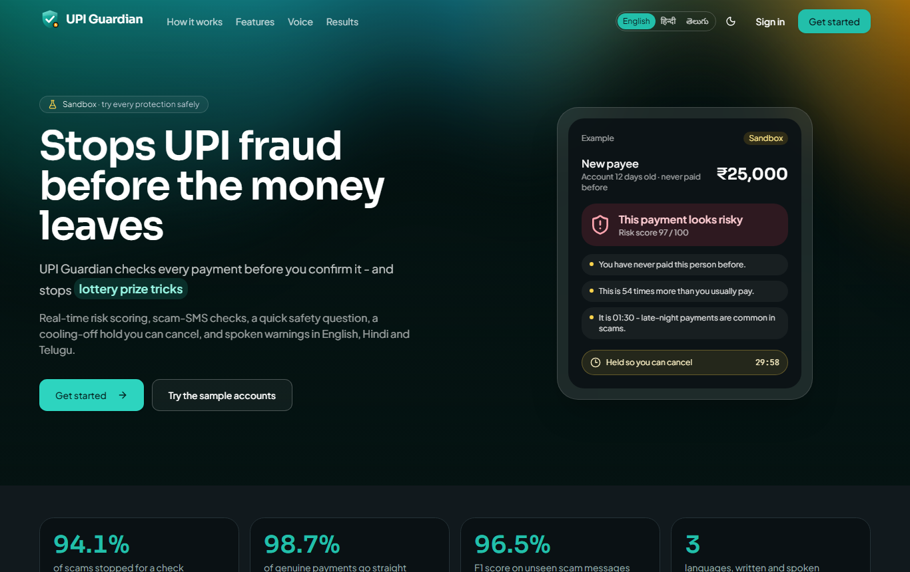
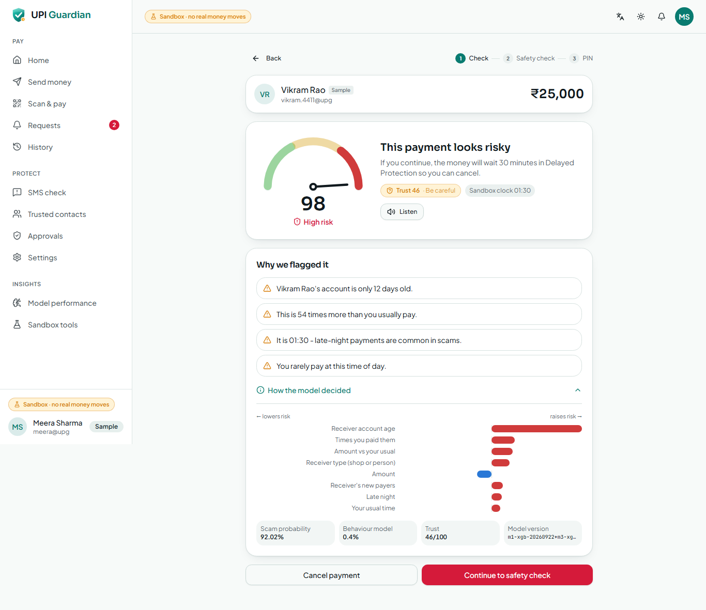
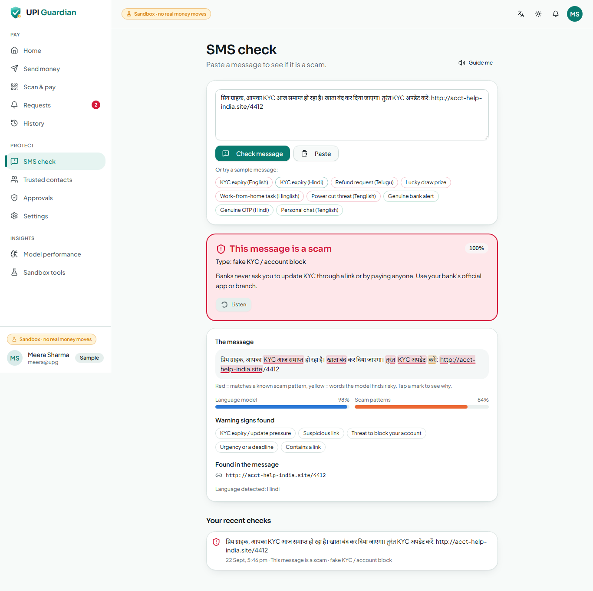
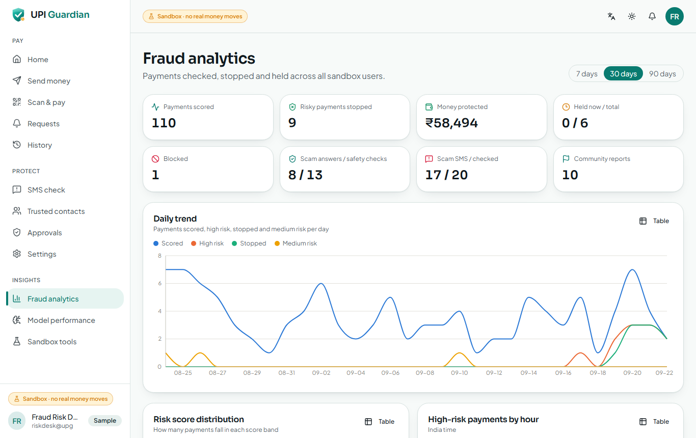

# UPI Guardian

**Stops UPI fraud before the money leaves.**

UPI Guardian scores every UPI payment in real time *before* you confirm it, checks suspicious SMS
messages, asks what a risky payment is for, holds high-risk payments in a cooling-off period you
can cancel, and explains every warning in plain language — written and spoken in **English,
Hindi and Telugu**. It runs as an installable web app (PWA) on your PC and your Android phone, in
a **sandbox** where no real money moves.



| Risk check before paying | Scam SMS check (Hindi) | Fraud analytics |
|---|---|---|
|  |  |  |

## Key features

- **Real-time risk engine** — two machine-learning models (a behaviour model trained on 400,000
  real benchmark transactions and a UPI payment-risk model) score each payment 0–100 from
  behaviour, payment history, payee trust and scam-SMS signals.
- **Payee trust score** — account age, how the receiver gets paid, community scam reports.
- **Suspicious SMS check** — NLP + Indian scam-pattern rules; verdict, scam type, advice and
  highlighted phrases; linked scam messages raise the risk of related payments.
- **Smart intent check** — "What is this payment for?" catches refund, prize, KYC, job-fee and
  "new number" scripts with the exact warning.
- **Delayed Protection Mode** — high-risk payments wait (default 30 min), cancel any time,
  optional approval by a trusted family member.
- **Explainable warnings** — SHAP reasons turned into short, true sentences.
- **Voice assistant** — personalised spoken warnings and screen guides in 3 languages.
- **Collect-request and QR guard** — catches "you will receive money" tricks that are debits.
- **Fraud analytics** — held, stopped and blocked payments, scam types, trends, live policy.
- **UPI sandbox** — wallets, UPI IDs, QR codes, collect requests, history, sample accounts.

Results on held-out test data: **94.1 %** of scams stopped for a check, **90.7 %** held, while
**98.7 %** of genuine payments go straight through; SMS scam F1 **0.965** across English, Hindi
and Telugu. See [docs/05_MODELS_AND_TRAINING.md](docs/05_MODELS_AND_TRAINING.md).

## Quick start (Windows 10/11)

Needs **Python 3.11** and **Node.js LTS** ([details](docs/03_HOW_TO_RUN.md)).

```bat
setup.bat        :: once - creates venv, installs everything, creates .env
run.bat          :: starts the API (8204) and the web app (5204) and opens the browser
```

Open **http://localhost:5204**. On a phone: install cloudflared once
(`winget install --id Cloudflare.cloudflared`) and run **`run_phone.bat`** — it prints an https
link to open in Chrome and install as an app. Stop everything with **`stop.bat`**.

## Demo login

| Account | Sign in | Password | Sandbox PIN |
|---|---|---|---|
| Everyday user — Meera Sharma | `demo@upiguardian.app` | `Guardian@123` | `1234` |
| Family member / trusted contact — Arjun Sharma | `family@upiguardian.app` | `Guardian@123` | `1234` |
| Fraud-risk team (admin) | `admin@upiguardian.app` | `Admin@1234` | `1234` |

The sign-in page also has one-tap **Use** buttons for these sample accounts. The four demo
scenarios are listed in [docs/03_HOW_TO_RUN.md §5](docs/03_HOW_TO_RUN.md#5-try-the-four-demo-scenarios).

## Tech stack

React 18 · Vite · TypeScript · Tailwind CSS · shadcn/ui · Motion · GSAP ScrollTrigger · Lenis ·
React Bits · Recharts · TanStack Query · vite-plugin-pwa · html5-qrcode — FastAPI · Pydantic v2 ·
SQLAlchemy 2 + SQLite · JWT + bcrypt — XGBoost · scikit-learn · SHAP · PyTorch · gTTS · qrcode —
Cloudflare quick tunnel for phones.

## Documentation index for maintainers

| Document | Contents |
|---|---|
| [docs/01_OVERVIEW.md](docs/01_OVERVIEW.md) | What the product is, the problem, users, feature list, headline results |
| [docs/02_ARCHITECTURE.md](docs/02_ARCHITECTURE.md) | Components, risk-engine data flow, sequence diagrams, data model, ports, security |
| [docs/03_HOW_TO_RUN.md](docs/03_HOW_TO_RUN.md) | Prerequisites, setup, start, sign-in, demo scenarios, phone, stop, reset, retrain, tests |
| [docs/04_DATASET.md](docs/04_DATASET.md) | Datasets, licences, schemas, cleaning, what is committed, download guide, Kaggle token |
| [docs/05_MODELS_AND_TRAINING.md](docs/05_MODELS_AND_TRAINING.md) | M1 / M2 / M3, training steps, result tables, policy, ablation, plots |
| [docs/06_API_REFERENCE.md](docs/06_API_REFERENCE.md) | Every endpoint with request and response examples |
| [docs/07_USER_GUIDE.md](docs/07_USER_GUIDE.md) | Screen-by-screen walkthrough of every feature |
| [docs/08_CONFIGURATION.md](docs/08_CONFIGURATION.md) | Every `.env` key, what it does and how to obtain it |
| [docs/09_TESTING.md](docs/09_TESTING.md) | Test suite, how to run it, results, the demo scenario, end-to-end checks |
| [docs/10_TROUBLESHOOTING.md](docs/10_TROUBLESHOOTING.md) | Common problems and fixes |
| [docs/11_PROJECT_STRUCTURE.md](docs/11_PROJECT_STRUCTURE.md) | Folder-by-folder explanation of the code |
| [docs/PLAN.md](docs/PLAN.md) | The original build plan and design decisions |

## Licences

Datasets: see [docs/04_DATASET.md](docs/04_DATASET.md). React Bits components in
`frontend/src/components/reactbits/` are used under their licence (`LICENSE.md` in that folder).
