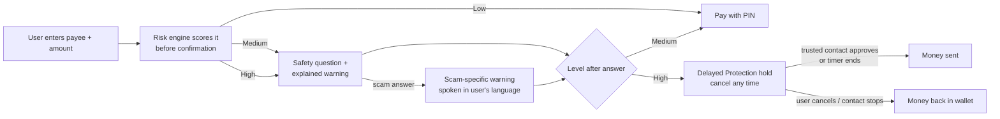

# 01 · Overview

**UPI Guardian stops UPI fraud before the money leaves.** It scores every payment in real time
before the user confirms it, checks suspicious SMS messages, asks what a risky payment is for,
holds high-risk payments for a cooling-off time that can be cancelled, and explains every warning
in plain language — written and spoken in English, Hindi and Telugu.

UPI Guardian runs as a **sandbox**: wallets, UPI IDs and money are simulated, so every protection
can be tried safely. No real bank, UPI app or money is ever involved.

---

## The problem

- UPI fraud through phishing messages, fake payment requests, QR code tricks and social
  engineering keeps rising.
- Most systems detect fraud only **after** the money has moved.
- In many scams the user approves the payment themselves, because they were tricked
  ("approve this request to receive your refund").
- Warnings are generic, unexplained and usually only in English.

**What is needed:** a preventive layer that assesses payment risk *before* confirmation and helps
the user stop — in a language they understand.

## Who uses it

| User | What they do with UPI Guardian |
|---|---|
| **UPI users**, especially first-time digital payment users and elderly people | Pay safely; get a clear, spoken warning when something looks wrong; cancel a held payment |
| **Family members (trusted contacts)** | Approve or stop a relative's risky payment while it is on hold |
| **Fraud-risk teams** | Watch held, stopped and blocked payments, scam types and trends; tune the risk policy |

## Features

| # | Feature | What it does |
|---|---|---|
| F1 | **UPI sandbox** | Wallets with UPI IDs, send money, scan-and-pay QR codes, collect requests (approve / decline), payment history. Clearly labelled sandbox. |
| F2 | **Real-time risk engine** | Every payment is scored 0–100 *before* confirmation from behaviour, payment history, payee trust and SMS signals, using two trained models (M1 behaviour + M3 payment risk). |
| F3 | **Payee trust score** | 0–100 score for the receiver from account age, received-payment pattern (many first-time payers, bursts) and community scam reports. |
| F4 | **Suspicious SMS check** | Paste a message: an NLP classifier plus Indian scam-pattern rules give a verdict (Safe / Suspicious / Scam), the scam type, advice and the risky phrases highlighted. A scam SMS mentioning a payee raises the risk of payments to that payee. |
| F5 | **Payment-intent verification** | Risky payments ask "What is this payment for?". Answers that match a scam script (refund, prize, KYC, job fee, "new number") show the warning for that exact scam and raise the risk. |
| F6 | **Delayed Protection Mode** | High-risk payments wait for a configurable cooling-off time (default 30 minutes), can be cancelled any time and — optionally — need a trusted contact's approval. |
| F7 | **Explainable warnings** | SHAP contributions from the risk model are turned into short, true sentences ("This is 54 times more than you usually pay"). |
| F8 | **Voice assistant** | Spoken, personalised warnings and screen guides in English, Hindi and Telugu (gTTS); the whole UI is translated. |
| F9 | **Collect-request and QR guard** | Detects "you will receive money" tricks that are really debits: deceptive collect-request notes, "scan to receive" QR codes, QR codes whose name does not match the account, QR codes that open websites. |
| F10 | **Fraud analytics** | Admin dashboard: payments scored, stopped, held and blocked, money protected, scam types, trends, risk distribution, most-reported UPI IDs, live policy editor. |
| – | **Model performance** | In-app view of every model's test metrics, comparisons, ablations and training plots. |

## How a risky payment is stopped (in one picture)

## Key results (held-out test data)

| Model | What it does | Headline result |
|---|---|---|
| M3 payment risk (XGBoost + SHAP) | The 0–100 score users see | PR-AUC **0.894**, ROC-AUC **0.980**; **94.1 %** of scams stopped for a check, **90.7 %** held, **98.7 %** of genuine payments go straight through |
| M1 behaviour (XGBoost) | Behavioural fraud signal from real benchmark data | ROC-AUC **0.844**, PR-AUC **0.350** (base rate 0.020) |
| M2 SMS scam classifier (TF-IDF + LR + rules) | Scam-message verdicts in 3 languages | F1 **0.965**, PR-AUC **0.991**; on unseen Indian templates F1 0.961 (en), 0.948 (hi), 0.993 (te) |

Details: [05_MODELS_AND_TRAINING.md](05_MODELS_AND_TRAINING.md).

## Where to go next

- Run it: [03_HOW_TO_RUN.md](03_HOW_TO_RUN.md)
- Use it: [07_USER_GUIDE.md](07_USER_GUIDE.md)
- Understand it: [02_ARCHITECTURE.md](02_ARCHITECTURE.md)
