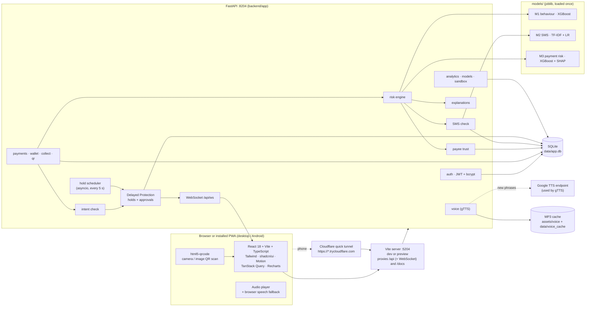
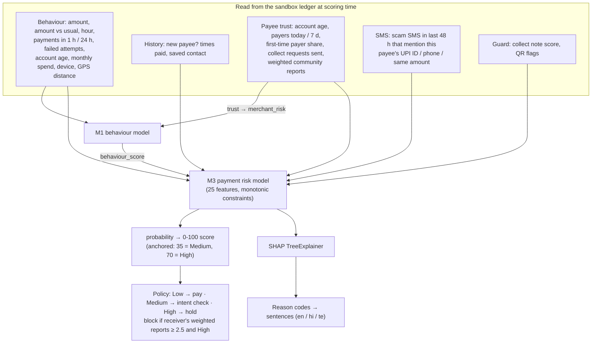
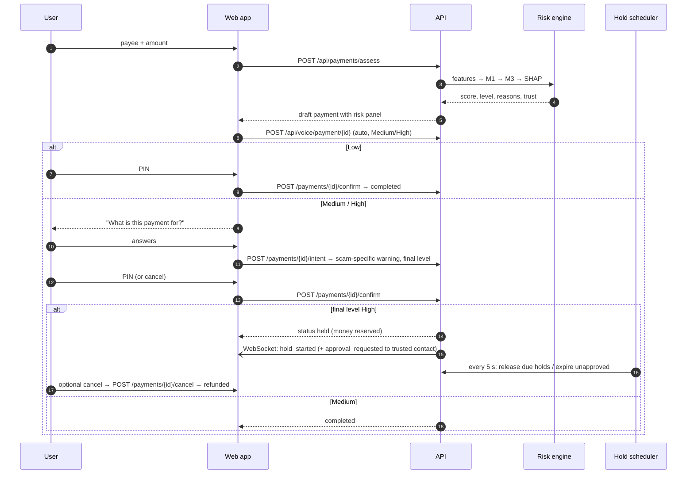
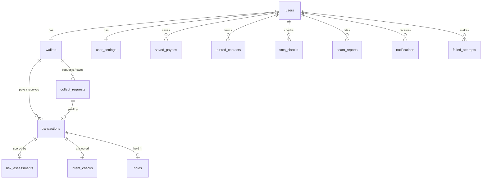

# 02 · Architecture

UPI Guardian is deliberately simple to run: **one FastAPI process, one SQLite file, one web
app** — all on one Windows PC. A phone reaches it through a Cloudflare quick tunnel.

## 1. Components

| Component | Where | Responsibility |
|---|---|---|
| Web app | `frontend/src` | All screens, translations (`locales/en|hi|te.ts`), PWA (service worker, manifest), charts, voice playback |
| API | `backend/app/api` | REST endpoints (OpenAPI at `/docs`) and the WebSocket |
| Services | `backend/app/services` | Business logic: ledger, risk engine, trust, guard, intent, holds, SMS, voice, notifications, sample data |
| ML runtime | `backend/app/ml` | Model registry, shared feature code (`features.py`), SMS analysis |
| Training | `ml/` | Training/evaluation scripts, scenario simulator, contrastive network |
| Scheduler | `services/scheduler.py` | Releases holds whose timer ended, expires unapproved holds and old collect requests |

## 2. The risk engine (F2, F3, F7)

- All features are computed by **`backend/app/ml/features.py`**, the same code the training
  pipeline and the simulator use — the live engine and the models can never disagree about what
  a feature means.
- The score is a monotone, piecewise-linear map of the model probability, anchored so that the
  thresholds tuned on validation land on **35** and **70**. Admins can move the thresholds in the
  analytics screen; the tuned defaults live in `models/risk_policy.json`.
- A reason is only shown when its sentence is true for this payment (for example "54 times more
  than usual" requires a ratio ≥ 2 and a payment history).

## 3. Main flows

### 3.1 Sending money (F1, F2, F5, F6, F7, F8)

### 3.2 Collect request (F9)

1. Another account creates a request: `POST /api/collect`. The requester's note is scored by the
   SMS model and the "promises money" rule; the payer is notified over WebSocket.
2. The payer sees a large **"Approving will DEBIT ₹X"** banner, the highlighted note and the
   requester's trust score.
3. "Review and pay" calls `POST /api/collect/{id}/assess`, which runs the normal risk engine with
   `channel=collect` — the reason list always starts with the debit guard.

### 3.3 QR scan (F9)

`POST /api/qr/parse` checks the decoded `upi://pay?…` payload *before* any payment screen:
unknown UPI ID, name on code ≠ registered name, preset amount + "receive" wording, or a code that
is really a website link. The payment then goes through the risk engine with `channel=qr`.

### 3.4 SMS check (F4)

`POST /api/sms/check` → language detection (script + romanised cue words) → TF-IDF model
probability + weighted scam-pattern rules (noisy-OR) → verdict with thresholds tuned on
validation → scam type (rule category first, classifier second) → highlights (rule spans + the
words with the largest model weights) → entities (UPI IDs, links, phone numbers, amounts). The
check is stored, so a later payment to a UPI ID or phone from that message scores higher.

### 3.5 Trusted-contact approval (F6)

If *Ask my trusted contact to approve held payments* is on, a high-risk payment waits for the
contact's decision. **Approve** sends it immediately; **Stop** refunds it; if nobody decides
before the timer ends, the payment is **cancelled and refunded** (never sent by default).

## 4. Data model

| Table | Purpose |
|---|---|
| `users`, `wallets`, `user_settings` | Account, sandbox wallet (balance in paise, `@upg` UPI ID), language / voice / hold time / sandbox clock |
| `transactions` | Every payment: draft → completed / held / cancelled / rejected / blocked |
| `risk_assessments` | Score, level, action, features, SHAP contributions, reasons (3 languages), guard flags, model versions |
| `intent_checks` | Safety-question answers, matched scam type |
| `holds` | Delayed Protection state, approval status, timer |
| `collect_requests` | Payment requests with guard analysis |
| `sms_checks`, `scam_reports` | SMS verdicts; community reports feeding the trust score |
| `trusted_contacts`, `notifications`, `failed_attempts`, `app_settings` | Approvals, live alerts, wrong-PIN / low-balance attempts, admin policy |

The database is created automatically on first start; sample data (all flagged `is_sample`) is
generated by `backend/app/seed.py` and `services/sample_activity.py`, scoring every sample
payment with the real models at its own point in time.

## 5. Ports and processes

| Process | Port | Started by |
|---|---|---|
| API (Uvicorn) | **8204** | `run.bat`, `run_phone.bat` (`backend/run_api.py`) |
| Web app (Vite dev / preview) | **5204** | `run.bat` (dev), `run_phone.bat` (preview of the production build) |
| Cloudflare quick tunnel | outbound only | `run_phone.bat` (`scripts/phone_link.py`) |

Both ports are fixed (`strictPort`) so UPI Guardian runs next to other products on the same PC.

## 6. Security notes

- Passwords and PINs are hashed with bcrypt; sessions are signed JWTs (`JWT_SECRET` in `.env`).
- Validation errors never echo submitted values (so passwords are never reflected).
- Receivers never see the payer's risk details; admin endpoints require the `admin` role.
- Voice audio URLs are unguessable content hashes; the public endpoints serve only headline
  metrics and pre-built guide audio.
