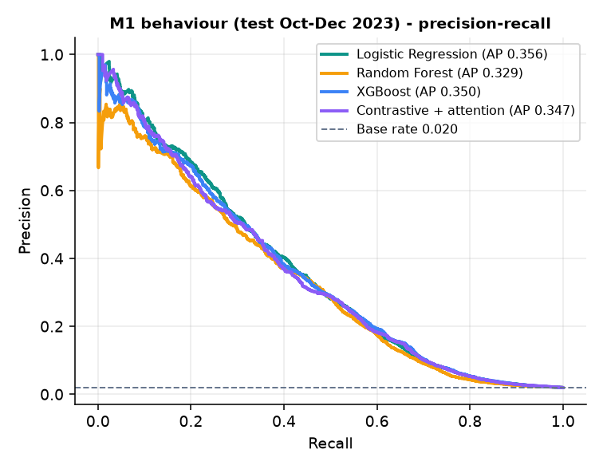
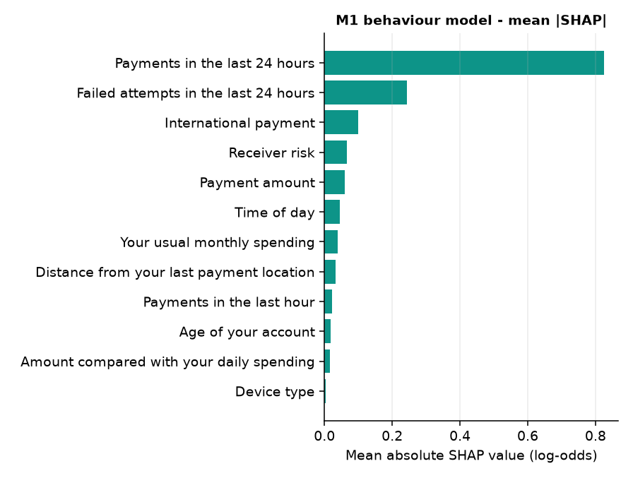
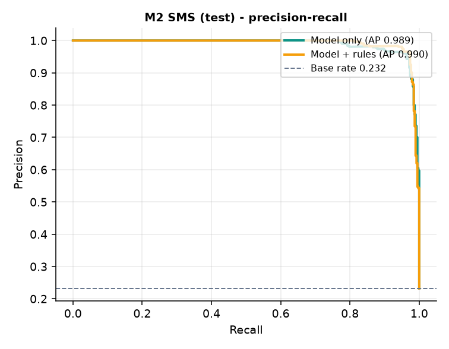
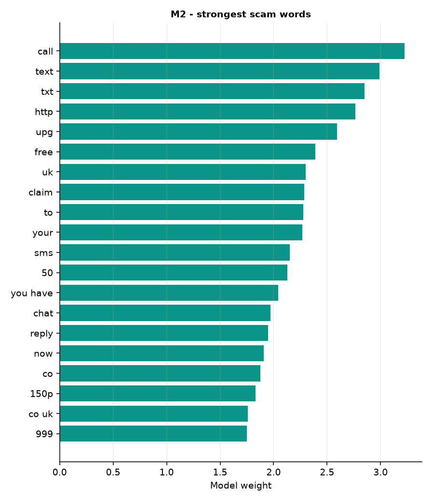
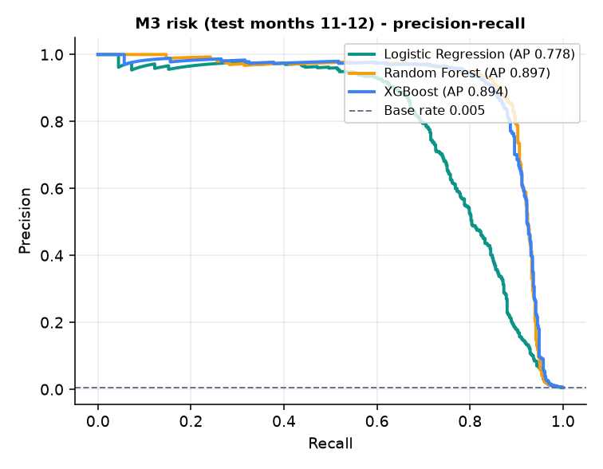
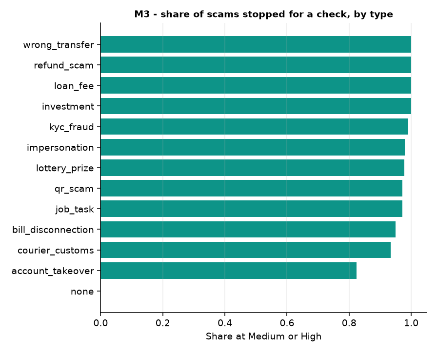
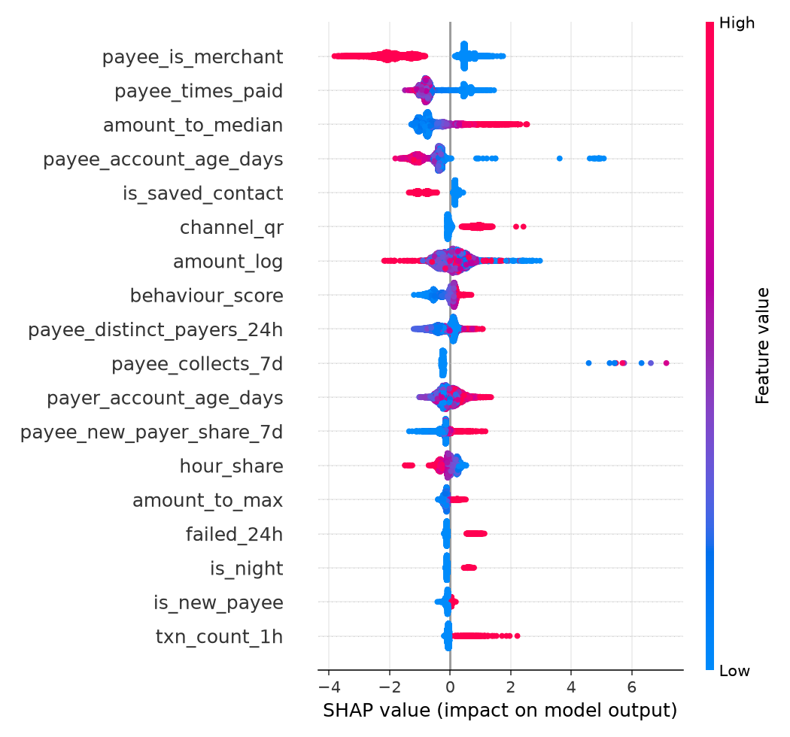
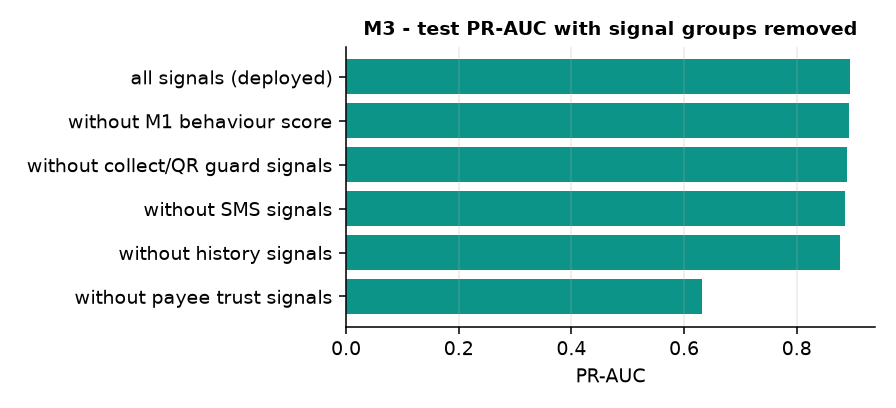

# 05 · Models and training

UPI Guardian uses three trained models. All training runs **locally on the CPU** with fixed seeds;
every run writes its model file, `metrics.json`, `training.log` and PNG plots to
`experiments/<run-name>/`, and the deployed model files are copied to `models/`. The same metrics
are shown in the app under **Model performance**.

| Model | File | Trained on | Deployed algorithm | Role |
|---|---|---|---|---|
| **M1** behaviour | `models/behaviour_model.joblib` | Digital Payment Fraud Detection Benchmark (real public data) | XGBoost | Behavioural fraud probability, fed into M3 |
| **M2** SMS scam | `models/sms_model.joblib` | SMS Spam Collection + Indian UPI-scam SMS set | TF-IDF (word + char) + Logistic Regression, combined with scam-pattern rules | SMS verdicts, collect-note scores, highlighted phrases |
| **M3** payment risk | `models/risk_model.joblib` | Seeded UPI scenario simulator (uses M1 and M2) | XGBoost with monotonic constraints + SHAP | The 0–100 score and the reasons users see |

Supporting files: `models/risk_policy.json` (tuned thresholds), `models/behaviour_profile.json`
(UPI 2024 profiles), `models/model_cards.json` (which experiment each model came from).

---

## 1. How to train

```bat
setup.bat train                          :: once: adds PyTorch (CPU) and sentence-transformers
venv\Scripts\python ml\train_all.py      :: about 15 minutes on a 6-core CPU
```

`ml/train_all.py` runs, in order:

| Step | Script | Output run |
|---|---|---|
| 1 | `ml/profile_upi2024.py` — label check + behaviour profiles | `experiments/m0_upi2024_<date>/` |
| 2 | `ml/train_behaviour.py` — M1 (four models compared) | `experiments/m1_behaviour_<date>/` |
| 3 | `ml/train_sms.py` — M2 | `experiments/m2_sms_<date>/` |
| 4 | `ml/train_risk.py --regenerate` — simulator + M3 (three models compared) | `experiments/m3_risk_<date>/` |

Optional comparison: `venv\Scripts\python ml\train_sms_transformer.py` (small multilingual
transformer vs TF-IDF, `experiments/m2_sms_transformer_<date>/`). A Kaggle-ready version of the M1
training is in `notebooks/02_kaggle_behaviour_model.ipynb` (add the benchmark dataset in Kaggle's
*Add data* panel, run all cells, download `behaviour_model_kaggle.joblib`).

Restart the API after retraining so it loads the new files.

---

## 2. M1 — behaviour fraud model

**Data and split.** 400,000 transactions over 2023. Strict time split: **fit** Jan–Aug
(267,224 rows, 1.59 % fraud), **validation** September (32,889, 1.90 %), **test** Oct–Dec — the
dataset's own held-out file (99,887, 1.99 %). The decision threshold is the maximum-F1 point on
the validation month.

**Features (15)** — only what the sandbox can observe: log amount, amount vs daily spend, monthly
spend, account age, payments in 1 h / 24 h, failed attempts in 24 h, distance from the last
payment location (often missing), receiver risk (fed from the payee trust score at run time),
international flag, hour (sin/cos), device (3 flags). `post_auth_risk_score` is excluded as
leakage.

**Models compared (test, Oct–Dec 2023)**

| Model | PR-AUC | ROC-AUC | Precision | Recall | F1 |
|---|---|---|---|---|---|
| Logistic Regression | 0.356 | 0.842 | 0.443 | 0.352 | 0.392 |
| Random Forest | 0.329 | 0.824 | 0.384 | 0.389 | 0.386 |
| **XGBoost (deployed)** | **0.350** | **0.844** | 0.455 | 0.346 | **0.393** |
| Contrastive + attention network | 0.347 | 0.843 | 0.419 | 0.366 | 0.391 |

The base rate is 0.020, so a PR-AUC of 0.35 is about 17× better than chance. The dataset's own
guidance expects 0.82–0.86 ROC-AUC for tuned gradient boosting — matched here. Logistic Regression
is essentially tied because the benchmark was generated from a logistic model; XGBoost is deployed
because it gives exact, fast SHAP explanations and handles missing GPS natively.

The **contrastive + attention network** (`ml/contrastive.py`) re-implements the published
approach UPI Guardian builds on: each feature becomes a token, a small transformer encoder mixes
them, and a Siamese contrastive loss pulls same-class transactions together on class-balanced
batches. It matches the tree models (0.347) but is slower and harder to explain, so it is kept as
a comparison.

**Robustness checks**

| Check | Result |
|---|---|
| Full-feature reference (adds IP risk, credit band, KYC level — not available in the sandbox) | PR-AUC 0.355 → the honest feature set loses almost nothing |
| Test without GPS distance | PR-AUC 0.353 |
| Drift: trained on Jan–May, scored June vs Jul–Sep | 0.300 → 0.309 (no collapse after the month-6 drift) |
| PR-AUC by month (Sep / Oct / Nov / Dec) | 0.324 / 0.338 / 0.369 / 0.345 |
| XGBoost early stopping | best iteration 272 |

**What drives it (mean |SHAP|):** payments in the last 24 h (0.83), failed attempts (0.24),
international payment (0.10), receiver risk (0.07), amount (0.06).

| PR curves | SHAP importance |
|---|---|
|  |  |

---

## 3. M2 — SMS scam classifier

**Data and split.** SMS Spam Collection (de-duplicated, 5,158 messages) + the Indian UPI-scam SMS
set (815 messages, English / Hindi / Telugu). UCI part: stratified 60 / 15 / 25. Indian part:
**split by template family** so test messages never share a template with training. Totals: train
3,444, validation 889, test 1,640 (350 Indian: 115 en, 120 hi, 115 te).

**Pipeline.** TF-IDF word 1–2-grams (a token pattern that keeps Devanagari / Telugu vowel signs
inside words) + character 2–5-grams → Logistic Regression (class-balanced). The product combines
the model with 19 weighted scam-pattern rules (KYC expiry, "PIN to receive", "approve to receive",
prize, fee before payout, OTP request with negation handling, urgency, suspicious links, power
cut, job task, customs, instant loan, "sent by mistake", impersonation, investment doubling …):

`combined = 1 − (1 − model) × (1 − rules)`; **Scam** ≥ 0.50 (≥ 95 % precision on validation),
**Suspicious** ≥ 0.353 (≥ 97 % recall on validation).

**Results (test)**

| | PR-AUC | ROC-AUC | Precision | Recall | F1 |
|---|---|---|---|---|---|
| TF-IDF + Logistic Regression | 0.989 | 0.996 | 0.965 | 0.937 | 0.951 |
| TF-IDF + Linear SVM (calibrated) | 0.990 | 0.996 | 0.966 | 0.955 | 0.960 |
| **Deployed verdict (LR + rules)** | **0.991** | **0.996** | 0.956 | **0.974** | **0.965** |

| Test group | F1 model only | F1 model + rules |
|---|---|---|
| SMS Spam Collection (1,290) | 0.958 | 0.962 |
| Indian UPI scams (350) | 0.946 | **0.967** |
| – English (115) | 0.933 | 0.961 |
| – Hindi (120) | 0.954 | 0.948 |
| – Telugu (115) | 0.950 | 0.993 |
| Collect-request notes (14) | 0.947 | 1.000 |

The SVM is marginally better on its own, but Logistic Regression is deployed because its
per-word weights produce the highlighted phrases.

**Scam type.** In the product, the type comes from the strongest matching rule category, then
from a TF-IDF type classifier: on unseen templates the pipeline names a type for every scam and
is right **80.5 %** of the time (the classifier alone: 43.8 %).

**Small transformer comparison.** Frozen `paraphrase-multilingual-MiniLM-L12-v2` sentence
embeddings + Logistic Regression on the identical split: PR-AUC **0.955**, F1 **0.871** (Indian
en / hi / te F1: 0.795 / 0.757 / 0.928). It does not beat TF-IDF, so TF-IDF stays deployed — it is
also faster, fully offline and explainable word by word.

**Worked examples** (`experiments/m2_sms_20260922/worked_examples.json`): the English, Hindi and
Telugu KYC-expiry messages are *scam* (0.999 / 0.945 / 0.934); a genuine debit alert that says
"never share your OTP" is *safe* (0.29); a lunch message is *safe* (0.01).

| PR curves (model vs model + rules) | Strongest scam words |
|---|---|
|  |  |

---

## 4. M3 — payment risk model (the score users see)

**Why a simulator.** No public dataset carries UPI context such as "new payee", community reports,
a linked scam SMS or a collect request disguised as a refund. `ml/simulator.py` (see
[04_DATASET.md](04_DATASET.md) §5) creates a year of UPI activity for 3,000 users, calibrated from
UPI Transactions 2024, with twelve scam typologies, deliberate overlap and label noise; the
behaviour signal comes from **M1** and the SMS / note signals from **M2** run on held-out messages.
The metrics below therefore measure how well M3 separates the simulated patterns; M1's results
above are the measure on real public data.

**Split.** Months 1–9 train (479,925 payments, 0.53 % scams), month 10 validation (54,598),
months 11–12 test (107,149, 0.58 %).

**Features (25)** — behaviour score (M1), log amount, amount vs usual median / maximum, new payee,
times paid, saved contact, night, share of past payments at this hour, payments in 1 h / 24 h,
failed attempts, payee account age, weighted community reports, payee's distinct payers today,
payee's first-time-payer share (7 d), payee's collect requests (7 d), payee is a shop, linked
scam-SMS probability, scam SMS checked in 24 h, QR / collect channel, collect-note score, QR flag,
payer account age. **Monotonic constraints** guarantee, for example, that more scam reports or a
higher linked-SMS score can never lower the risk, and more past payments to a payee can never
raise it.

**Models compared (test months 11–12)**

| Model | PR-AUC | ROC-AUC | Precision | Recall | F1 |
|---|---|---|---|---|---|
| Logistic Regression | 0.807 | 0.977 | 0.879 | 0.701 | 0.780 |
| Random Forest | 0.900 | 0.975 | 0.942 | 0.863 | 0.901 |
| **XGBoost (deployed)** | **0.894** | **0.980** | 0.942 | 0.831 | 0.883 |

XGBoost and Random Forest are tied on PR-AUC; XGBoost is deployed for its monotonic constraints,
exact TreeSHAP explanations and the best ROC-AUC.

**Policy (what users experience).** Thresholds are tuned on the validation month with *friction
budgets*: Medium must reach 92 % scam recall but ask about at most 8 % of genuine payments; High
needs ≥ 60 % precision and may hold at most 0.5 % of genuine payments. The score is anchored so
those thresholds are **35** (Medium) and **70** (High).

| On the test months | Result |
|---|---|
| Scams stopped for a safety check (Medium or High) | **94.1 %** |
| Scams held by Delayed Protection (High) | **90.7 %** |
| Genuine payments that go straight through (Low) | **98.7 %** |
| Genuine payments asked the safety question | 1.1 % |
| Genuine payments held | 0.22 % |
| Precision of High | 71.0 % |

**By scam type (test):** refund 100 % / 98.6 % (checked / held), loan fee 100 / 100, investment
100 / 93, wrong transfer 100 / 92, KYC 99 / 97, impersonation 98 / 96, lottery 98 / 91, job 97 / 95,
QR 97 / 94, power cut 95 / 90, courier 93 / 73, misused contact account 82 / 71 (hardest: the payee
is a known contact).

**Ablation (test PR-AUC with a signal group removed):** all signals 0.894 · without payee trust
**0.668** · without history 0.858 · without SMS 0.883 · without the M1 behaviour score 0.891 ·
without collect / QR guard 0.893. Payee trust is the strongest group; each group adds signal.

**Most important features (mean |SHAP|):** receiver is a shop (1.27), times paid (0.86), saved
contact (0.64), receiver account age (0.59), amount vs usual (0.50).

| PR curves | Scams caught by type |
|---|---|
|  |  |
| **SHAP summary** | **Ablation** |
|  |  |

---

## 5. Explanations at run time

For every payment the API runs `shap.TreeExplainer` on M3 (and on M1 for the behaviour detail).
Positive contributions become reason codes — `NEW_PAYEE`, `AMOUNT_UNUSUAL`, `NIGHT`,
`NEW_ACCOUNT`, `REPORTED`, `MANY_NEW_PAYERS`, `SCAM_SMS_LINKED`, `COLLECT_DEBIT`, `QR_TRICK`,
`BEHAVIOUR_*` … — each with a template in English, Hindi and Telugu filled with the real values.
A reason is shown only when its sentence is literally true (see `backend/app/services/explain.py`).
Negative contributions give reassuring reasons ("You have paid Ravi Kumar 18 times before").

## 6. UPI Transactions 2024 label check

| Model (train Jan–Sep, test Oct–Dec 2024) | PR-AUC | Base rate |
|---|---|---|
| Logistic Regression | 0.0027 | 0.0020 |
| XGBoost | 0.0022 | 0.0020 |

Fraud rates are flat across transaction type, category, device and hour, so the label is not
learnable. The dataset is used for behaviour profiles only (`models/behaviour_profile.json`).

## 7. Experiment folders

| Folder | Contents |
|---|---|
| `experiments/m0_upi2024_20260922/` | label check PR/ROC, hour profile, amounts by category, `behaviour_profile.json` |
| `experiments/m1_behaviour_20260922/` | `behaviour_model.joblib`, PR/ROC, confusion matrix, calibration, SHAP importance + summary, PR-AUC by month |
| `experiments/m2_sms_20260922/` | `sms_model.joblib`, PR/ROC, confusion matrix, calibration, F1 by test group, top terms, worked examples |
| `experiments/m2_sms_transformer_20260922/` | transformer comparison metrics, PR/ROC |
| `experiments/m3_risk_20260922/` | `risk_model.joblib`, PR/ROC, confusion matrix at the High threshold, calibration, SHAP importance + summary, caught by type, ablation |

Every folder has `metrics.json` (data, split, sizes, dates, all metrics) and `training.log`.
