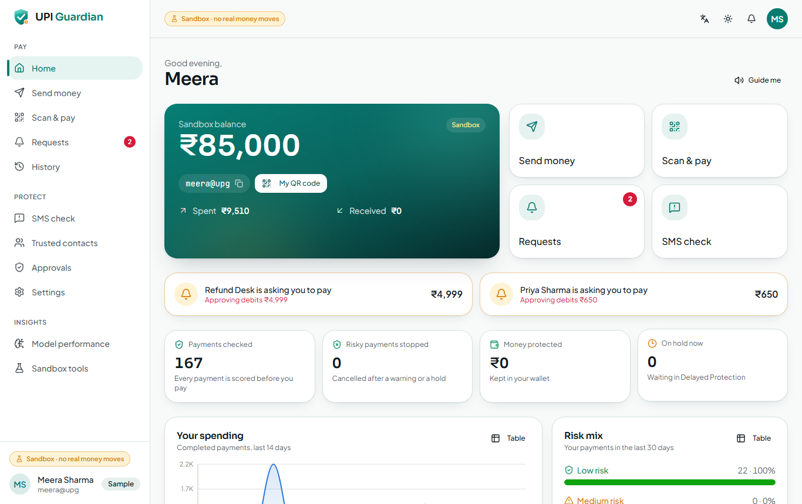
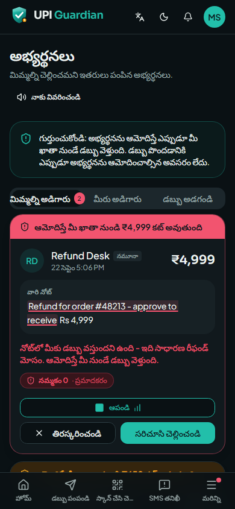

# 07 · User guide

A screen-by-screen walkthrough. Everything happens in the **sandbox**: no real money moves.

The top bar on every screen has: **language** (文A — English, हिन्दी, తెలుగు), **theme** (light /
dark / system), **notifications** (🔔) and your **account menu**. On a phone the main screens are
in the bottom bar and the rest under **More**. Many screens have a **Guide me** button that reads a
short explanation aloud in your language.

| Home | Risk check | Requests on a phone (Telugu, dark) |
|---|---|---|
|  |  |  |

---

## 1. Landing page (`/`)

The public front page: what UPI Guardian does, live results from the latest model runs, *How it
works*, the feature list and voice samples in all three languages. **Get started** creates an
account; **Try the sample accounts** opens sign-in.

## 2. Sign in and register (`/login`, `/register`)

- **Sign in** with your mobile number or email and password. The panel *Try the sample accounts*
  signs you in with one tap (everyday user, family member, fraud-risk team).
- **Create an account**: name, 10-digit mobile number, optional email, password (8+ characters), a
  4-digit **sandbox UPI PIN** (used to confirm payments) and your preferred language. You get a
  UPI ID like `asha.0001@upg` and ₹50,000 of sandbox money.

## 3. Home (`/app`)

- **Balance card** — sandbox balance, your UPI ID (tap to copy), **My QR code** (others scan it to
  pay you), money spent and received this month.
- **Quick actions** — Send money, Scan & pay, Requests (with a red count when someone is asking
  you to pay), SMS check.
- **Waiting for you** — pending payment requests (with the "approving debits ₹X" reminder) and
  payments currently on hold, with their countdown.
- **KPIs** — payments checked, risky payments stopped, money protected, payments on hold.
- **Charts** — your spending over 14 days and your risk mix over 30 days (each chart has a
  **Table** button that shows the same numbers as a table).
- **Recent activity** — tap any payment for its details.

## 4. Send money (`/app/send`)

1. Tap a **saved or recent contact**, or type a **UPI ID**. UPI Guardian looks it up and shows
   the receiver's name, whether you have paid them before and their **trust badge** (tap it to see
   how the trust score was built: account age, community reports, new payers, steady history).
2. Enter the **amount** (quick buttons ₹100 … ₹5,000) and an optional note.
3. Tap **Check and pay**. Nothing is sent yet — the payment is scored first.

## 5. The risk check (`/app/pay/:id`)

- **Gauge** — the 0–100 risk score and level: **Low** (green shield), **Medium** (amber triangle) or
  **High** (red shield). A *Sandbox clock* chip appears if you are simulating another time of day.
- **Why we flagged it / Why it looks safe** — plain-language reasons from the model, such as
  "You have never paid Vikram Rao before", "This is 54 times more than you usually pay",
  "It is 01:30 – late-night payments are common in scams", "3 people reported this UPI ID as a
  scam". Reassuring reasons (paid before, saved contact) appear with a green tick.
- **Listen** — hear the warning in your language (it plays automatically for risky payments if
  *Speak warnings automatically* is on).
- **How the model decided** — the SHAP bars (which signals raised or lowered the risk), the scam
  probability, the behaviour-model score, the trust score and the model version.
- **Collect requests and QR codes** show an extra red banner at the top: *Approving will DEBIT ₹X*
  or *Warning: this QR code is a trick*.

Then:

| Level | What you do next |
|---|---|
| **Low** | **Pay ₹X** → enter PIN → *Payment sent* |
| **Medium / High** | **Continue to safety check** (or **Cancel payment**) |
| **Blocked** | The receiver was reported as a scam by several people; the payment cannot be sent. **Report this UPI ID** or **Close**. |

## 6. Safety check and warning

1. **What is this payment for?** — Family or a friend · Buying something · Bill, rent or recharge ·
   Getting a refund or cashback · Claiming a prize or reward · KYC / account update · Job, task or
   work fee · Loan processing fee · Investment returns · Something else.
2. **Did someone call, message or send a link asking you to make this payment?** — Yes / No.
3. Depending on your answer, one more question: *Have you confirmed this UPI ID by calling them on
   a number you already had?* (family, new payee) or *Is this an advance to a seller you found
   online?* (shopping, new payee).

If your answer matches a scam script you see a red card — for example *"Warning: this matches a
known scam – fake refund or cashback. You never need to pay, scan a QR code or enter your PIN to
receive a refund."* — spoken aloud, with **Cancel payment (recommended)** as the main button. To
continue anyway you must tick *I understand this looks like a scam and I still want to continue*.
Answers can raise the risk but never lower it.

## 7. PIN and Delayed Protection hold

- Enter your **sandbox PIN** on the keypad (sample accounts: `1234`). A wrong PIN is counted as a
  failed attempt (which itself raises the risk of the next payment).
- **High-risk** payments are **held**: the money leaves your balance but does not reach the
  receiver. The hold screen shows a countdown ring, when the money will be sent, tips for using the
  time, the reasons, and **Cancel this payment** (asks for confirmation; the money comes straight
  back). If your trusted contact must approve, you see *Waiting for your trusted contact to
  approve*.
- When the timer ends the payment is sent automatically — unless approval was required and did
  not come, in which case it is cancelled and refunded. You get a notification either way.

## 8. Scan & pay (`/app/scan`)

- **Camera** — point it at a UPI QR code (needs `https`, i.e. the phone link from `run_phone.bat`).
- **Upload** — choose a photo or screenshot of a QR code.
- **Samples** — sandbox codes: two genuine shops and three tricks ("scan to receive ₹5,000
  cashback", an "Electricity bill" code that pays someone else, a code that opens a website).

UPI Guardian checks the code first: tricks show a red warning (spoken), genuine codes a green
*This QR code looks normal*. Then you see who you would pay, the note (risky words highlighted)
and the amount (fixed if the code sets it) → **Check and pay** → the normal risk check.

## 9. Requests (`/app/collect`)

- **Asking you** — requests from others. Each shows a banner **Approving will DEBIT ₹X from your
  account**, the requester, their note with deceptive words highlighted ("refund", "approve to
  receive", "cashback"), a trust badge, **Listen**, **Decline** and **Review and pay** (opens the
  risk check with the collect-request guard).
- **You asked** — requests you sent.
- **Request money** — ask someone to pay you (their UPI ID, amount, note).

## 10. SMS check (`/app/sms`)

Paste a message (or tap a sample: KYC expiry in English/Hindi, a Telugu refund request, a lottery
prize, a Hinglish job task, a power-cut threat, or genuine bank / OTP / chat messages) and tap
**Check message**.

- **Verdict** — *This message is a scam* / *looks suspicious* / *looks safe*, the confidence, the
  scam type and advice, and **Listen**.
- **The message** with phrases marked — red: matches a known scam pattern; yellow: words the model
  finds risky. Hover or tap a mark to see why.
- **Language model** and **Scam patterns** meters, the warning signs found, and what was found in
  the message (UPI IDs, links, phone numbers, amounts).
- **Report the UPI IDs in it** — adds a community report (lowers those accounts' trust scores).
- A scam message that mentions a UPI ID, phone number or amount makes **your later payments to
  that receiver** score higher.

## 11. History (`/app/history`) and payment details

Filter by *All / Sent / Received* and risk level, or search by name, UPI ID or note. Open a payment
to see its score gauge, the reasons, the SHAP bars, the safety-check answer and warning, and a
timeline (checked → safety check → held → sent / cancelled).

## 12. Trusted contacts (`/app/trusted`) and Approvals (`/app/approvals`)

- Add a family member by **UPI ID or mobile number** (sample: `arjun@upg`). Turn on **Ask my
  trusted contact to approve held payments** to make their approval necessary.
- The trusted contact sees the payment under **Approvals** (with a live notification): the payee,
  amount, risk level, reasons, your answer, a countdown, and **Stop payment** / **Approve** (both
  ask for confirmation). *People you protect* lists everyone who added you.

Try it: sign in as Meera, turn approval on, make a high-risk payment; sign in as Arjun
(`family@upiguardian.app`) in another browser and stop or approve it.

## 13. Settings (`/app/settings`)

Language · Spoken warnings on/off · Speak warnings automatically · **Hold time** for high-risk
payments (1, 2, 5, 10, 15, 30, 60 or 120 minutes; default 30) · Trusted-contact approval · Theme ·
**Sandbox clock** (pretend it is another time of day, e.g. `01:30`, to try night-time protection;
only the risk check uses it; **Use real time** switches it off) · Change sandbox PIN · Sign out.

## 14. Model performance (`/app/models`)

Tabs for **Payment risk** (M3), **Behaviour** (M1), **SMS scams** (M2) and **Data checks**: test
metrics of the deployed model, the comparison table, what users experience under the policy,
catch rate by scam type, the ablation, the most important features, robustness checks and all
training plots (tap to enlarge).

## 15. Sandbox tools (`/app/sandbox`)

- **Receive a sample payment request** — a fake "refund" request from *Refund Desk* or a genuine
  "Dinner split" from *Priya*.
- **Sample QR codes** — show them on a second screen and scan them with the phone.
- **Sample messages** — copy into SMS check.
- **Reset the sandbox** (admin only) — reload all sample data.

## 16. Fraud analytics (`/admin`, fraud-risk team)

Sign in as `admin@upiguardian.app` / `Admin@1234`.

- **Range** — 7, 30 or 90 days.
- **KPIs** — payments scored, risky payments stopped, money protected, held now / total, blocked,
  scam-matching answers / safety checks, scam SMS / checked, community reports.
- **Daily trend** (scored, high risk, stopped, medium risk), **risk-score distribution**,
  **high-risk payments by hour**, **scam types seen** (SMS verdicts + safety-check answers +
  reports) — all with table views.
- **Recent flagged payments** — who paid whom, amount, level and score, outcome, top reason.
- **Most reported UPI IDs** — report counts, main category and trust score.
- **Risk policy** — move the Medium / High thresholds and the block threshold; **Save** applies
  them to new payments immediately; **Back to tuned defaults** restores 35 / 70 / 2.5.
