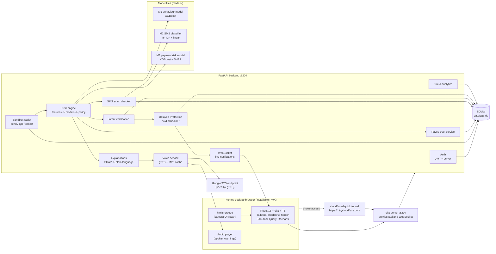
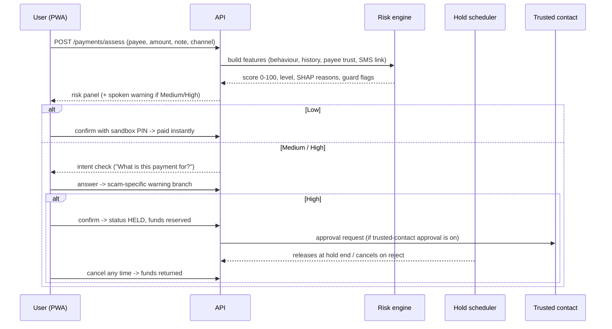

# UPI Guardian - Build Plan

> Stops UPI fraud before the money leaves: real-time payment risk scoring, scam-SMS checks,
> intent verification, a protective hold on risky payments and spoken warnings in English,
> Hindi and Telugu.

This plan covers the architecture, the modules mapped to features F1-F10, the database, the API,
the ML pipeline, the screens, the milestones and the known risks. It runs on one Windows PC and
can be shown on an Android phone through an HTTPS tunnel.

---

## 1. Machine check (done 2026-09-22)

| Item | Found | Status |
|---|---|---|
| Windows | Windows 11 Pro 10.0.26200 | OK |
| CPU / RAM | Intel i5-12500 (12 threads), 15.7 GB | OK - all training is CPU-only |
| GPU | none (no NVIDIA driver) | Not needed |
| Python | 3.11.9 (64-bit), also 3.14 installed | OK - venv is created with `py -3.11` |
| Node.js | v24.19.0 (LTS), npm 11.17.0 | OK |
| Git | 2.55.0, remote `origin` configured | OK |
| Free disk | D: 85.8 GB, C: 200.5 GB | OK (the project needs about 3 GB with venv and node_modules) |
| Docker | installed | Not used - nothing here needs a container |
| cloudflared | **not installed** | Installed in Phase 2 (`winget install --id Cloudflare.cloudflared`) |
| Kaggle token | **not found** | Created in Phase 2 |
| Ports 8204, 5204, 12040-12049 | all free | OK |

---

## 2. Architecture

**How a payment flows (send, QR or collect approval):**

**Design choices**
- One FastAPI process, one SQLite file, one Vite server. No containers, queues or cloud services.
- The hold timer runs as an `asyncio` background task inside the FastAPI lifespan (checks every
  5 seconds), so held payments release or expire even when nobody has the app open.
- Live updates (hold released, approval requested, collect request received) go over one
  WebSocket at `/api/ws`; TanStack Query refetches as a fallback.
- The phone uses the production build served by `vite preview` on 5204 (same proxy settings), so
  the service worker and "Install app" work. Desktop development uses `vite dev` on 5204.
- All AI runs locally. **No LLM is needed for this product, so no Gemini key is required.**
  The only outside call is gTTS (Google's text-to-speech endpoint); common warnings are
  pre-generated into an MP3 cache during setup so the demo still speaks without internet.
- Money is stored as integer paise. Every sandbox screen carries a visible "Sandbox - no real
  money moves" label.

---

## 3. Modules mapped to features

| Feature | Backend module (`backend/app/...`) | Frontend (`frontend/src/...`) |
|---|---|---|
| **F1 UPI sandbox** | `services/wallet.py`, `services/ledger.py`, `api/wallet.py`, `api/payments.py`, `api/collect.py`, `services/qr.py` (qrcode PNG, `upi://pay` parse/build) | `pages/Home`, `pages/Send`, `pages/Scan`, `pages/Collect`, `pages/History`, `pages/Sandbox` |
| **F2 Real-time risk engine** | `services/risk/features.py`, `services/risk/engine.py`, `ml/behaviour_model.py`, `ml/risk_model.py`, `services/policy.py` (thresholds -> action) | `components/risk/RiskPanel`, `RiskGauge` |
| **F3 Payee trust score** | `services/trust.py` (account age, received-payment pattern, community reports), `api/trust.py`, `api/reports.py` | `components/risk/TrustBadge`, report dialog |
| **F4 Suspicious SMS check** | `ml/sms_model.py`, `services/sms/rules.py` (EN/HI/TE scam lexicon), `services/sms/entities.py` (UPI IDs, links, phone numbers, amounts), `api/sms.py` | `pages/SmsCheck`, `components/sms/HighlightedText` |
| **F5 Intent verification** | `services/intent.py` (question tree, scam-type branches), `api/payments.py` (`/intent`) | `pages/IntentCheck` (step flow) |
| **F6 Delayed Protection Mode** | `services/holds.py`, `services/scheduler.py`, `services/trusted.py`, `api/holds.py`, `api/approvals.py`, `api/trusted_contacts.py` | `pages/HoldStatus` (countdown), `pages/Approvals`, `pages/TrustedContacts` |
| **F7 Explainable warnings** | `services/explain.py` (SHAP -> reason codes -> sentences in 3 languages) | `components/risk/ReasonList`, contribution bars |
| **F8 Voice assistant** | `services/voice.py` (gTTS en/hi/te, hashed MP3 cache), `api/voice.py`, `i18n/messages.py` | `lib/i18n` + `locales/{en,hi,te}.json`, `components/voice/SpeakButton`, "Guide me" on each screen |
| **F9 Collect-request and QR guard** | `services/guard.py` (debit-disguised-as-credit detection, note NLP, QR name/UPI mismatch, preset-amount "scan to receive" trick) | `components/guard/DebitWarning`, `pages/Collect`, `pages/Scan` |
| **F10 Fraud analytics** | `services/analytics.py`, `api/admin.py` | `pages/admin/Analytics` |
| Model performance | `api/models.py` (reads `experiments/*/metrics.json`, serves plots) | `pages/ModelPerformance` |
| Platform | `core/config.py`, `core/security.py`, `core/logging.py` (JSON logs), `core/db.py`, `models/*` (SQLAlchemy), `schemas/*` (Pydantic v2), `seed.py` | app shell, sidebar, theme, auth guard, toasts, skeletons |

---

## 4. Risk engine design (F2, F3, F7)

Scoring happens **before** the user confirms. Three layers:

1. **Feature builder** - reads the sandbox ledger and computes, for this payer and payee:
   - *Behaviour:* amount, amount vs the payer's usual (median and max so far), hour of day,
     night flag, day of week, payments in the last 1 h / 24 h, failed attempts in 24 h (wrong
     PIN, insufficient balance), payer account age, average monthly spend, device type, distance
     from the last payment location (only if the phone shares GPS; otherwise missing).
   - *History:* new payee or not, times paid before, saved contact or not.
   - *Payee trust (F3):* payee account age, distinct payers in 24 h and 7 d, share of first-time
     payers, inbound velocity, collect requests sent, community scam reports (weighted by the
     reporter's own account age, decaying over 30 days). Shown as a 0-100 trust score with its
     components.
   - *SMS signal (F4):* highest scam probability among SMS checks from the last 48 h that mention
     this payee's UPI ID, phone number or the same amount; plus a "scam SMS checked recently" flag.
   - *Channel context (F9):* send / QR / collect, QR name mismatch, collect note that promises money.
2. **Models** - M1 turns the behaviour features into a behaviour-risk probability; M3 combines
   M1's output with history, trust, SMS and channel features into the final 0-100 score.
3. **Policy** - maps the score to an action (defaults to confirm in Phase 2):

   | Level | Score | Action |
   |---|---|---|
   | Low | < 35 | Pay instantly after PIN |
   | Medium | 35 - 69 | Intent check + explained warning, user may continue |
   | High | >= 70 | Intent check + explained warning + **Delayed Protection hold** (default 30 min) |

   An intent answer that matches a scam pattern ("I'm receiving a refund", "I won a prize",
   "KYC update", "someone on a call asked me") raises the level by one step and shows the matching
   scam warning. The final thresholds are tuned on the validation month from the precision-recall
   curve and stored in `models/risk_policy.json`; admins can change them in the analytics screen.

**Explanations (F7):** SHAP `TreeExplainer` on M3 gives per-feature contributions for every
payment. The top 3-4 positive contributors become reason codes (for example `NEW_PAYEE`,
`AMOUNT_8X_USUAL`, `NIGHT_TIME`, `PAYEE_REPORTED`, `SCAM_SMS_LINKED`, `COLLECT_DEBIT`), each with
a sentence template in English, Hindi and Telugu filled with the real values
("This is 8 times more than you usually send"). When the behaviour score is a top contributor,
M1's own SHAP top reason is added. Reasons and contributions are stored with the payment so
history shows exactly why it was flagged.

---

## 5. ML pipeline (Phase 4)

All training runs locally on the CPU with fixed seeds. Every run writes
`experiments/<run-name>/` with the model file, `metrics.json` (dataset, split, dates, sizes,
metrics), `training.log`, and PNG plots (confusion matrix, PR curve, ROC curve, calibration,
SHAP summary). The chosen model files are copied to `models/`.

### M1 - Behaviour fraud model (real public data)
- **Data:** Digital Payment Fraud Detection Benchmark - 400k transactions, 12 months of 2023,
  about 1.5 % fraud, drift after month 6. The provided split is kept: train before 2023-10-01,
  test on/after. Validation = the last month of train (September), strictly chronological.
- **Features:** only those the sandbox can compute honestly - amount (log), hour (sin/cos), day
  of week, device type, `txn_count_1h`, `txn_count_24h`, `failed_txn_count_24h`,
  `amount_deviation_from_user_mean`, `avg_monthly_spend`, `account_age_days`,
  `geo_distance_from_last_txn` (randomly masked in training so missing GPS is handled) and
  `merchant_risk_score` (fed at run time from the payee trust score). `post_auth_risk_score` is
  dropped (target leakage); `ip_risk_score`, `credit_score_band`, `kyc_level` and
  `is_international` are dropped because the sandbox cannot observe them. A full-feature variant
  is trained only to report how much accuracy the honest subset gives up.
- **Models compared:** Logistic Regression, Random Forest, **XGBoost** (class weighting, early
  stopping on validation PR-AUC), and a reference-style contrastive + attention network in PyTorch
  (Siamese pair pre-training, attention over features, classifier head) for comparison with the
  published approach this product builds on.
- **Metrics:** precision, recall, F1 (at the tuned threshold), PR-AUC (primary), ROC-AUC, plus
  PR-AUC before vs after the month-6 drift.

### M2 - SMS scam classifier
- **Data:** SMS Spam Collection (5,574 English messages) + a new **Indian UPI-scam SMS set**
  written for this product, committed as `data/raw/upi_scam_sms/upi_scam_sms.csv`: English,
  Hindi (Devanagari and Hinglish) and Telugu (script and romanised); scam types fake KYC,
  account block, refund/cashback, lottery/prize, job/task, bill disconnection, collect-request
  trick, "sent by mistake", courier/customs, loan, OTP/PIN request, investment - plus realistic
  legitimate messages (debit/credit alerts, genuine OTPs, bills, deliveries, personal chat).
  Hand-written messages plus a seeded template expander (`scripts/generate_scam_sms.py`) for
  volume. Fictional bank and company names only.
- **Split:** stratified by language and scam type, and **grouped by template family** so test
  messages never share a template with training messages.
- **Models:** TF-IDF (word 1-2 grams + character 2-5 grams) + Logistic Regression and Linear SVM
  (calibrated) as the baseline; a small multilingual transformer (multilingual MiniLM) as the
  comparison. The transformer ships only if it clearly beats the baseline on the Indian test set
  (its weights would then need Git LFS or a download step - I will ask first).
- **Verdict:** Safe / Suspicious / Scam from the calibrated probability combined with the rule
  layer; scam type from the rules + a type classifier; **highlighted phrases** from the matched
  rules and the tokens with the largest positive model weights in that message.
- **Metrics:** precision, recall, F1, PR-AUC overall and per language.

### M3 - UPI payment risk model (the score users see)
- **Why simulated data:** no public dataset carries UPI-specific context such as new payee,
  payee reports, linked scam SMS or collect-request tricks. So a committed, seeded simulator
  (`scripts/generate_upi_scenarios.py --seed 42`) creates 12 months of payments for 5,000 users:
  normal behaviour is calibrated from **UPI Transactions 2024** (amount distributions by
  transaction type, category, hour and weekday), and scam episodes follow the typologies above
  with deliberate overlap and noise (scams through a friend's taken-over account, genuine large
  night payments to new payees, label noise) so the task is not trivially separable. M1 scores
  each simulated payment, and that score becomes one M3 feature.
- **Split:** time-based - months 1-9 train, month 10 validation (threshold tuning), months 11-12 test.
- **Models compared:** Logistic Regression, Random Forest, **XGBoost** (deployed) + SHAP.
- **UPI Transactions 2024 label check:** its `fraud_flag` (0.2 %) is evaluated with the same
  pipeline. If it is not learnable (PR-AUC close to the base rate), that result is reported
  honestly and the dataset is used for behaviour profiles only, as the brief allows.

### Inference service
`backend/app/ml/` loads the three models once at start-up, with version info from their
`metrics.json`. Pytest covers feature building, scoring, SHAP reason generation, the SMS verdict
and model loading.

---

## 6. Datasets

| Dataset | Size | Licence | What is committed |
|---|---|---|---|
| Digital Payment Fraud Detection Benchmark (`transactions_train.csv` 45.4 MB, `transactions_test.csv` 15.1 MB) | 60.5 MB | CC0-1.0 | Full, `data/raw/payment_fraud_benchmark/` |
| UPI Transactions 2024 (`upi_transactions_2024.csv`) | 29.8 MB | CC0-1.0 | Full, `data/raw/upi_transactions_2024/` |
| SMS Spam Collection (`spam.csv`) | 0.5 MB | Kaggle lists "unknown"; UCI publishes it under CC BY 4.0 | Full, `data/raw/sms_spam_collection/` |
| Indian UPI-scam SMS set | small | written for this product | Full, `data/raw/upi_scam_sms/` |
| Simulated UPI scenarios | ~40 MB | generated | Not committed - recreated exactly by the seeded script; a 5k-row sample goes in `data/sample/` |

Total committed data is about 91 MB and no file exceeds 50 MB, so **the full datasets are
committed** and `data/raw/` is not git-ignored. `scripts/download_data.py` (kagglehub) still
re-downloads and checksum-verifies them.

---

## 7. Database tables (SQLite, SQLAlchemy 2.x)

| Table | Key columns |
|---|---|
| `users` | id, full_name, phone, email, password_hash, pin_hash, role (user/admin), is_sample, created_at |
| `wallets` | id, user_id, upi_id (`name@upg`), balance_paise, created_at |
| `user_settings` | user_id, language (en/hi/te), voice_enabled, hold_minutes, trusted_approval_required, sandbox_clock_offset |
| `saved_payees` | user_id, payee_wallet_id, nickname, first_paid_at, times_paid |
| `transactions` | id, payer_wallet_id, payee_wallet_id, amount_paise, note, channel (send/qr/collect), status (draft/completed/held/cancelled/rejected/failed/declined), device_type, geo_lat/lon, created_at, completed_at |
| `risk_assessments` | id, transaction_id, model_versions, behaviour_score, risk_score, level, features_json, shap_json, reasons_json, guard_flags_json, action |
| `intent_checks` | id, transaction_id, answers_json, matched_scam_type, warning_key, outcome |
| `holds` | id, transaction_id, hold_until, status (active/released/cancelled/expired), needs_trusted_approval, approver_user_id, decided_at |
| `collect_requests` | id, requester_wallet_id, payer_wallet_id, amount_paise, note, status, guard_flags_json, expires_at, transaction_id |
| `sms_checks` | id, user_id, text, language, probability, verdict, scam_type, highlights_json, entities_json, created_at |
| `scam_reports` | id, reporter_user_id, upi_id, category, note, created_at |
| `trusted_contacts` | id, user_id, contact_user_id, can_approve_holds, status, created_at |
| `notifications` | id, user_id, kind, payload_json, read_at, created_at |
| `failed_attempts` | id, user_id, reason (wrong_pin/insufficient), created_at |

Created automatically on first run; `backend/app/seed.py` loads clearly labelled sample data.

---

## 8. API endpoints (all under `/api`, OpenAPI at `/docs`)

| Area | Endpoints |
|---|---|
| Health | `GET /health` |
| Auth | `POST /auth/register`, `POST /auth/login`, `GET /auth/me`, `POST /auth/pin` |
| Wallet | `GET /wallet`, `GET /wallet/qr.png`, `GET /payees/lookup?upi_id=`, `GET /payees/recent` |
| Payments | `POST /payments/assess`, `POST /payments/{id}/intent`, `POST /payments/{id}/confirm`, `POST /payments/{id}/cancel`, `GET /payments`, `GET /payments/{id}` |
| QR | `POST /qr/parse` (decoded text -> payee + guard flags), `GET /qr/samples` |
| Collect | `POST /collect`, `GET /collect/incoming`, `GET /collect/outgoing`, `POST /collect/{id}/assess`, `POST /collect/{id}/approve`, `POST /collect/{id}/decline` |
| Holds | `GET /holds`, `POST /holds/{id}/cancel` |
| Trusted contacts | `GET /trusted-contacts`, `POST /trusted-contacts`, `DELETE /trusted-contacts/{id}`, `GET /approvals`, `POST /approvals/{id}/approve`, `POST /approvals/{id}/reject` |
| Trust and reports | `GET /trust/{upi_id}`, `POST /reports` |
| SMS | `POST /sms/check`, `GET /sms/history` |
| Voice | `POST /voice/speak` (text or message key + language -> MP3 URL), `GET /voice/audio/{hash}.mp3` |
| Settings | `GET /settings`, `PUT /settings` |
| Notifications | `GET /notifications`, `POST /notifications/read`, `WS /ws?token=` |
| Admin | `GET /admin/overview`, `GET /admin/trends`, `GET /admin/scam-types`, `GET /admin/held`, `GET /admin/reports`, `GET/PUT /admin/policy` |
| Models | `GET /models`, `GET /models/{run}/plots/{file}` |
| Sandbox | `GET /sandbox/samples` (sample SMS, sample QR codes), `POST /sandbox/incoming-collect` (sample account sends a collect request), `POST /sandbox/reset` (admin) |

---

## 9. Screens (all responsive from 360 px, light and dark theme)

| # | Screen | Route | Notes |
|---|---|---|---|
| 1 | Landing | `/` | React Bits hero, GSAP ScrollTrigger "How it works" + feature grid, Lenis, footer |
| 2 | Login / Register | `/login`, `/register` | Register sets a 4-digit sandbox PIN and language |
| 3 | Wallet home / dashboard | `/app` | Balance, UPI ID, my QR, KPI cards (payments protected, held, money saved), Recharts risk mix and weekly activity |
| 4 | Send / Scan / Collect | `/app/send`, `/app/scan`, `/app/collect` | Live risk panel with trust badge before confirmation; camera or image-upload QR scan |
| 5 | Intent check and hold | `/app/pay/:id/intent`, `/app/pay/:id/hold` | Step questions, scam-specific warning, spoken warning, countdown, cancel |
| 6 | SMS check | `/app/sms` | Paste, verdict, highlighted phrases, scam type, "Speak", report UPI ID |
| 7 | History | `/app/history`, `/app/history/:id` | Filters, risk level chips, reasons and contribution bars per payment |
| 8 | Trusted contacts and settings | `/app/trusted`, `/app/approvals`, `/app/settings` | Language, voice, hold time, trusted approval, theme, sandbox clock |
| 9 | Admin fraud analytics | `/admin` | KPIs, trends, scam types, held/blocked list, reported payees, policy thresholds |
| 10 | Model performance | `/app/models` | Metrics tables and plots for M1, M2, M3 from `experiments/` |
| - | Sandbox tools | `/app/sandbox` | Sample SMS, sample QR codes to scan, trigger a sample incoming collect request |

Each screen has loading (skeletons), empty and error states, toasts and confirmation dialogs.
The whole UI is translated into English, Hindi and Telugu; each screen has a "Guide me" button
that speaks a short explanation in the chosen language.

**Sample data** (labelled "Sample" in the UI): a demo user with six months of generated history
and saved contacts, a family member as trusted contact, a grocery shop and a bill payee, and
sample scam accounts (a "KYC help desk", a "refund desk" that sends collect requests, a
"lucky draw" account) with community reports. Sandbox UPI IDs use the fictional `@upg` handle.

**Demo time of day:** the risk engine uses the real current time. The settings screen has a
labelled "Sandbox clock" so the night-time scenario can be shown during the day.

---

## 10. Milestones

| Phase | Deliverable | Commit |
|---|---|---|
| 3 Foundations | Folder skeleton, `setup.bat`, `run.bat`, `run_phone.bat`, FastAPI app with DB, auth, seed data, JSON logging; React app shell with routing, theme, sidebar, i18n scaffold, PWA manifest | "Add project foundations" |
| 4 Data and ML | Datasets committed, scam SMS set, simulators, M1/M2/M3 training + evaluation, experiment artefacts, inference service + tests | "Add data and models" |
| 5 Features | F1 sandbox -> F3 trust -> F2 risk engine + F7 explanations -> F5 intent -> F6 hold + trusted contacts -> F4 SMS -> F9 collect/QR guard -> F8 voice + translations -> F10 analytics + model performance | one commit per major feature |
| 6 Landing and polish | Animated landing page, micro-interactions, reduced-motion support, 360 px pass, accessibility pass | "Add landing and polish" |
| 7 End-to-end test | pytest green, production build, the four demo scenarios walked through and fixed | "Fix end-to-end issues" |
| 8 Docs and hand-over | `docs/01..11`, README, copy of HOW_TO_RUN | "Add docs and handover" |

---

## 11. Risks and mitigations

| Risk | Mitigation |
|---|---|
| gTTS needs internet (it calls Google's TTS endpoint) | Setup pre-generates all standard warnings and guides in 3 languages into an MP3 cache; custom text is cached after first use; the UI shows a clear message if a new phrase cannot be spoken offline |
| Both transaction datasets are synthetic; the UPI 2024 fraud label may carry no signal | Evaluate and report honestly; keep M1 on the benchmark with strict time split; use UPI 2024 for behaviour profiles if its label is uninformative |
| M3 is trained on simulated scenarios | Seeded, committed simulator with overlap and noise; time-based split; documented clearly in `docs/05`; M1 metrics on real public data reported separately |
| Camera, GPS and PWA install need HTTPS on the phone | Cloudflare quick tunnel via `run_phone.bat`; QR image upload works without a camera |
| The quick-tunnel URL changes on every start | `run_phone.bat` reads the new URL from cloudflared's output and prints it; the PWA is re-opened from the new link |
| passlib + new bcrypt versions clash | Pin `bcrypt==4.0.1` |
| A transformer model file over 100 MB | Only shipped if it clearly wins; ask about Git LFS first |
| Other products run on this PC | Fixed ports 8204 / 5204 with `strictPort`; extra services only on 12040-12049 |
| Repository size (about 91 MB data) | Every file is under 50 MB; model files are small (a few MB) |

---

## 12. Tech stack (as specified)

Frontend: React 18, Vite, TypeScript, Tailwind CSS, shadcn/ui (Radix), Lucide, React Router,
TanStack Query, Axios, Motion, GSAP + ScrollTrigger, Lenis, React Bits (source copied into
`src/components/reactbits/`), Recharts, vite-plugin-pwa, html5-qrcode.

Backend: Python 3.11, FastAPI, Uvicorn, Pydantic v2, SQLAlchemy 2.x + SQLite, PyJWT, passlib +
bcrypt, python-dotenv, pytest, qrcode, gTTS.

ML: scikit-learn, XGBoost, SHAP, PyTorch (CPU), joblib, pandas, NumPy, matplotlib, kagglehub.

Not used: Google Gemini (no LLM feature is needed), Docker.
